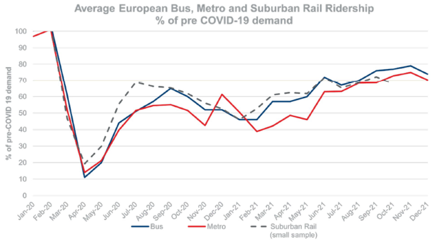
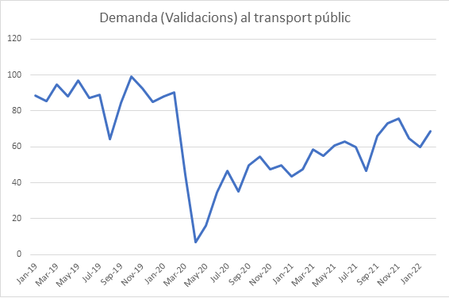
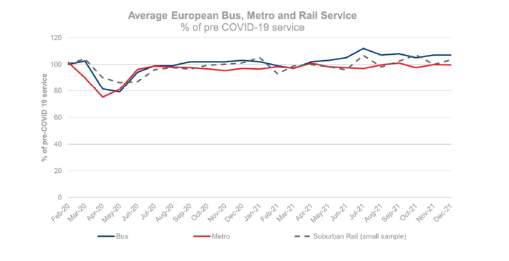
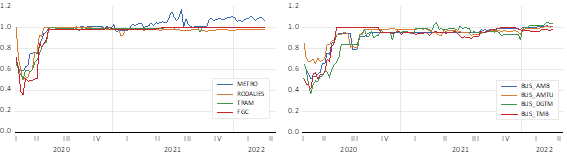
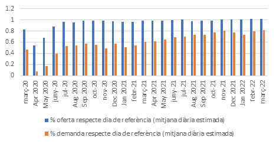
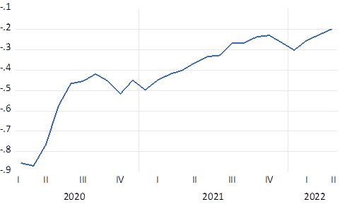
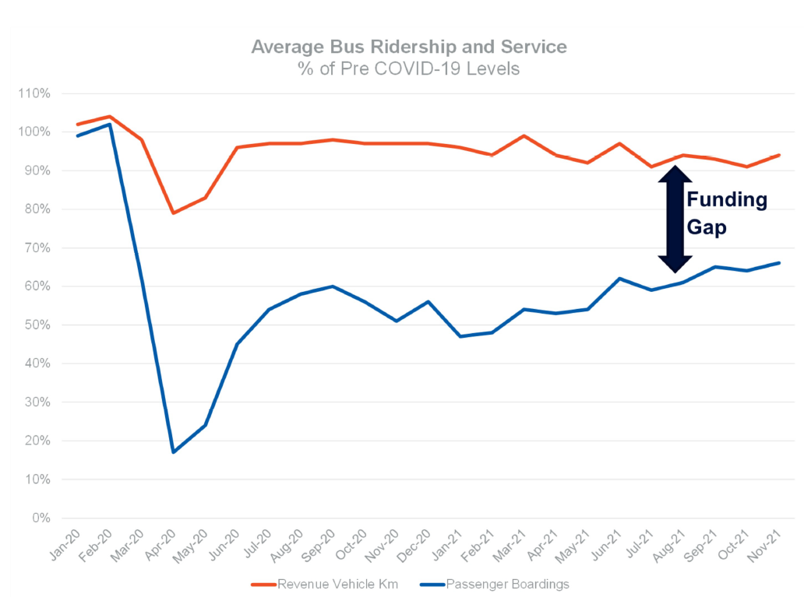

# Transport públic: demanda, oferta i problemes de finançament

## Introducció

L'arribada de la COVID-19 i les restriccions de la mobilitat que va comportar han tingut un impacte molt significatiu sobre el transport públic. Aquest capítol fa un repàs de l'impacte de la pandèmia en la demanda i l'oferta de transport públic i, consegüentment, en la seva capacitat de finançament. L'anàlisi té en compte l'impacte durant els mesos en què la pandèmia ha estat activa, però també les possibles conseqüències a mitjà i llarg termini.

Com podrem veure en l'apartat següent, la demanda de transport públic va caure de forma abrupta amb l'arribada de la COVID-19 i el confinament domiciliari que es va aplicar gairebé a tot Europa. Posteriorment, aquesta demanda es va recuperar de forma progressiva, tot i que encara se situa aproximadament entre un $10\%$ i un $20\%$ per sota dels nivells previs a la pandèmia.

L'oferta, després d'una reducció durant els dies de més restriccions de la mobilitat, va recuperar ràpidament el nivell de capacitat previ a la pandèmia i, en alguns casos, fins i tot va augmentar-lo lleugerament. Les mesures sanitàries de distanciament dictades per reduir el risc de contagi van obligar els operadors de transport públic a oferir una capacitat molt superior a la demanda. D'aquesta manera, no només es reduïa el risc de contagi, sinó que també s'atorgava més confiança al transport públic davant la pèrdua de quota de mercat respecte dels modes de transport personal.

La conseqüència evident d'una disminució de la demanda amb un manteniment de l'oferta va ser un intens increment de les necessitats de finançament de tots els modes de transport públic. La manca de recursos financers va requerir transferències extraordinàries des dels diferents nivells de govern per poder garantir la continuïtat del servei. L'increment del dèficit, malgrat no ser un fenomen nou, es va presentar de manera molt més intensa amb la crisi provocada per la COVID-19 i va posar de manifest la vulnerabilitat de les finances del transport públic davant l'impacte d'una crisi. L'augment de les subvencions extraordinàries no hauria de ser un problema si fos un fet acotat en el temps. Això no obstant, les dificultats financeres del transport públic tenen un caràcter estructural que fa necessari i urgent buscar fonts de finançament que atorguin estabilitat al sistema i li permetin garantir la mobilitat.

Val a dir que el comportament de la demanda i l'oferta de transport públic amb les implicacions consegüents sobre el seu finançament ha estat molt similar en tots els països afectats per la pandèmia. Ara bé, mentre que els països més rics han pogut assumir l'augment de les subvencions, en països de renda baixa s'hi ha observat tant un augment del preu del transport públic com una reducció de l'oferta i, per tant, de la qualitat.

Aquest capítol està estructurat de la manera següent: després d'aquesta breu introducció, en l'apartat dos analitzem l'evolució de la demanda després de la COVID-19. En l'apartat tres expliquem l'evolució de l'oferta; i en l'apartat quatre, presentem l'impacte de la pandèmia sobre el finançament del transport públic, i les perspectives futures. El capítol es tanca amb unes consideracions finals.

L'àmbit geogràfic de referència és el de l'Autoritat del Transport Metropolità de Barcelona (ATM). Aquest àmbit comprèn 296 municipis i agrupa pràcticament tots els modes de transport públic: metro, autobusos urbans, autobusos interurbans, tramvia, Ferrocarrils de la Generalitat de Catalunya (FGC) i Rodalies de Catalunya (Renfe). Es tracta d'un àmbit representatiu del comportament del transport públic a Catalunya durant la pandèmia, del qual disposem de dades homogènies i actualitzades. Al llarg del capítol ens hi referim de manera indistinta com a àrea de l'ATM o Regió Metropolitana de Barcelona.

## Demanda

La pandèmia de la COVID-19 va tenir un impacte molt significatiu sobre la demanda de mobilitat a tot Europa. La demanda de transport públic no n'ha estat una excepció, sinó tot el contrari. Atès l'elevat nivell de contagi de la malaltia, no només hi ha hagut una reducció de la mobilitat, sinó també un desplaçament de passatgers del transport públic cap al privat. Com es pot veure a la Figura \@ref(fig:fig1c1), el confinament patit després de l'esclat del virus, el març de 2020, va suposar una caiguda molt significativa de la demanda de transport públic a Europa, fins a nivells del $10\%$ respecte al període precovid. Aquesta demanda s'ha recuperat de mica en mica, però a dia d'avui encara no ha assolit els nivells de l'any 2019.

```{r fig1c1, echo=FALSE, fig.cap="Evolució de la demanda de transport públic a Europa. *Font: Transport Strategy Centre, Imperial College London*", out.width = '100%'}

```

Aquesta caiguda abrupta de la demanda, seguida d'una recuperació gradual, però sense assolir els nivells previs a la COVID-19, és un patró que es repeteix a la Regió Metropolitana de Barcelona. Si observem l'evolució de les validacions (la demanda) de transport públic a l'AMB podem veure exactament el mateix patró: una caiguda abrupta el mes de març (fins a nivells aproximats del $10\%$ de la demanda anterior a la COVID-19), i posteriorment una recuperació contínua fins a nivells aproximats del $80\%$ de la demanda prèvia (Figura \@ref(fig:fig1c2)).[^01-perdiguero_matas_cap1-1]

[^01-perdiguero_matas_cap1-1]: Tant per a la demanda com per a l'oferta, la comparativa precovid es fa amb un dia similar de referència de l'any 2019 o els mesos de gener i febrer de 2020, i els resultats es presenten en termes percentuals.

```{r fig1c2, echo=FALSE, fig.cap="Percentatge de demanda respecte de l’habitual a l’Àrea Metropolitana de Barcelona *Font: Elaboració pròpia a partir de les dades de l’ATM.*", out.width = '100%'}

```

A més, com es pot apreciar en els gràfics següents (Figura \@ref(fig:fig1c3)), aquest patró de comportament és similar en tots els mitjans de transport públic. Per tant, podem concloure que tots van patir una caiguda profunda a l'inici de la pandèmia (igual que en la resta de països europeus), i una represa que no ha permès recuperar totalment la demanda fins als nivells previs.

```{r fig1c3, fig.show = "hold", echo=FALSE, fig.cap="Percentatge de demanda respecte de l’habitual a l’Àrea Metropolitana de Barcelona per tipus de transport ^[Nota: FGC: Ferrocarrils de la Generalitat de Catalunya; Bus AMB: autobusos de l’Àrea Metropolitana de Barcelona; Bus DGTM: autobusos interurbans, Direcció General de Mobilitat i Transport; Bus AMTU: autobusos urbans; Bus TMB: autobusos de Transports Metropolitans de Barcelona.] *Font: Elaboració pròpia a partir de les dades de l’ATM.*", out.width = '45%'}
knitr::include_graphics(c("fig_por_cap/Cap.1/fig3_1.png","fig_por_cap/Cap.1/fig3_2.png", "fig_por_cap/Cap.1/fig3_3.png","fig_por_cap/Cap.1/fig3_4.png","fig_por_cap/Cap.1/fig3_5.png","fig_por_cap/Cap.1/fig3_6.png","fig_por_cap/Cap.1/fig3_7.png","fig_por_cap/Cap.1/fig3_8.png","fig_por_cap/Cap.1/fig3_9.png"))
```

És difícil saber si la demanda de transport públic es recuperarà al cent per cent, encara que alguns elements ens fan pensar que un percentatge significatiu de viatgers poden haver modificat la seva pauta de mobilitat. Un primer element és la percepció d'inseguretat que alguns usuaris poden tenir amb relació al transport públic. Compartir mitjà de transport pot ser un inconvenient per a alguns usuaris davant d'un virus que es transmet a través de l'aire. Segons una enquesta recent de l'Associació de Transports Públics Urbans i Metropolitans (ATUC), el $57\%$ dels enquestats assenyalaven la seguretat sanitària com un element clau per utilitzar el transport públic. L'obligatorietat d'utilitzar màscara pot ajudar a incrementar la sensació de seguretat i, per tant, a recuperar de manera més ràpida la demanda. Un segon aspecte que cal tenir en compte és l'increment del teletreball. La reducció de la presencialitat laboral pot ser un element important que faci disminuir les necessitats de mobilitat dels treballadors. Aquest fet no només pot reduir de manera significativa l'ús del vehicle privat i del transport públic, sinó que pot ser especialment important a les hores punta. Tot i això, hem de tenir en compte que els treballadors que teletreballen poden decidir viure en segones residències que es troben més allunyades dels llocs de treball. Aquest increment en el desplaçament, encara que sigui un nombre menor de dies, pot compensar en part la reducció de mobilitat fruit del teletreball. De fet, un estudi recent de Caldarola i Sorrell [-@Caldarola2022] mostra que els treballadors anglesos que teletreballen viatgen des de més lluny que els treballadors que no teletreballen. A mitjà i llarg termini caldria tenir en compte aquests canvis residencials a l'hora de valorar els efectes que el teletreball pot tenir sobre la mobilitat.

## Oferta

La necessitat de garantir la mobilitat de les persones va obligar els operadors de transport a mantenir uns nivells de servei similars o fins i tot superiors als existents en una situació de normalitat. A més, el fet que el transport públic s'identifiqués amb un espai massificat i, per tant, amb un risc elevat de contagi, va requerir mantenir una oferta sempre per sobre de la demanda. La figura 4 mostra, per a una mitjana d'operadors europeus, com l'oferta de transport públic se situa al $100\%$ del nivell precovid a partir del juny de 2020 i, amb algunes petites oscil·lacions, s'ha mantingut en aquest punt o per sobre.

```{r fig1c4, echo=FALSE, fig.cap="Evolució de l’oferta de transport públic a Europa *Font: Transport Strategy Centre (TSC), Imperial College London.*", out.width = '100%'}

```

Les dades disponibles per a la Regió de Barcelona mostren un comportament similar. Durant les setmanes en què les restriccions a la mobilitat van ser més severes, l'oferta de places de transport públic es va reduir entre un $40\%$ i un $60\%$ segons l'hora del dia. A partir de la segona quinzena d'abril del 2020, amb la progressiva disminució de les restriccions a la mobilitat, l'oferta es va incrementar gradualment i, a mitjans de juny, ja se situava de mitjana en un $90\%$ del seu valor habitual. Amb l'inici del curs escolar el mes de setembre, tots els operadors van recuperar, pràcticament, el nivell habitual de l'oferta. La incertesa sobre el risc de contagi en el transport públic i el temor de contagi per part dels usuaris potencials van obligar les empreses a prendre mesures especials que ajudessin a recuperar la confiança. Entre aquestes mesures, destaca el ràpid augment de l'oferta per evitar aglomeracions i garantir una certa distància entre els viatgers, així com mesures d'higienització i renovació de l'aire. El gràfic següent (Figura \@ref(fig:fig1c5)) mostra , per a l'àrea de l'ATM de Barcelona, el percentatge d'oferta respecte al seu valor habitual per a cada mode de transport des de l'inici de la pandèmia fins a l'abril de 2022. Tots els operadors se situen al voltant del nivell previ a la pandèmia, a excepció del metro, que ha augmentat l'oferta de places fins a situar-les a l'entorn del $108\%$. En particular, els operadors han reforçat l'oferta en hores punta de matí i tarda per reduir, en la mesura del que és possible, les aglomeracions.

```{r fig1c5, echo=FALSE, fig.cap="Percentatge de places ofertes respecte de l’habitual *Font: Elaboració pròpia a partir de les dades de l’ATM.*", out.width = '100%'}

```

Com a conseqüència d'una reducció del nombre de places sempre inferior a la disminució de la demanda (Figura \@ref(fig:fig1c6)), el grau d'ocupació del transport públic s'ha situat clarament per sota l'habitual en tot el període observat (Figura \@ref(fig:fig1c7)). Fins a l'abril de l'any 2021, el grau d'ocupació va ser més d'un $40\%$ inferior a l'habitual; a partir d'aquest mes, es va recuperar a poc a poc, malgrat que un any més tard encara se situava un $20\%$ per sota del que havia estat un dia similar de referència.

```{r fig1c6, echo=FALSE, fig.cap="Dades setmanals d’oferta i demanda per a tots els modes *Font: ATM.*", out.width = '100%'}

```

```{r fig1c7, echo=FALSE, fig.cap="Ràtio d’ocupació mensual del transport públic respecte de l’habitual (%) *Font: Elaboració pròpia a partir de les dades diàries de validacions i places ofertes de l’ATM.*", out.width = '100%'}

```

Per tant, podem observar com el sector públic ha fet un esforç important per mantenir l'oferta de transport públic, tot i la reducció significativa de la demanda. Això ha provocat que les ràtios d'ocupació hagin caigut i ha generat una reducció dels ingressos i de la capacitat de finançament del transport públic.

## Finançament

La caiguda d'ingressos com a conseqüència de la davallada del nombre de passatgers va crear greus problemes financers a les empreses de transport l'any 2020 que, en menor mesura, han continuat l'any 2021. Així, el 2020 les dades per als operadors a la Regió Metropolitana de Barcelona mostren una caiguda dels ingressos superiors al $50\%$. A la vegada, les despeses van augmentar per satisfer les mesures sanitàries i de seguretat imposades per fer front a la COVID-19. Malgrat els esforços de les empreses per reduir els costos variables, el deteriorament de les finances de les companyies es van haver de cobrir amb subvencions públiques extraordinàries. El juliol de 2021, l'Estat va concedir una subvenció als serveis de titularitat de les entitats locals equivalent al $40\%$ dels ingressos computables per ingressos tarifaris l'any 2019. Les pèrdues no cobertes es van finançar amb transferències de les administracions autonòmiques i locals. L'any 2021, malgrat l'increment de passatgers, els ingressos per tarifa encara estan clarament per sota dels habituals i novament han estat necessàries subvencions extraordinàries per fer front a l'impacte de la COVID-19. A manera d'exemple, els comptes anuals del grup de Transports Metropolitans de Barcelona mostren que els ingressos tarifaris de 2021, malgrat haver crescut un $25\%$ respecte de l'any anterior, encara són un $40\%$ inferiors a la recaptació del 2019.[^01-perdiguero_matas_cap1-2]

[^01-perdiguero_matas_cap1-2]: Vegeu TMB, Memòria de Sostenibilitat [-@TMB2022],

La generació d'un fort dèficit financer és un fet compartit per la gran majoria de ciutats afectades pel coronavirus. En el gràfic següent, i per a un conjunt internacional d'operadors d'autobusos, es mostra la necessitat de finançament a partir de la diferència entre vehicles-kilòmetre recorreguts i els passatgers transportats, les dues variables relatives al nivell precovid.

```{r fig1c8, echo=FALSE, fig.cap="Evolució del dèficit de finançament al servei d’autobús a Europa *Font:Transport Strategy Center (TSC, 2022).*", out.width = '100%'}

```

Les subvencions públiques extraordinàries per finançar aquest dèficit han estat una opció per a la majoria de països de renda elevada. Encara que la informació disponible respecte als ajuts públics està molt fragmentada, podem destacar que, ja en els primers mesos de la pandèmia, la Comissió Europea va aprovar un ajut d'estat de 6 mil milions d'euros per al govern alemany destinat a finançar les pèrdues dels serveis de transport públic regional i local (Rothengatter et al. [-@Rothengatter2021]). D'altra banda, l'entitat responsable dels serveis de metro i autobusos de Londres, Transport for London (TfL), va rebre del govern nacional mil milions de lliures per finançar tant el servei de metro com les empreses privades d'autobús que operen amb contractes de concessió fins al març de 2021. L'ajut concedit es va calcular partint del supòsit que el nombre de passatgers era d'un $65\%$ del nivell precovid, una xifra molt per sobre de la real segons apunta Vickerman [-@Vickerman2021]. A més, TfL es va comprometre a prendre un seguit de mesures per incrementar la recaptació via tarifes. Als Estats Units, l'autoritat del transport metropolità (MTA) de Nova York va rebre una transferència de 6.000 milions de dòlars i la de Washington (WMATA), transferències successives que sumen 2.193 milions de dòlars entre 2021 i 2023.

Més enllà d'haver de fer front a un fort dèficit a curt termini, hi ha incertesa sobre si a mitjà termini serà possible recuperar la demanda prèvia a la pandèmia o s'imposarà un nou patró de mobilitat amb menys viatges per persona i un pes més alt dels modes de transport personal.

Com ja hem indicat anteriorment, un dels elements que contribueix a reduir el nombre de desplaçaments diaris és l'augment del teletreball. Segons Eurostat, l'any 2019, a Espanya només un $2,2\%$ de les persones treballaven des de casa. Aquest percentatge era inferior a la mitjana de la UE-27 ($3,7\%$), i estava clarament per sota del dels Països Baixos ($8,3\%$) o França ($7,1\%$). Les mesures de confinament imposades per reduir la incidència de la COVID-19 van estendre ràpidament el teletreball entre la població. A l'àrea de Barcelona, el percentatge de persones que van teletreballar de manera regular va passar d'un $2,2\%$ l'any 2019 a un $15,1\%$ el 2020 i un $14\%$ el 2021. Per als residents a la ciutat de Barcelona, aquests percentatges són més elevats: $2,3\%$, $21\%$ i $17\%$, sempre segons les dades de l'Enquesta de Mobilitat en Dia Feiner (EMEF). Cal tenir en compte que l'any 2021 la mobilitat encara ha estat afectada pel virus. Caldrà veure quin percentatge de teletreball es consolida una vegada la pandèmia deixi d'afectar la població. Pel que fa a Espanya, Brindusi et al. [-@Brindusi2020] estimen que un $30\%$ dels ocupats podrien teletreballar, almenys ocasionalment[^01-perdiguero_matas_cap1-3], encara que hi ha diferències notables entre els tipus d'ocupació; en les ocupacions qualificades el potencial per treballar des de casa és més alt. En qualsevol cas, el marge per teletreballar és ampli, i segur que no es tornarà a xifres del $2\%$. Això repercutirà en els ingressos de les companyies de transport, que seran menors. En aquest sentit, ciutats com ara Berlín o Brussel·les ja han posat a la venda títols de transport flexibles adaptats a un patró de teletreball de 2 o 3 dies a la setmana.

[^01-perdiguero_matas_cap1-3]: Vegeu Brindusa et al. [-@Brindusi2020] per a una ordenació de les ocupacions segons el potencial de teletreball

Un segon element que pot reduir el nombre de viatges en transport públic és el transvasament cap a modes de transport personal, tant motoritzats (cotxe i moto) com actius (a peu, bicicleta o patinet). Com és sabut, la pandèmia ha afectat més el transport públic que la mobilitat activa o el transport privat. Novament, caldrà veure quina serà la permanència dels desplaçaments des del transport públic cap a viatges a peu i bicicleta o cap a l'automòbil i motocicleta. Estudis recents apunten que les reticències per part d'antics usuaris cap al transport públic, malgrat que van a la baixa, encara es mantenen[^01-perdiguero_matas_cap1-4]. A més, els governs locals estan fent grans inversions per incentivar la mobilitat en bicicleta, cosa que absorbirà usuaris del transport públic.

[^01-perdiguero_matas_cap1-4]: L'EMEF-2021 posa de relleu que encara que els motius relacionats amb la COVID-19 perden importància a l'hora d'explicar els canvis previstos en el mode de transport, continuen sent rellevants. Vegeu IERMB [-@IERMB2022]

En l'àmbit internacional, les previsions apunten que la demanda seguirà per sota del nivell previ a la pandèmia almenys durant un temps (TSC, [-@TSC2022]). Ja hi ha veus que apunten un canvi estructural en el patró de viatges, amb una menor mobilitat, que afecta tots els modes de transport motoritzats, però especialment el transport públic (The Economist, 19 maig, 2022). Segons aquest setmanari, la COVID-19 hauria provocat una reducció de la mobilitat, molt més intensa per motius ocupacionals que per lleure, que queda reflectida en un menor ús del transport, especialment en hores punta. Així, a Auckland, el nombre de viatges en metro es troba només a un $66\%$ del nivell precovid, mentre que, a Londres, la demanda és del $60\%$ en els dies laborables i del $80\%$ en els caps de setmana. Els autobusos al Regne Unit, amb una demanda menys lligada a la mobilitat ocupacional, tenen un percentatge d'ús a l'entorn del $80\%$ del nivell previ a la pandèmia. La caiguda del nombre de passatgers és més clara en les ocupacions de major qualificació i, per tant, en la població amb un nivell de renda més elevat.

Atès que el transport públic és un element essencial per a un bon funcionament de l'economia i juga un paper clau en la descarbonització, cal buscar estratègies per garantir-ne el finançament a mitjà i llarg termini. Cal dir que el problema de finançament del transport públic no neix amb la COVID-19, sinó que l'impacte de la pandèmia ha posat més clarament de manifest la vulnerabilitat de les seves finances (vegeu Matas i Perdiguero, [-@Matas2022], per a una anàlisi del finançament del transport públic urbà).

Una primera via per garantir la sostenibilitat financera seria reduir el cost del servei. En aquest sentit, cal que tant les autoritats del transport com els operadors tinguin els incentius adequats per garantir un servei eficient i evitar costos superiors als mínims. Dit això, davant la insuficiència financera, una manera ràpida que tenen les empreses per reduir els costos d'operació és disminuir la qualitat del servei oferint menys capacitat. Segons l'últim informe del TSC, en els primers mesos de 2022 alguns operadors de transport a Europa i els Estats Units ja han començat a reduir l'oferta del servei o s'ho plantegen. Per exemple, l'acord que ha signat Transport for London (TfL) amb el govern del Regne Unit per rebre subvencions extraordinàries preveu una reducció de la xarxa d'autobusos del $4\%$, principalment en les àrees de baixa demanda. Això no obstant, els usuaris del transport públic són més sensibles a la qualitat que al preu. Per tant, en un context d'incerta recuperació de la demanda, les retallades en la qualitat es traduiran en una caiguda addicional del nombre de passatgers, la qual cosa farà més difícil la recuperació. En economia del transport existeix el que es coneix com a efecte Mohring. Herbert Mohring va mostrar l'existència d'economies d'escala quan els costos inclouen el temps d'espera. Així, un augment de l'interval de pas entre vehicles augmenta el temps d'espera del passatger amb la consegüent reducció de la demanda, i s'entra en una espiral negativa de caiguda de la qualitat i caiguda de la demanda. Pel que fa als mitjans ferroviaris tenen costos fixos elevats que no es poden reduir ni a curt ni a mitjà termini. Finalment, cal afegir que el transport públic ha d'assumir grans inversions per contribuir a la descarbonització. Es tracta d'inversions en material mòbil que en cap cas haurien d'anar en contra de la qualitat del servei. En resum, si es vol que el transport públic no perdi capacitat d'atracció, l'oferta no es pot reduir al ritme que ho fa la demanda.

Alternativament, es pot optar per un augment dels ingressos tarifaris. Atès que la demanda és inelàstica respecte al preu, un augment de la tarifa reverteix en un increment dels ingressos. En tenim exemples a diverses ciutats espanyoles, que arran de la crisi econòmica de 2007 van incrementar el preu. Així, per exemple, entre 2008 i 2014, a Madrid, Barcelona i València el preu del títol de transport més usat va augmentar, respectivament, un $26\%$, un $43\%$ i un $40\%$. Ara bé, quan l'objectiu és augmentar l'ús del transport públic, l'increment de tarifes no sembla que sigui una opció. Això no implica, però, que qualsevol esquema de tarifes i, per tant, de subvenció, pugui considerar-se eficient, sinó que es poden explorar canvis en l'estructura i nivell de tarifes per acostar-los a l'òptim.

D'acord amb el que hem expressat, els operadors de transport continuaran havent d'afrontar un problema d'insuficiència financera. Aquest problema afectarà tots els modes de transport i àmbits, però és especialment greu per a les àrees urbanes i el transport ferroviari que ja operen amb nivells de subvenció elevats[^01-perdiguero_matas_cap1-5].

[^01-perdiguero_matas_cap1-5]: En les àrees metropolitanes, els ingressos tarifaris cobreixen entre un $40\%$ i un $60\%$ dels costos d'operació, percentatge similar al de moltes altres àrees europees (Matas i Perdiguero [-@Matas2022]).

Les mesures d'estímul fiscal adoptades per fer front a la COVID-19 han elevat el deute públic fins a acostar-se al $120\%$ del PIB, sense que a curt termini hi hagi gaire marge per reduir-lo. Aquesta situació, juntament amb el tipus d'interès a l'alça, introdueix una forta incertesa respecte a la capacitat per garantir les subvencions necessàries al transport públic, una incertesa que es traslladarà als operadors de transport. La situació serà més greu per als operadors privats que, d'acord amb el contracte de subministrament del servei, hagin assumit el risc dels ingressos. Hörcher et al. [-@Horcher2022] apunten que els serveis més dependents de les subvencions públiques i formes alternatives de finançament s'han vist menys afectats per la pandèmia. Els mateixos autors alerten, però, que a mitjà termini la situació pot canviar davant les dificultats financeres del sector públic, sobretot quan la subvenció està lligada al nombre de passatgers transportats.

Seria desitjable que els diferents mitjans de transport comptessin amb un marc financer estable a mitjà termini, sempre que incorpori els incentius necessaris per millorar l'eficiència en costos. Arran de l'impacte de la COVID-19, als Estats Units es va aprovar la US Infrastructure Investment and Jobs Act (novembre 2021), que garanteix el finançament al transport públic per un període de 8 anys. Això no obstant, aquesta llei introdueix compromisos per part dels operadors quant a l'oferta i els costos de transport.

Davant les dificultats financeres del sector públic, resulta especialment important buscar fonts alternatives de finançament del transport públic. La diversificació de les fons de finançament pot ser clau per garantir el servei de transport públic, més en un moment d'un fort dèficit públic en què els recursos destinats a subvencionar el transport poden competir amb els destinats a altres polítiques socials. Són moltes les possibles fonts de finançament alternatives[^01-perdiguero_matas_cap1-6], però en destacarem dues que poden ser especialment importants: la introducció de peatges d'accés a les ciutats, i l'increment dels impostos sobre els carburants.

[^01-perdiguero_matas_cap1-6]: Vegeu Ubbels et al. [-@Ubbels2001] i Litman [-@Litman2014] per a un repàs de les diferents fonts alternatives de finançament del transport públic.

Respecte als peatges d'accés, també anomenats peatges de congestió, cal destacar que no es tracta d'una eina nova; ja fa molts anys que s'utilitzen els peatges per finançar la construcció i el manteniment de diferents infraestructures. El que potser és més nou és comprometre part d'aquests ingressos per finançar el transport públic. En els darrers vint anys són diverses les ciutats europees que han introduït aquesta mesura (Londres, 2003; Estocolm, 2007; o Milà, 2009), que ha provocat principalment dos tipus d'efectes: una reducció significativa de la circulació de vehicles privats, i un increment dels recursos disponibles per finançar el transport públic. Malgrat els efectes positius sobre la qualitat de l'aire i sobre la capacitat de finançament del transport públic que aquest tipus de mesures poden tenir, tradicionalment no compten amb el suport de la ciutadania, especialment abans d'implementar-se. Es necessita una forta voluntat política per implementar els peatges d'accés, especialment en les primeres etapes, fins que els ciutadans n'observen els beneficis. De moment, a l'Àrea Metropolitana de Barcelona no sembla que aquesta voluntat política existeixi. Fins ara, el que s'ha implementat és una zona de baixes emissions, que com es pot veure a Fageda i Flores-Fillol [-@Fageda2018] no resulta eficient a mitjà i llarg termini per reduir l'ús del transport privat, i a més a més no genera recursos per finançar el transport públic.

El segon dels mecanismes seria l'increment dels impostos sobre el carburants (o, si de cas, sobre l'impost de matriculació dels vehicles de combustió interna). La capacitat per desincentivar l'ús del vehicle privat, traslladar una part dels usuaris al transport públic i generar recursos per finançar-lo dependrà molt de l'elasticitat de la demanda d'aquest producte. A curt termini, un increment prou elevat dels impostos sobre els carburants pot no generar una reducció significativa del consum; en canvi, sí que generaria una quantitat important de recursos per finançar el transport públic. No obstant això, a mitjà i llarg termini, en què els consumidors tenen més capacitat per adaptar-se, la reducció de l'ús del vehicle privat pot ser més gran (i també l'increment de l'ús del transport públic), cosa que reduiria la capacitat de generar recursos. Cal comptar, a més, amb la progressiva substitució de vehicles de combustió interna per vehicles elèctrics que, almenys fins ara, estan exempts de bona part dels impostos. Als Estats Units és habitual que part dels ingressos generats pels impostos sobre els carburants es destinin a finançar el transport públic. Hem de tenir en compte que Espanya és un dels països de la Unió Europea amb els impostos dels carburants més reduïts, pràcticament al llindar del mínim que imposa la normativa comunitària. Per tant, hi ha capacitat per poder incrementar aquests impostos perquè siguin una font important de finançament del transport públic. De fet, aquesta mesura també es preveu al recent Libro blanco sobre la reforma tributaria (2022), en què es parla, per exemple, d'igualar els impostos especials sobre el gasoil i la benzina. Lamentablement, l'increment del preu de l'energia ocasionat per la invasió d'Ucraïna per part de Rússia, fa molt difícil que els diferents governs incrementin els impostos sobre els carburants. De fet, la mesura introduïda pel govern espanyol, encara que sigui temporal, ha sigut la contrària: subvencionar amb vint cèntims el consum de carburants. Aquest tipus de mesures entren en contradicció amb l'objectiu de reduir l'ús del transport privat i fomentar l'ús del transport públic, i no ajuden a poder finançar-lo a mitjà i llarg termini.

## Conclusions

La pandèmia de la COVID-19 ha tingut un impacte molt significatiu sobre la mobilitat, i el transport públic no n'ha sigut una excepció. El confinament domiciliari va provocar una caiguda abrupta de la demanda, que va arribar fins a un $10\%$ de la de períodes anteriors. Encara que es va anar recuperant de forma progressiva, a dia d'avui se situa entre un $10\%$ i un $20\%$ per sota del període anterior a la pandèmia. En canvi, l'oferta de transport públic es va mantenir durant tota la pandèmia, i fins i tot va augmentar lleugerament en alguns modes de transport per disminuir la concentració de passatgers. Tot això va provocar una reducció dels ingressos tarifaris i, per tant, un increment significatiu de la necessitat de subvencions directes per part del sector públic.

Si finalment es confirma que una part de la reducció de la demanda és estructural, el sistema de transport públic s'enfronta a un repte important: com recuperar i captar nous usuaris que permetin finançar el sistema, o com aconseguir noves formes de finançament que permetin donar viabilitat al sistema tot i tenir una demanda més baixa. Per incrementar el nombre de passatgers serà important que el transport públic s'adapti a les preferències dels usuaris, optimitzant la xarxa de transport i reduint el temps de desplaçament.

Aquesta millora de la qualitat del transport públic, necessària per atraure més usuaris, requerirà inversions que poden tenir un encaix difícil amb la situació actual d'elevat dèficit públic. Els recursos que venen des d'Europa a través del fons Next Generation poden ser una bona possibilitat per finançar aquest tipus d'inversions.

Una altra forma d'aconseguir recursos per finançar les despeses i les noves inversions del transport públic és introduir nous instruments de finançament. Entre les diverses alternatives, destaquen la introducció de peatges d'accés a les ciutats, i l'increment dels impostos sobre els carburants. Les dues mesures ajudarien, per una banda, a reduir l'ús del vehicle privat, traspassant una part dels usuaris cap al transport públic, i, per l'altra, generarien un increment dels recursos per poder finançar els costos operatius del transport públic i fer front a les inversions necessàries per incrementar-ne la qualitat. Es tracta, però, de mesures de difícil implementació donada la forta oposició de bona part de la població. L'experiència en alguna ciutat europea com ara Estocolm aconsella posar en marxa un període de prova per tal que la població conegui directament les conseqüències d'aquesta política i la pugui avaluar adequadament.
