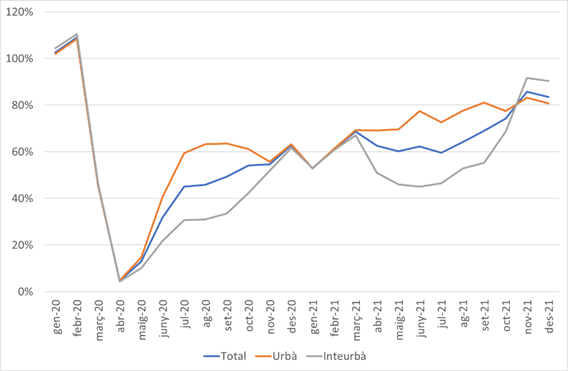
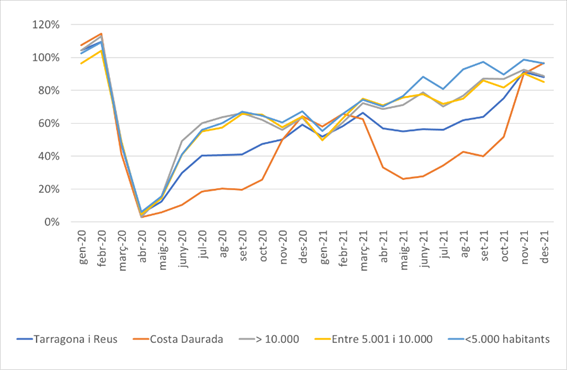
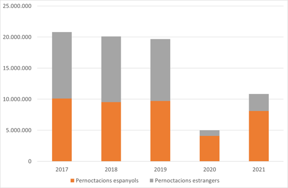
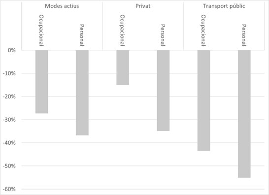
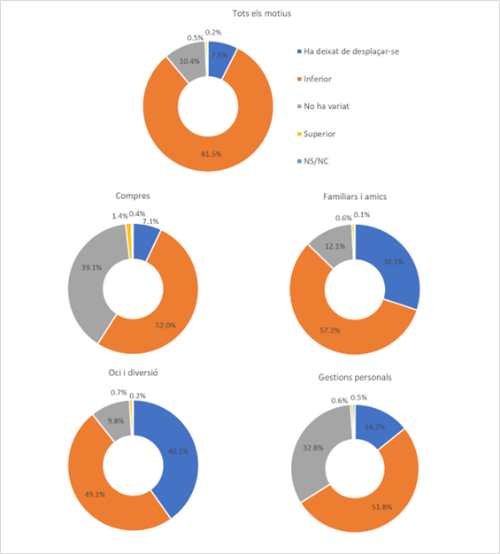
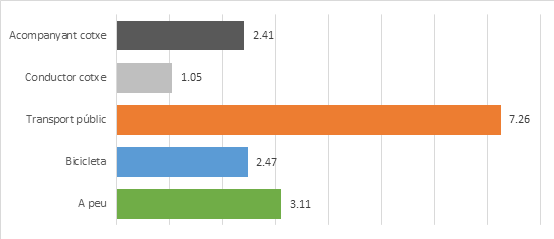
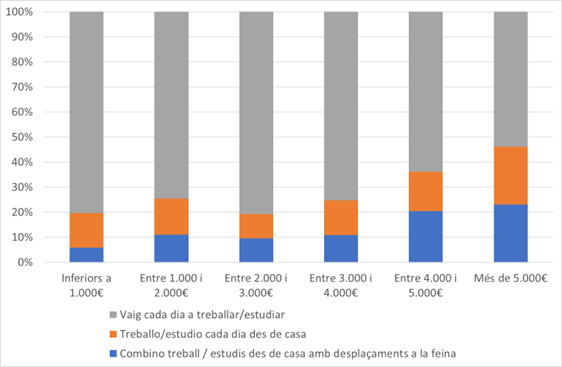
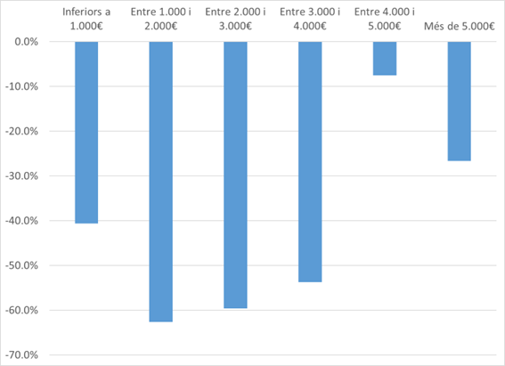
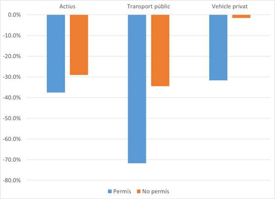
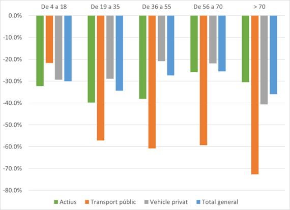

# Impacte de la COVID-19 sobre la demanda de transport públic en Tarragona: ciutats mitjanes, zones turístiques i territoris de baixa densitat {-}

###### Daniel Miravet *(Universitat Rovira i Virgili)*	{-}	
###### Aaron Gutiérrez *(Universitat Rovira i Virgili)*	{-}	
###### Xavier Delclòs-Alió *(Universitat Rovira i Virgili)*	{-}	

## Introducció

Quan s’analitzen les múltiples afectacions que ha patit la vida quotidiana de les persones com a conseqüència de la pandèmia de la COVID-19, més enllà òbviament d’aquelles relacionades amb la salut i el proveïment de serveis i materials sanitaris, entre els àmbits més afectats trobem la mobilitat. Les afectacions causades pel virus sobre la mobilitat han estat determinades per dos elements fonamentals. En primer lloc, aquelles derivades de les restriccions mateixes a la mobilitat i a les activitats personals generadores de desplaçaments, introduïdes pels poders públics per tal de tallar les cadenes de contagi, tot alternant períodes de més o menys obertura segons la incidència de la malaltia i el nivell de saturació dels hospitals (Hale et al.,[-@hale2021government]; Askitas et al.,[-@askitas2021estimating]). Les limitacions que van afectar directament la mobilitat van suposar prohibicions segons les franges horàries, els àmbits geogràfics o el nombre de persones que es desplaçaven juntes, i, en paral·lel, es van establir limitacions, i fins i tot prohibicions, d’activitats com ara l’oci nocturn o la restauració. En segon lloc, la por de contraure la malaltia va tenir un paper clau a l’hora de disminuir els desplaçaments de les persones (Vich et al., [-@vich2022presence]). La por va suposar un fre per a la mobilitat de molta gent, i no va afectar tots els segments de població de manera homogènia, sobretot per la percepció del risc de les conseqüències que es podien derivar de contraure la COVID-19, que eren superiors entre els grups de més edat i els col·lectius immunodeprimits (Nino et al., [-@nino2021race]).

La percepció del risc a contraure la malaltia també ha estat molt diferent en funció de l’activitat o de la situació concreta. És a dir, el risc percebut al contagi ha estat molt desigual depenent de la destinació i la tipologia d’activitat a fer (Kim i Kang, [-@kim2021perceived]). D’aquesta percepció divergent de la probabilitat de patir la malaltia tampoc se n’ha deslliurat l’elecció dels modes de transport. En aquest sentit, el transport públic ha estat amb diferència el mode de transport més castigat amb relació a la pèrdua d’usuaris (Gutiérrez et al., [-@gutierrez2021covid]), mentre que caminar ha seguit una tendència decreixent, tot i que no tan negativa (Kim i Kang, [-@kim2021perceived]), i l’ús del vehicle privat ha estat el mode de transport que menys se n’ha ressentit (Wen et al., [-@wen2022impact]). Una de les raons principals que justifiquen la pèrdua de confiança en el transport públic ha estat la sensació d’aglomeració quan s’utilitza (Gutiérrez et al., [-@gutierrez2021covid]), com a resultat de les campanyes de comunicació que des d’un primer moment es van centrar a posar l’accent en la necessitat de mantenir una distància interpersonal de com a mínim 1,5 metres (Pawar et al., [-@pawar2020impact]). 

La magnitud de l’impacte de la COVID-19 sobre la demanda de transport públic s’ha vist reflectida en el nombre d’estudis que han analitzat aquesta temàtica. Entre les temàtiques més tractades hi ha, d’una banda, la considerable pèrdua de viatgers en comparació a la resta de modes de transport (Anke et al., [-@anke2021impact]; Shamshiripour et al., [-@shamshiripour2020covid]); de l’altra, com aquesta disminució d’ús ha estat asimètrica segons el segment de població i la classe social, amb grups que s’han convertit en usuaris captius (Checa et al., [-@checa2020those]), passant per les percepcions dels usuaris amb relació al transport públic en diferents moments de la pandèmia (Politis et al., [-@politis2021capturing]). Aquests treballs han tendit a centrar el seu objecte d’anàlisi en ciutats o àmbits metropolitans de gran dimensió, mentre que altres territoris amb un nombre inferior d’habitants han rebut menys atenció (Campisi et al., [-@campisi2020impact]). Es pot dir el mateix per a les zones turístiques, on el transport públic és un element fonamental que articula la qualitat de la seva oferta (Miravet et al., [-@miravet2021sources]) i té prou capacitat per transformar les dinàmiques de mobilitat d’un territori (Domènech et al., [-@domenech2020mining]). Per aquesta raó, el present treball planteja l’estudi de l’impacte de la COVID-19 sobre la demanda de transport públic al Camp de Tarragona, un territori caracteritzat, no només per l’existència de grans ciutats, sinó també per ciutats de mitjana dimensió, Tarragona i Reus, una destinació turística de costa de primer nivell, la Costa Daurada, i un àmbit territorial de baixa densitat de gran extensió integrat per comarques senceres, com el Priorat o la Conca de Barberà. 

##	Dades 

###	Àmbit territorial

L’àmbit territorial analitzat es correspon amb el del Camp de Tarragona i, més concretament, amb les comarques que conformen l’àrea territorial sobre la qual té competències amb relació a la mobilitat l’Autoritat Territorial de la Mobilitat del Camp de Tarragona (d’ara en endavant, ATM). Les comarques que hi pertanyen són el Tarragonès, el Baix Camp, l’Alt Camp, el Baix Penedès, la Conca de Barberà i el Priorat. Aquest territori, que d’acord amb les dades padronals de l’Idescat l’any 2021 tenia una població de 641.926 habitants, està configurat per una bicefàlia pel que fa a les seves principals ciutats: Tarragona i Reus, la primera amb més de 135.000 habitants, i la segona amb 106.000. Cambrils, Salou i Vila-seca superen totes els 20.000 habitants i conformen un important centre turístic a l’àmbit central de la Costa Daurada, que, segons les dades del Tourist Open Knowledge, l’any 2019, va rebre més de 5 M de visitants que van fer prop de 20 M de pernoctacions. A banda d’aquestes poblacions, només Valls, el Vendrell, Cunit, Calafell, Torredembarra i Mont-roig del Camp superen els 10.000 habitants. Cal tenir en compte que, amb l’excepció de Valls, la resta de municipis amb més de 10.000 habitants se situen tots en la franja costanera. D’aquesta manera, un ampli territori del Camp de Tarragona es caracteritza perquè té baixes densitats de població. La prova d’això és el fet que mentre que al Tarragonès la densitat de població l’any 2021 era de 820,4 habitants/km2, a les comarques interiors era molt més baixa: a l’Alt Camp era de 83,7, a la Conca de Barberà de 30,9 i al Priorat de 18,5.

###	Dades utilitzades

Les fonts de dades utilitzades per a aquest treball són principalment dues: les dades agregades de registres de viatgers de l’ATM, i els resultats de l’Enquesta de mobilitat quotidiana al Camp de Tarragona [-@ATM2020] (d’ara en endavant, EMQ). La primera font de dades és el resultat de les validacions de les targetes intel·ligents de transport públic als serveis de transport col·lectiu per carretera integrats a l’ATM.  Un cop es valida un títol de transport a les màquines que hi ha a bord dels vehicles, es genera un registre al sistema. El registre es genera a la pujada; ara bé, es desconeix la parada on el viatger baixa (Gutiérrez i Miravet, [-@gutierrez2016estacionalidad]). Posteriorment, aquests registres que contenen la informació de la parada, la línia, l’hora i la data de les validacions, així com el títol de transport utilitzat, s’envien al sistema de gestió de la integració tarifària, on queden recollits (Zaragozí et al., [-@zaragozi2021development]). El grau de flexibilitat pel que fa a la selecció de l’àmbit territorial i la dimensió temporal d’anàlisi que presenta aquesta tipologia de dades és una particularitat que facilita l’exploració de fenòmens disruptius sobre la demanda de transport públic, com ara l’efecte de la COVID-19, al mateix temps que permet recopilar informació relativa a la mobilitat dels no residents (Gutiérrez et al., [-@zaragozi2020profiling]).

Pel que fa l’EMQ, el seu treball de camp es va iniciar a mitjan febrer de l’any 2020, i tenia per objecte assolir 13.814 enquestes. La irrupció de la pandèmia va obligar a interrompre les entrevistes el 12 de març, quan se n’havien dut a terme un total de 9.228, que representen un 67 % de l’objectiu establert. L’enquesta consta de tres blocs principals: un primer, en què la persona entrevistada ha de detallar els desplaçaments que havia dut a terme durant el dia precedent; un segon, en què es recull l’opinió i la percepció respecte de diversos elements de la mobilitat, i, finalment, un tercer bloc recull les característiques socioeconòmiques dels enquestats. El procés d’enquesta al novembre es va reprendre el novembre del mateix any. El context de les entrevistes era força diferent, no obstant això, amb un escenari caracteritzat per fortes restriccions, com ara el tancament de bars i restaurants, gimnasos i activitats culturals, la recomanació de fer teletreball o l’obertura de les universitats estrictament per a pràctiques amb grups reduïts. D’aquesta manera, el qüestionari va ser modificat lleugerament per tal d’introduir-hi qüestions com ara la por al contagi per mode de transport o fins a quin punt s’havien reduït els desplaçaments segons la motivació d’aquest. 

##	Resultats

###	Caiguda global de la mobilitat i de l’ús del transport públic al Camp de Tarragona

D’acord amb les dades de l’EMQ, un dia tipus anterior a l’esclat de la pandèmia de la COVID-19, els residents del Camp de Tarragona duien a terme un total d’1.890.785 desplaçaments de mitjana en un dia feiner. Aquesta xifra va minvar dràsticament un cop la malaltia es va escampar. Així, les dades recollides al novembre mostren un descens de la mobilitat en dia feiner fins a 1.329.352 desplaçaments diaris, és a dir, un 29,7 %. Per modes de transport, malgrat que tots van perdre usuaris, la davallada va ser força desigual. En el cas del transport privat, la disminució va ser del 24,9 %, els modes actius van registrar una pèrdua del 33,6 %, mentre que la pitjor part se la va endur el transport públic, amb un 47,4 %.

Tal com es pot apreciar en la figura \@ref(fig:fig2c1), l’evolució del descens del transport públic ha anat variant en funció del moment de la pandèmia. Sens dubte, el pitjor moment fou el tancament dels mesos de març, abril i maig de l’any 2020. D’aquesta manera, mentre que els mesos de gener i febrer d’aquell any la demanda va ser superior fins i tot a la registrada l’any 2019, els mesos de març, abril i maig el percentatge amb prou feines arriba al 20 % del volum de viatgers de l’any anterior. El pitjor mes de tots va ser l’abril, amb només un 5 %. El posterior procés d’obertura gradual va suposar una recuperació de la demanda, que va iniciar un procés de creixement molt i molt lent, no exempt de descensos temporals, que van acompanyar els increments de la incidència de la malaltia. De juny a desembre de 2020, la demanda va suposar un 48 % en comparació al mateix període de 2019. L’any 2021, tal com s’aprecia a la gràfica, la recuperació es va alentir durant el primer semestre, i va tornar a agafar embranzida durant la segona meitat de l’any, sobretot el darrer trimestre. Els mesos de novembre i desembre de 2021 el nombre total d’usuaris ja es va situar en el 86 % i el 84 %, respectivament, dels valors dels mateixos mesos de 2019. 

La gràfica també distingeix les tendències del transport urbà, que inclou les ciutats de Tarragona i Reus, i el transport interurbà. Des d’aquesta perspectiva, s’aprecia com durant els mesos d’hivern la tendència de les corbes d’ambdues tipologies de servei presenta un comportament molt similar. En canvi, durant l’estiu les tendències presenten un comportament divergent. Durant els mesos de juny a setembre de l’any 2020, el volum de viatgers interurbans es va situar en percentatges d’entre el 30 % i el 35 % respecte de 2019, mentre que el 2021 la proporció de viatgers es va moure entre el 45 % i el 55 %. Tots dos anys, el transport urbà presenta uns percentatges entre 25 i 30 punts superiors. Tal com es podrà constatar en els propers apartats, això es deu al pes de la demanda turística en el transport interurbà.

```{r fig2c1, echo=FALSE, fig.cap="Comparació de l’evolució mensual de la demanda de transport públic al Camp de Tarragona durant 2020 i 2021 en comparació al mateix mes de l’any 2019 (2019 = 100 %). *Font: elaboració pròpia a partir de les dades del sistema tarifari integrat de l’ATM.*", out.width = '100%'}

```

### Reducció de l’ús del transport públic segons la tipologia de municipi

En aquest apartat, s’ha centrat l’anàlisi únicament en el transport interurbà, i s’ha considerat una classificació dels municipis del Camp de Tarragona en cinc categories diferents:

*	Categoria 1: Tarragona i Reus.
*	Categoria 2: municipis de la Costa Daurada central (Salou, Vila-seca i la Pineda).
*	Categoria 3: municipis de més de 10.000 habitants, excloent-ne els que pertanyen a les categories anteriors (el Vendrell, Calafell, Valls, Torredembarra, Cunit i Mont-roig del Camp).
*	Categoria 4: municipis d’entre 5.001 i 10.000 habitants (Montblanc, Roda de Berà, Constantí, Vandellòs i l’Hospitalet de l’Infant, Riudoms, la Canonja, la Selva del Camp, l’Arboç, Altafulla i Alcover).
*	Categoria 5: municipis amb 5.000 habitants i menys (els 111 municipis restants del Camp de Tarragona).

Les dues primeres categories van concentrar el 84,1 % dels viatges en transport públic l’any 2019, amb un 44,1 % i un 40 %, respectivament. La tercera va registrar un 7,2 %; la quarta, un 3,2 %, mentre que la darrera, tot i els 111 municipis que la conformen, només va representar un 5,4 % de la demanda total.

En la figura \@ref(fig:fig2c2) es pot constatar com la recuperació de viatgers entre els anys 2019 i 2020 ha seguit una tendència molt dispar en funció dels territoris. Un aspecte que cal destacar és que les corbes de totes les tipologies de municipi tendeixen a convergir durant la temporada baixa turística, és a dir, entre els mesos de novembre i febrer. En contraposició, les diferències s’eixamplen en funció de la intensitat de l’activitat turística en el teixit productiu de la població. D’acord amb la gràfica, les parades de transport públic ubicades en els municipis de menor dimensió són les que han seguit una millor tendència de recuperació de la demanda, lleugerament superior a la dels municipis d’entre 5.001 i 10.000 habitants, i els de més de 10.000 habitants que no pertanyen ni a la primera ni a la segona categoria. En contraposició, la figura \@ref(fig:fig2c2) revela com el creixement de la demanda es va veure clarament frenat durant els mesos d’estiu a les parades interurbanes de les ciutats de Tarragona i Reus i, encara més, a les dels tres municipis de la Costa Daurada central. En aquests darrers municipis, cap dels mesos d’estiu de 2020 la demanda va superar el 20 % de les dades assolides el 2019, mentre que el 2021 el percentatge no va arribar al 45 %. Aquestes tendències tan divergents s’expliquen per la combinació de dos factors. 

```{r fig2c2, echo=FALSE, fig.cap="Comparació de l’evolució mensual de la demanda de transport públic interurbà al Camp de Tarragona durant 2020 i 2021 en comparació al mateix mes de l’any 2019 (2019 = 100 %), segons la tipologia de municipi on es troba ubicada la parada. *Font: elaboració pròpia a partir de les dades del sistema tarifari integrat de l’ATM.*", out.width = '100%'}

```

En primer lloc, la incidència tan diferenciada de l’activitat turística segons la categoria de municipi, juntament amb el marcat descens de la demanda turística en les destinacions on aquesta és l’activitat econòmica principal i es du a terme de manera intensiva. Així, mentre que les poblacions que pertanyen a les categories 3, 4 i 5 durant el mes d’agost de l’any 2019 van experimentar una reducció del nombre d’usuaris de transport públic en comparació al febrer, el nombre d’usuaris del transport interurbà va augmentar un 77 % a Tarragona i Reus; i als municipis de la zona central de la Costa Daurada, el volum de demanda es va multiplicar per un factor de 6,5. Aquestes dades assenyalen que, tot i que les pernoctacions de turistes es concentren a Salou, Cambrils i Vila-seca, es produeix un efecte de desbordament cap a Tarragona i Reus associat a dos motius: les visites dels turistes i els desplaçaments per motiu de feina dels residents a la zona més turística. En segon lloc, el 2020 i 2021 es va produir un desplomament de les arribades de turistes, i especialment de turistes internacionals. En la figura \@ref(fig:fig2c3) es pot apreciar l’esfondrament general de les pernoctacions a la Costa Daurada, que passen de rondar els 20 M anuals els anys 2017, 2018 i 2019, a ser només de 5 M l’any 2020, i 10,8 M el 2021. A més, el descens és molt més acusat en el cas del turisme estranger. Si amb anterioritat a la COVID-19 el turisme procedent de la resta de l’Estat no representava ni el 50 % de les pernoctacions, el 2020 va passar a suposar un 82 % del total, mentre que l’any 2021 el seu pes encara no va sobrepassar el 75 %. Aquestes dades s’ajusten al marc teòric proposat per Duro et al. [-@duro2021covid], segons els quals les zones costaneres caracteritzades pel turisme massiu, i amb una proporció més elevada de turistes internacionals, han resultat especialment vulnerables quan la incidència de la COVID-19 s’ha disparat. En aquest escenari, cal tenir en compte que els visitants estrangers són els que més demanen el transport públic a la Costa Daurada (Gutiérrez i Miravet, [-@gutierrez2016determinants]; Miravet et al., [-@miravet2021prompts]), ja que arriben majoritàriament en avió i tenen una predisposició més gran a fer visites turístiques per a les quals necessiten el transport públic. 

```{r fig2c3, echo=FALSE, fig.cap="Evolució de les pernoctacions dels turistes nacionals i estrangers. Anys 2017 a 2021. *Font: elaboració pròpia a partir de les dades del Tourism Open Knowledge.*", out.width = '100%'}

```

Pel que fa als municipis més petits, les característiques de l’oferta de transport públic disponible en aquestes poblacions fa que la seva utilització estigui molt condicionada per la motivació del desplaçament dels habitants. És a dir, aquestes persones tendeixen a fer ús del transport públic quan la motivació del desplaçament és d’obligada necessitat, i no disposen d’alternatives. La manca d’una freqüència d’expedicions àmplia fa que els habitants d’aquests municipis optin per altres alternatives de transport amb un major grau de flexibilitat quan tenen accés a aquestes altres opcions, mentre que aquells que no les tenen, es converteixen en usuaris captius del transport públic quan el motiu del desplaçament és ineludible. Per aquest motiu, en els municipis petits, el pes més elevat dels desplaçaments per motivacions ineludibles fa que la demanda dels anys de 2020 i 2021 estigui més a prop de la de 2019, en comparació a la resta de tipologies de municipi.

### Motivacions de desplaçament

Un dels aspectes clau de la mobilitat en el context de la pandèmia és l’efecte combinat de les restriccions i la por de contraure la malaltia, les quals han tingut un paper fonamental a l’hora de redefinir els patrons de desplaçaments individuals. Aquest fet es reflecteix en el descens de la mobilitat, en general, en funció de la motivació i, en particular, pel que fa al transport públic. En aquest sentit, d’acord amb les dades de l’EMQ, al Camp de Tarragona, el novembre de 2020 els residents havien reduït la mobilitat per temes ocupacionals, és a dir, per raons de feina o estudis, un 21,2 %. La disminució va ser considerablement més elevada per a la mobilitat de tipus personal, fins al 36,5 %.

```{r fig2c4, echo=FALSE, fig.cap="Descens de la mobilitat com a conseqüència de la COVID-19 per modes de transport, segons la motivació del desplaçament. *Font: elaboració pròpia a partir de les dades de l’EMQ.*", out.width = '100%'}

```

Si aquest descens se segmenta per modes, el transport públic mostra la major caiguda en termes relatius. Prenent sempre com a referència els dies feiners, la mobilitat ocupacional en els modes actius va caure un 27,3 %, i un 36,8 % la personal. En el cas del vehicle privat, la mobilitat ocupacional va patir una disminució més modesta, concretament del 15,1 %, mentre que la personal va caure molt més, el 34,9 %. Finalment, en el cas dels desplaçaments en transport públic, les taxes de variació negatives són força més elevades: un 43,5 % per a la mobilitat ocupacional i un 55,1 %, per a la mobilitat personal. 

```{r fig2c5, echo=FALSE, fig.cap="Variació de la mobilitat en comparació amb abans de la pandèmia, segons el motiu. Novembre de 2020. *Font: elaboració pròpia a partir de les dades de l’EMQ.*", out.width = '100%'}

```

Tot plegat es va traduir en una disminució evident dels desplaçaments quan es podien evitar. En el cas dels desplaçaments per motius ocupacionals, la mobilitat va decaure a causa dels acomiadaments, dels expedients de regulació d’ocupació temporals, del teletreball o de les classes magistrals a distància en el cas dels estudiants universitaris. No sempre va ser possible evitar aquests desplaçaments, ja que en molts àmbits laborals la presencialitat va ser una exigència. Això va provocar un cert transvasament dels modes de transport que es veien com a més insegurs, el transport públic principalment, cap a aquells que eren percebuts com a més segurs, els modes actius, i sobretot, el vehicle privat (Bagdatli i Ipek, [-@bagdatli2022transport]; Eisenmann et al., [-@eisenmann2021transport]). En el cas de la mobilitat per motius personals, la naturalesa de la motivació del desplaçament fa que sigui més fàcil no moure’s. Per exemple, durant la pandèmia, es va produir una explosió del comerç per internet per tal d’evitar els desplaçaments a les botigues (Bhatti et al., [-@bhatti2020commerce]). Les limitacions a la mobilitat imposades per les administracions també van ser més restrictives en el cas de la mobilitat personal que en el cas de l’obligada. Així, durant el treball de camp de l’enquesta, mentre que el teletreball va ser una obligació per a les empreses amb la condició que aquest fos «possible», moltes activitats lúdiques i d’oci es van veure obligades a tancar directament. L’impacte global va ser, doncs, més fort per a la mobilitat de caire personal, i, tal com s’aprecia en la figura \@ref(fig:fig2c5), particularment més elevat per a la mobilitat relacionada amb les activitats socials d’oci, i les visites a amics i familiars.

### La por al contagi i el transport públic

En l’apartat anterior s’ha posat de manifest, d’una banda, com la pandèmia ha reduït desplaçaments evitables i, de l’altra, el transvasament des del transport públic cap a altres mitjans de transport. La por de contagiar-se ha estat la clau de volta de tot plegat. Aquesta por al contagi, a més, no va quedar circumscrita a l’objecte del desplaçament, sinó que també afecta els desplaçaments en si mateixos, fet que va acabar condicionant en gran mesura l’elecció modal. El transport públic va ser considerat a moltes ciutats del món i per molta gent un focus de contagi, fet que va anar en detriment del seu ús (Jenelius i Cebecauer, [-@jenelius2020impacts]; Neuburger i Egger, [-@neuburger2021travel]). Tal com demostren les dades de la recuperació de la mobilitat quotidiana dels residents, tot i que de mica en mica la demanda es va acostant als nivells anteriors a la pandèmia, el procés de recuperació de la confiança per part dels usuaris que van abandonar aquesta opció de transport és lent després d’una pandèmia (Wang, [-@wang2014change]).

```{r fig2c6, echo=FALSE, fig.cap="Risc percebut de contreure la COVID per mode de transport. Novembre de 2020. *Font: elaboració pròpia a partir de les dades de l’EMQ.*", out.width = '100%'}

```

El Camp de Tarragona no va ser una excepció pel que fa a la por al transport públic. Les dades de l’EMQ, presentades en la figura \@ref(fig:fig2c6), així ho demostren. En una escala de l’1 al 10, es fa palès que els enquestats van considerar que el transport públic tenia un risc de contagi del 7,3, molt per sobre del de la resta de modes de transport. De la figura també cal destacar que els modes actius, que van associats a desplaçaments a l’aire lliure, i on, per tant, el risc de contagiar-se hauria de ser inferior, presenten un risc percebut superior al del vehicle privat, fins i tot, quan es va acompanyat d’altres persones. La mateixa EMQ revela que, entre les justificacions adduïdes pels residents del Camp de Tarragona per no agafar el transport públic, la quarta més anomenada va ser la por al contagi. Aquestes dades expliquen el transvasament del transport públic a altres modes, que, com a resultat, van frenar el descens de la seva mobilitat associada. Un cop es té en compte això, cal reflexionar sobre les desigualtats socials associades a aquest transvasament. Tampoc cal perdre de vista l’impacte en termes emocionals que ha pogut implicar per a aquells usuaris captius el fet de no poder tenir alternatives a l’abast, i veure’s obligats a continuar fent servir el transport públic (Vich et al., [-@vich2022presence]).

### Asimetries en l’impacte de la pandèmia sobre l’ús del transport públic

Diversos estudis han posat en relleu que l’impacte de la reducció de la utilització del transport públic no ha estat simètric. Gutiérrez et al. [-@gutierrez2021covid] ja van anticipar que el teletreball no seria un fenomen al qual tindrien accés tots els treballadors, sinó que les feines amb un nivell més baix de qualificació ho tindrien més complicat a l’hora de no haver-se de desplaçar. Aquesta hipòtesi va ser confirmada per Liu et al. [-@liu2020impacts]. Gutiérrez et al. [-@gutierrez2021covid] també van assenyalar que les alternatives al transport públic també serien més accessibles per a les persones amb un nivell de renda més alt. Aquest fet provocaria que, mentre que alguns grups de població podrien substituir la utilització del transport públic pel transport privat, una altra part de la població no tan afavorida es veuria obligada a continuar utilitzant-lo. En consonància amb aquesta argumentació, estudis posteriors han demostrat que el nivell de renda, l’ètnia o la classe social han tingut un paper clau en la possibilitat de deixar d’utilitzar el transport públic (Checa et al., [-@checa2020those]; Qi et al., [-@qi2021impacts]). Finalment, l’edat també és un element que ha jugat en contra d’amplis segments de la població, que han vist com la seva mobilitat s’ha vist molt més afectada que la de la resta (Liu et al., [-@liu2022impact]).

```{r fig2c7, echo=FALSE, fig.cap="Accés al teletreball o estudi a distància en funció del nivell de renda familiar. Novembre de 2020 *Font: elaboració pròpia a partir de les dades de l’EMQ.*", out.width = '100%'}

```

Les dades de l’EMQ permeten estudiar aquests fenòmens al Camp de Tarragona amb suficient deteniment. En primer lloc, tal com es fa palès en la figura \@ref(fig:fig2c7), l’accés al teletreball i a la possibilitat d’estudiar des de casa es van veure condicionats pel nivell de renda familiar. En el cas de les famílies amb rendes inferiors als 3.000 €, el treball o l’estudi des de casa, ja fos parcial o total, va oscil·lar entre el 20 % i el 25 %. Aquests percentatges es van enfilar fins al 36 % en el cas de les llars amb rendes d’entre 4.000 € i 5.000 €, i el 46 % per a les famílies amb ingressos superiors als 5.000 €.

El pas següent és avaluar el descens de cada mode de transport, segons el volum de renda, tal com apareix representat en la figura \@ref(fig:fig2c8). La gràfica sembla entrar en contradicció amb els resultats d’anteriors treballs que concloïen que les persones amb un menor nivell de renda es convertien en captives del transport públic. De fet, serien els grups amb major nivell de renda, aquells per sobre dels 4.000 €, els que van experimentar una reducció més petita de l’ús del transport públic. L’explicació rau en el fet que, tal com s’ha exposat prèviament, la majoria de treballs parteixen d’entorns caracteritzats per una gran densitat urbana, bàsicament àrees metropolitanes associades a grans ciutats, mentre que les dades aquí presentades fan referència al Camp de Tarragona, que presenta comparativament una concentració de població menor sobre el territori, que pivota sobre ciutats de dimensió mitjana. En aquest context territorial, tenir accés al vehicle privat pot resultar més necessari per poder treballar que no pas en àmbits territorials amb més densitat urbana, on el transport públic disposa de més cobertura territorial i una freqüència de servei també superior gràcies a l’aglomeració urbana. En un context menys dens, fins i tot les rendes més baixes es poden veure obligades a adquirir un vehicle per poder desplaçar-se al lloc de treball. D’altra banda, els costos associats al vehicle, sobretot els econòmics, com pot ser el cost de l’aparcament, o els no monetaris, com el temps de trajecte o la dificultat per aparcar, també afavoreixen l’adquisició generalitzada d’un turisme o una motocicleta.

```{r fig2c8, echo=FALSE, fig.cap="Disminució percentual dels desplaçaments en transport públic en funció del nivell de renda. Novembre de 2020. *Font: elaboració pròpia a partir de les dades de l’EMQ.*", out.width = '100%'}

```

Per tant, el fet diferencial que determina la captivitat ha de ser un altre, i una segona hipòtesi fa referència a la possessió o no de permís de conduir. La figura \@ref(fig:fig2c9) apunta que la caiguda de la utilització de tots els modes va ser superior quan es disposava de carnet de conduir. Com era d’especial, el mode amb un diferencial més alt és el transport públic: el nombre de desplaçaments mitjans d’aquells que disposaven de permís de conduir va caure un 71,7 %, percentatge que contrasta amb la caiguda del 34,5 % d’aquells que no en tenien. En el vehicle privat, la diferència és una mica més estreta, i destaca la mínima reducció de l’ús del vehicle privat per part de les persones sense permís de conduir, segurament a causa de la necessitat de desplaçar-se. En el cas dels modes actius, la reducció del nombre de desplaçaments també va ser més gran si es disposava de carnet de conduir, tot i que el diferencial va ser clarament inferior. En conseqüència, i a diferència de les àrees metropolitanes de major densitat, la captivitat del transport públic al Camp de Tarragona va ser determinada en major mesura per tenir carnet de conduir, i no tant per la renda de la llar.

```{r fig2c9, echo=FALSE, fig.cap="Disminució percentual dels desplaçaments en transport públic en funció de si es disposava o no de permís de conduir. Novembre de 2020 *Font: elaboració pròpia a partir de les dades de l’EMQ.*", out.width = '100%'}

```

Davant la por al contagi, el grau de captivitat amb el transport públic no només pot estar determinat per disposar de permís de conduir, sinó també per l’edat. Per aquest motiu, es tanca aquest apartat amb l’anàlisi de la relació entre els canvis dels patrons de mobilitat per diferents franges d’edat (figura \@ref(fig:fig2c10)). El primer element que cal destacar és el fet que unes franges d’edat van minvar en major mesura la seva mobilitat en comparació a la resta. Es tracta dels enquestats d’entre 36 i 70 anys, la majoria dels quals es trobava en edat de treballar i, per tant, amb un pes més gran de la mobilitat ocupacional que la resta de població. La caiguda de la mobilitat en el tram que comprèn la població de 4 a 18 anys va ser també inferior a la del segment d’entre 19 a 35. En aquest cas, aquest darrer grup patia les restriccions de les classes universitàries, ja que en el moment de l’enquesta les sessions de tipus magistral es duien a terme telemàticament. En canvi, les escoles van restar obertes i funcionaven amb normalitat. Particularment preocupant és la caiguda de la mobilitat de la població de més de 70 anys, que en molts casos va implicar la immobilitat, és a dir, no moure’s de casa. El volum de reducció de la mobilitat per a la franja de més edat va assolir el 36 %.

El transport públic és, amb diferència, el mode de transport que més va disminuir el seu volum de demanda per a totes les franges d’edat, amb l’única excepció de la població menor d’edat. La gràfica posa de manifest que en els grups d’edat d’entre 19 i 70 anys hi ha una relació de vasos comunicants entre el transport privat i el transport públic. Així, les reduccions de l’ús del transport públic d’aquests col·lectius no són determinades solament per una mobilitat més reduïda, sinó també per un cert transvasament cap al vehicle privat. La caiguda del 57,2 % de l’ús del transport públic per part de la població d’entre 19 i 35 anys contrasta amb el descens comparativament menor, del 28,9 %, de la utilització del vehicle privat. Les diferències encara s’eixamplen més per als dos següents grups d’edat. Per als que tenien entre 36 i 55 anys, l’ús del transport públic va disminuir un 60,8 %, mentre que el del transport privat ho va fer 40 punts menys, un 20,9 %. Entre els 56 i 70 anys, l’ús del transport públic va caure un 59,3 %, mentre que el del vehicle privat només va minvar un 21,9 %.

```{r fig2c10, echo=FALSE, fig.cap="Disminució percentual dels desplaçaments de cada mode de transport segons el tram d’edat. Novembre de 2020 *Font: elaboració pròpia a partir de les dades de l’EMQ.*", out.width = '100%'}

```

Una atenció particular mereixen els grups de més i menys edat. El col·lectiu dels menors d’edat va ser el grup que va reduir en menor mesura la seva demanda de transport públic, possiblement pels missatges que associaven la COVID-19 a unes repercussions negatives per a la salut dels infants i adolescents menys perjudicials en comparació amb la resta de la població. En contrast, la por a la COVID-19, i la seva elevada taxa de mortalitat en la gent gran, va enfonsar l’ús del transport públic per part de la població de més de 70 anys. En aquest cas, els problemes a l’hora de trobar modes de transport alternatius per part d’una proporció no negligible d’aquesta franja d’edat va suposar que una part restessin condemnats a la immobilitat. Això explica que el nombre de persones que van fer 0 desplaçaments creixés del 10,7 % al 22,5 % en la segona onada de l’enquesta (ATM, [-@ATM2020]). 

## Conclusions i discussió

Aquest capítol ha avaluat l’impacte de la caiguda del transport públic al Camp de Tarragona com a conseqüència de la pandèmia de la COVID-19. Tal com revela l’informe de l’OMM [-@OMM2021], el descens de la demanda de transport públic en aquest àmbit territorial va ser, en termes relatius, superior al registrat en qualsevol altra de les àrees metropolitanes de l’Estat que reporten dades a l’informe esmentat. Les raons que justifiquen aquest descens més fort, les hem d’anar a buscar a les característiques de la demanda del territori analitzat. Les sis comarques que integren l’àmbit d’anàlisi (Tarragonès, Baix Camp, Alt Camp, Baix Penedès, Conca de Barberà i Priorat) fan referència a l’àmbit sobre el qual té competències l’ATM del Camp de Tarragona, i es caracteritzen per la seva diversitat funcional a escala territorial. L’anàlisi d’un territori com aquest diferencia aquest treball d’altres estudis que han analitzat l’efecte de la COVID-19 sobre el transport públic, atès que la majoria estaven centrats en ciutats i àrees metropolitanes amb elevades densitats de població (Vickerman, [-@vickerman2021will]; Shakibaei et al., [-@shakibaei2021impact]). La coexistència al Camp de Tarragona de dues ciutats mitjanes (Tarragona i Reus), d’una important zona turística (Costa Daurada) i d’un ampli territori de caràcter rural amb baixes densitats de població a l’interior estableix unes dinàmiques pròpies de mobilitat pròpies i, per tant, un impacte també particular sobre el volum d’usuaris del transport públic.

Aquestes funcionalitats territorials han exercit una influència decisiva en la disminució dels viatgers de transport públic al Camp de Tarragona. D’una banda, van propiciar, en conjunt, un impacte superior de la pandèmia en comparació amb altres territoris, mentre que, a la vegada, la recuperació dels viatgers s’està produint a un ritme més lent. El factor que explica l’evolució de la demanda de transport públic al Camp de Tarragona, un cop el confinament es comença a suavitzar de manera progressiva a partir de maig de 2020, és sobretot el pes de la mobilitat generada per l’activitat turística de la Costa Daurada (Gutiérrez i Miravet, [-@gutierrez2016estacionalidad]). Les xifres de turistes de l’any 2020 i 2021 van restar molt allunyades de les dels anys precedents, a més, les seves característiques no es corresponien amb les del demandant de transport públic (Miravet et al., [-@miravet2021prompts]), en ser bàsicament visitants procedents d’altres territoris de l’Estat que ja coneixien la destinació. Com a resultat, el transport interurbà col·lectiu per carretera, que és el que articula bàsicament la mobilitat interna de la Costa Daurada, i connecta aquests municipis amb Tarragona i Reus, va patir una caiguda molt significativa del seu volum de viatgers durant els mesos d’estiu de 2020 i 2021 en comparació al 2019, tots dos anys amb descensos per damunt del 50 %. 

En el cas de les ciutats de Tarragona i Reus, en tractar-se de ciutats mitjanes, s’ha pogut observar com la recuperació de la demanda ha estat gradual, amb un impuls decisiu el darrer tram de l’any 2021. Ara bé, les xifres encara no han arribat als nivells de l’any 2019, i si es compara l’evolució amb ciutats més grans d’altres territoris, com pot ser Barcelona, encara es troben uns punts percentuals per sota. La raó es troba en el teixit urbà de les ciutats mitjanes, on la distància que s’ha de recórrer facilita els desplaçaments a peu com a alternativa al transport públic i, sobretot, una densitat menor en comparació amb àrees metropolitanes amb volums més grans de població no és dissuasiva de l’ús del vehicle privat. Pel que fa a les zones de menys densitat de l’interior, l’estructura de l’oferta de transport públic fa que el seu ús ja fos molt modest amb anterioritat a la pandèmia. Es tracta, bàsicament, d’usuaris captius, que, a mesura que s’ha anat recuperant la normalitat en la vida quotidiana, han anat recuperant l’ús que en feien abans de març de 2020. L’impacte sobre les xifres globals de viatgers és, no obstant això, mínim, ja que la seva demanda de transport públic és molt reduïda.

La por ha estat un element clau a l’hora de configurar la caiguda superior del transport públic en comparació amb la resta de modes de transport. Tal com s’ha pogut constatar, el risc de contagi atribuït al transport públic es troba molt per damunt del percebut a la resta de modes de transport. Això ha fet que moltes de les persones que han continuat utilitzant el transport públic fossin usuaris captius, mentre que altres han aconseguit trobar-hi alternatives. En consonància amb Gutiérrez et al. [-@gutierrez2021covid], tenir un nivell d’ingressos més elevat ha emergit com un factor decisiu a l’hora de fer teletreball o d’estudiar a distància. Tanmateix, i en contraposició a àmbits més densament poblats (Checa et al., [-@checa2020those]), això no s’ha traduït en un menor ús del transport públic. En canvi, disposar de permís de conduir sí que ha estat un element que ha obligat molta gent a continuar fent ús del transport públic. El darrer grup captiu per la COVID-19 és el de la franja de població de més edat. Aquest col·lectiu ha patit la por a utilitzar el transport públic, i la manca d’accés a alternatives per desplaçar-se, que en molts casos els ha condemnat a la immobilitat (Liu et al., [-@liu2022impact]). La motivació subjacent al desplaçament és un altre factor estretament lligat a l’ús del transport públic durant la pandèmia, tot i que a través de la decisió directament de no dur a terme el desplaçament. La mobilitat ocupacional, ja sigui per raons de feina o d’estudi, va reduir-se en una mesura molt menor en comparació a la mobilitat personal. Els desplaçaments per raons d’oci i les trobades amb familiars i amics es van reduir dràsticament, com a resultat de les mateixes restriccions que es van imposar durant la pandèmia, com també per la por ocasionada pels increments periòdics de la incidència de la malaltia.

De tot plegat, es pot concloure que a les ciutats mitjanes el procés de recuperació de la demanda de transport públic pot ser més lent que en les grans ciutats. En les primeres és més fàcil identificar alternatives de transport, ja que les distàncies faciliten la utilització dels modes actius, fet per si mateix positiu, però, alhora, elements com la disponibilitat d’aparcament no són dissuasius a l’hora de fer ús del vehicle privat. Pel que fa a les zones turístiques, aquestes restaran a expenses de la recuperació de la seva activitat els propers estius. En aquest sentit, tot i que les dades de la mobilitat dels turistes demostren que tendeixen a desplaçar-se de manera més sostenible que la població resident, amb un fort pes dels modes actius per als desplaçaments urbans, i del transport públic per als interurbans (Ajuntament de Salou, [-@AjuntamentdeSalou2022]), caldrà veure si els visitants recuperen la confiança en el transport públic. El fet de recuperar la confiança ha de fixar-se com una fita que cal assolir per tal de recuperar la demanda dels usuaris. En aquest sentit, els missatges enviats a la població des de molts àmbits diferents van contribuir a incrementar la percepció de risc de contagi en el transport públic (Gutiérrez et al., [-@gutierrez2021covid]), quan diversos estudis han demostrat que, amb la implementació de les mesures de prevenció apropiades, el risc de propagació del virus al transport públic pot reduir-se substancialment (Ku et al., [-@ku2021safe]). 

El repte de l’emergència climàtica necessita una mobilitat ambientalment sostenible a les ciutats mitjanes, el creixement de les quals, a més, ha estat considerable en els darrers anys (Martínez Navarro et al., [-@navarro2020ciudades]). Per aquest motiu, l’objectiu de recuperar els viatgers perduts amb la pandèmia pot quedar-se curt. En el context de les destinacions turístiques i de la mobilitat dels seus visitants, caracteritzades per un domini dels desplaçaments amb motivacions marcadament de tipus personal, la por pot esdevenir un fre per a la realització de visites turístiques. Cal tenir present que, a les destinacions turístiques, la recuperació de la demanda de transport públic no respon únicament a raons estrictament ambientals, sinó també al seu paper a l’hora d’impulsar-ne la competitivitat (Miravet et al., [-@miravet2021sources]). Finalment, a les zones rurals, la no utilització del transport públic pot suposar l’aïllament de moltes persones, especialment de la població d’edat més avançada. Per tot plegat, és necessari combatre aquells missatges que han anat penetrant amb la transmissió del virus, i que han culpabilitzat el transport públic considerant-lo un focus de contagi de primer ordre. Tot i la durada de la pandèmia, és indispensable recuperar la confiança dels usuaris, de la mateixa manera que es va aconseguir amb anterioritat amb altres malalties com el SARS i el MERS, als països asiàtics. La recuperació de la confiança va ser gradual, i es va necessitar un temps per recuperar els volums de demanda previs a la propagació de les malalties. Wang [-@wang2014change] va distingir entre la por immediata i la por residual. En el cas de la COVID-19, mentre que la primera ha anat desapareixent a mesura que es van anar reduint dràsticament les xifres de letalitat, la segona pot persistir en el temps. En conseqüència, cal dissenyar campanyes apropiades per tal d’anar mitigant aquesta por residual, a la vegada que s’introdueixen mesures efectives de gestió de la mobilitat que afavoreixin la racionalització del vehicle privat en l’entorn urbà i metropolità del Camp de Tarragona.


