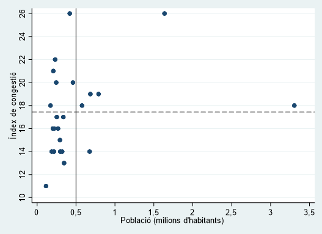
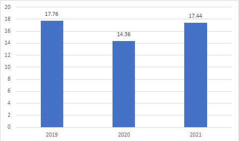

# Efectes de la pandèmia en l’evolució del trànsit

###### Xavier Fageda *(Universitat de Barcelona)* {-}
###### Carlos León-Gómez *(Universitat de Barcelona)* {-}

## Introducció 

La pandèmia originada per la COVID-19 ha tingut un impacte molt important en la mobilitat per les restriccions imposades pels governs, per la por al contagi i per l’extensió del teletreball. Aquesta caiguda de la mobilitat va ser molt forta per a tots els modes de transport l’any 2020, particularment a la primavera, que coincideix amb el confinament estricte derivat de la primera onada de la pandèmia. Tanmateix, l’evolució del trànsit el 2021 ha sigut més heterogènia segons el context geogràfic i el mode de transport analitzats. I més incerta és l’evolució que s’espera que tindrà la mobilitat en el període de la postpandèmia. 

Abans de la pandèmia, hi havia una preocupació creixent sobre el pes excessiu dels cotxes en la mobilitat urbana. En efecte, el gran pes que té el cotxe a les grans ciutats genera importants externalitats negatives en termes de congestió, contaminació, accidents, ocupació de l’espai públic i soroll. En aquest sentit, és evident que a curt termini la pandèmia ha tingut un efecte colateral positiu, ja que menys cotxes ha implicat menys contaminació, congestió, etc. Tanmateix, no és gens clar que en el període de la postpandèmia es redueixi la dependència dels vehicles privats que mostren la majoria de ciutats espanyoles i d’Europa. Per exemple, en el període de la pandèmia es constata una preferència pel vehicle privat en detriment del transport públic. A més, hi ha hagut un creixement del trànsit generat pels vehicles comercials com a conseqüència del boom del comerç electrònic. Per això, els governs locals i metropolitans pot ser que hagin d’assumir nous reptes amb l’objectiu cada cop més generalitzat d’avançar cap a una mobilitat sostenible.

En aquest capítol, posem l’atenció en l’evolució del trànsit en cotxe arran de la pandèmia. En la secció 2, revisem la literatura científica que ha examinat l’impacte de la pandèmia sobre la mobilitat en transport privat. En la secció 3, mostrem algunes dades que ens permeten identificar l’evolució de la congestió arran de la pandèmia a ciutats espanyoles de les quals disposem d’informació. També revisem alguns estudis sobre els impactes de la pandèmia en la mobilitat privada a ciutats espanyoles. Finalment, en l’última secció fem menció de diferents factors que han pres en consideració diversos estudis científics que poden tenir una incidència rellevant en l’evolució del trànsit de vehicles en el període de la postpandèmia. 

## Revisió de la literatura sobre els efectes de la pandèmia en la mobilitat urbana

La pandèmia ha generat canvis en els patrons de transport de les persones a diferents parts del món. Diversos estudis de casos (a partir d’enquestes) que tracten de mesurar l’ús i les preferències de transport abans i durant la pandèmia, han proporcionat una quantitat d’informació considerable sobre l’efecte de la pandèmia en l’ús del cotxe. Per exemple, Abdullah et al. [-@Abdullah2021] analitzen el cas de tres ciutats principals del Pakistan (Lahore, Faisalabad i Rawalpindi, tres de les ciutats més poblades de la regió del Punjab), i troben que la pandèmia ha fet reduir el nombre dels viatges no principals (és a dir, els que no s’han de fer cada dia de la setmana, com ara anar a comprar o assistir a activitats socials, entre d’altres). Tot i això, si es compara amb les persones que no tenen cotxe, els propietaris de cotxes han fet una quantitat de viatges significativament més gran, abans i durant la pandèmia. És més, hi ha hagut una substitució del transport públic pel cotxe privat en itineraris més llargs de 5 km de distància. Per la seva banda, Dias et al. [-@Dias2021] mostren, per al cas de Malàisia, que els propietaris de cotxes privats també han viatjat més que aquells que no ho són, i que entre les raons que han motivat l’elecció modal a favor del cotxe privat hi ha factors de salut derivats de la pandèmia, com ara el compliment del distanciament social o les mesures d’higiene (l’ús de gel hidroalcohòlic i de màscara), entre altres factors. Per al cas d’Alemanya, Eisenmann et al. [-@Eisenmann2021] mostren que, mentre que el transport públic ha tingut una reducció en la participació modal, el cotxe privat s’ha mantingut relativament estable, abans i durant la pandèmia. Przybylowski et al. [-@Przybylowski2021] troben resultats similars per al cas de Gdansk (Polònia): en concret, el $44\%$ dels enquestats declara que ha reduït parcialment l’ús del transport públic a causa de la pandèmia, mentre que el $47\%$ comenta que aquesta reducció ha estat total. En base a això, dels individus que han declarat una reducció parcial en l’ús del transport públic, el $14\%$ assenyala que han canviat del mode de transport públic al privat, mentre que aquesta xifra és del $42\%$ entre els individus que declaren que han reduït l’ús del transport públic de manera total.

La pandèmia no només ha incrementat la disparitat en la freqüència de viatges entre propietaris i no propietaris de cotxes privats, o la substitució del transport públic pel privat, sinó que ha incrementat el desig per adquirir un cotxe privat en famílies que mai n’han tingut. Per exemple, per a la zona metropolitana de Boston, Basu i Ferreira [-@Basu2021] troben que, a causa de la pandèmia, un $18\%$ de les famílies que mai han estat propietàries d’un cotxe privat estan ben decidides a comprar-se’n un. En particular, en el cas de les famílies que consideren de comprar-se un cotxe privat, un $26\%$ pretén fer-ho en un termini inferior a un any. Per al cas d’Alemanya, Eisenmann et al. [-@Eisenmann2021] mostren que, a causa de la pandèmia, un $33\%$ de les famílies que mai no han tingut un cotxe privat haurien volgut tenir-ne un i, fins i tot, un $6\%$ d’aquestes famílies pensen de comprar-ne un.

En concret, les persones que viatgen amb transport públic estan més disposades a canviar el seu mode de transport a causa de diferents factors que tenen a veure amb el risc de contagi de la COVID-19. En aquest sentit, a partir d’una enquesta d’àmbit internacional, Dingil et al. [-@Dingil2021] estimen que el creixement observat en l’ús del transport privat per arribar al lloc de treball és del $26\%$ i per a activitats recreatives és del $15\%$, i això es pot explicar per una percepció de menys risc de contagi en vehicles de transport privat.

El teletreball ha estat considerat com un dels factors que ajuda a explicar el descens de la demanda de transport. En línies generals, Falchetta et al. [-@Falchetta2020] assenyalen que la demanda de transport de passatgers continuarà sent inferior més enllà de l’any 2020, a causa d’un augment del teletreball. Per la seva banda, mitjançant una enquesta nacional a Grècia, Mouratidis et al. [-@Mouratidis2021] documenten un augment substancial de la importància del teletreball ($+31\%$), les teleconferències ($+34\%$), l’aprenentatge en línia ($+34\%$) i la telesalut ($+21\%$), tot derivat de la pandèmia. De fet, la xifra de persones que diàriament han teletreballat, han fet teleconferències i videotrucades amb familiars o amics s’ha quadruplicat durant la COVID-19, mentre que la xifra d’estudiants en línia ha augmentat set vegades. La telesalut i les compres en línia també han augmentat, tot i que de manera més modesta; això ha generat una reducció del transport privat per fer les compres de manera personal, a canvi d’un augment del transport comercial, que s’ha encarregat de lliurar les compres fetes en línia. Mouratidis et al. [-@Mouratidis2022] també assenyalen que, per a Oslo i la regió circumdant de Viken (Noruega), el teletreball ha estat un factor clau que ha reduït la demanda de transport. En el cas dels Estats Units, Barrero et al. [-@Barrero2020] mostren que, a causa de la pandèmia, el teletreball ha contribuït a reduir el temps de trasllat a la feina dels americans en 60 milions d’hores per dia laboral, i el $35\%$ d’aquest estalvi s’ha utilitzat per a activitats relacionades amb la feina. Per ser exactes, Bick et al. [-@Bick2021] indiquen que el maig del 2020 un $35\%$ de la força laboral dels Estats Units va adoptar el teletreball (un $8\%$ més que el mes anterior), cosa que suggereix que la tendència per incrementar aquesta forma de treball continua guanyant terreny des del començament de la pandèmia; de fet, també observen que el $71\%$ dels treballadors que podien desenvolupar les seves tasques de manera remota, ho estaven fent.

Finalment, hi ha certs indicis que assenyalen que la pandèmia també ha causat un augment de la suburbanització, és a dir, el canvi de residència del centre de la ciutat cap a la zona suburbana. En particular, el confinament ha afavorit que els individus que podien treballar de manera remota comencessin a cercar cases que oferissin més comoditat i més espai, i evidentment les han trobades als afores. De fet, per a una mostra de 12 zones metropolitanes dels Estats Units (Boston, New York, Philadelphia, DC, Denver, Portland, San Francisco, Seattle, Baltimore, Cleveland, Detroit, St. Louis, Dallas, Houston, Nashville i Phoenix), Chun et al. [-@Chun2022] fan veure com en la majoria dels casos la pandèmia, en les diferents fases, ha causat un increment del preu dels habitatges suburbans en comparació amb els habitatges de la ciutat principal. Per la seva banda, Murat et al. [-@Uccouglu2021] també assenyalen que, en el cas de la zona metropolitana de Toronto (Canadà), la pandèmia ha accelerat la suburbanització que feia anys que s’observava, la qual cosa ha aprofundit la crisi de l’habitatge en aquesta regió. Stawarz et al. [-@Stawarz2022] troben resultats similars en relació amb el fet que la pandèmia ha incrementat la intensitat de suburbanització a Alemanya.

## Evolució del trànsit i de la congestió a ciutats d’Espanya

La congestió sol mesurar-se com el temps de viatge addicional amb relació a una situació de trànsit fluid. En aquesta línia, TomTom publica en accés obert [dades de congestió de ciutats de tot el món](https://www.tomtom.com/en_gb/traffic-index/ranking/). En particular, TomTom aporta informació d’un indicador de congestió (basat en els temps addicionals de viatge) que mesura els nivells de congestió mitjans de tot l’any. Per exemple, un nivell de congestió del $26\%$ significa que, de mitjana, els temps de viatge van ser un $26\%$ més llargs que en condicions de trànsit fluid. Això significa que un viatge de 30 minuts en condicions de trànsit fluid trigarà a fer-se 8 minuts més quan el nivell de congestió és del $26\%$. 

TomTom ofereix la informació d’aquest indicador per a 25 ciutats espanyoles incloent-hi els anys 2019, 2020 i 2021. Això permet examinar l’impacte de la pandèmia sobre l’evolució de la congestió. El gràfic \@ref(fig:fig3c1) mostra els nivells de congestió mitjans per a les 25 ciutats espanyoles amb relació a la seva població. En primer lloc, podem assenyalar que no hi ha una relació tan clara com podria esperar-se entre congestió i nombre d’habitants. La congestió és el resultat de la interacció complexa de diferents factors, més enllà de la dimensió de la ciutat. 

Barcelona (juntament amb Palma de Mallorca) és la ciutat espanyola amb uns nivells de congestió més elevada, del $26\%$. Val a dir aquí que els nivells de congestió en hores punta són molt més elevats que els nivells de congestió mitjans. Per al cas de Barcelona, els nivells de congestió en hores punta del matí són del $48\%$ (uns 14 minuts més en un trajecte de 30 minuts sense congestió) i del $43\%$ en hores punta de la tarda (uns 13 minuts més en el trajecte tipus de 30 minuts). Això, de mitjana, suposa perdre unes 104 hores de temps en viatges per culpa de la congestió. 

En el cas de la contaminació, l’Organització Mundial de la Salut (OMS) estableix uns llindars recomanats de concentració de contaminants. Per sobre d’aquests llindars, la qualitat de l’aire és prou dolenta per posar en risc la salut dels ciutadans que respiren aquest aire (i la majoria de ciutats espanyoles i europees superen aquests llindars molts dies de l’any). Pel que fa a la congestió, no hi ha uns llindars tan acceptats políticament i socialment com els que estableix l’OMS per poder afirmar que hi ha massa congestió o no n’hi ha tanta. Tanmateix, les dades esmentades ens permeten considerar que els nivells de congestió en una ciutat com, per exemple, Barcelona són molt elevats, i això en un any com el 2021, tan afectat pels estralls de la pandèmia. 

En contrast amb Barcelona, Madrid presenta un nivell de congestió del $18\%$, només lleugerament per sobre de la mitjana espanyola, que es troba en el $17,5\%$. Altres ciutats de més de mig milió d’habitants com València, Màlaga o Sevilla també presenten nivells de congestió similars als de Madrid, mentre que Saragossa mostra nivells de congestió baixos, del $14\%$. Pel que fa a les ciutats de menys de mig milió d’habitants, hi ha molta variabilitat: des de ciutats amb nivells de congestió del $20\%$ o més (Múrcia, Santa Cruz de Tenerife, Granada, la Corunya) fins a ciutats per sota del $15\%$ (San Sebastià, Cadis, Valladolid, Cartagena, Còrdova o Bilbao). Les raons dels diferents nivells de congestió poden ser diverses, incloent-hi, a més del nombre d’habitants, l’estructura urbana (més o menys pes de la ciutat central respecte al conjunt de l’àrea metropolitana), renda, densitat de població, condicions climàtiques, oferta de transport públic o densitat d’autopistes.^[Vegeu Bernardo et al. [-@Bernardo2021] i Albalate i Fageda [-@Albalate2021] per a una anàlisi detallada dels determinants de la congestió a ciutats europees.]  

```{r fig3c1, echo=FALSE, fig.cap="Índex de congestió a ciutats espanyoles l’any 2021", out.width = '100%'}

```

El gràfic \@ref(fig:fig3c2) mostra l’evolució dels nivells de congestió a ciutats espanyoles. Seguint la tendència que es constata també per a ciutats d’altres països, hi ha una caiguda forta de la congestió mitjana el 2020 respecte al 2019. Així, la congestió mitjana passa de gairebé el $18\%$ el 2019 al $14,36\%$ el 2020. La caiguda és d’entorn del $19\%$. Tanmateix, s’observa també una recuperació clara del trànsit el 2021, que es concreta en uns nivells mitjans de congestió del $17,4\%$. És a dir, els nivells mitjans de congestió només són un $2\%$ més baixos el 2021 respecte al 2019. Així que sembla que s’han recuperat molt ràpidament els nivells de trànsit prepandèmia malgrat que el 2021 també s’ha vist afectat per onades fortes de contagi que han comportat restriccions a la mobilitat. 

```{r fig3c2, echo=FALSE, fig.cap="Índex de congestió a ciutats espanyoles l’any 2021", out.width = '100%'}

```

La taula [3.1](#tab:tab3c1) mostra amb més detall l’evolució dels nivells de congestió a ciutats espanyoles abans i després de la pandèmia. En primer lloc, nou ciutats tenen el 2021 uns nivells de congestió inferiors als que tenien el 2019. En aquesta llista, s’inclouen totes les ciutats de més de mig milió d’habitants, excepte Saragossa. 

Madrid és la ciutat on els nivells de congestió són més baixos el 2021 respecte al 2019 ($-2\%$). I de fet, és la ciutat on més forta va ser la caiguda del trànsit el 2020 respecte al 2019 ($-35\%$). Barcelona i ciutats andaluses com ara Sevilla, Màlaga o Granada han seguit un comportament similar amb caigudes per sobre del $20\%$ el 2020 i uns nivells de congestió un $10\%$ inferiors als que es tenien el 2019. D’altra banda, ciutats costeres amb importants fluxos turístics com ara Múrcia, Alacant o Santa Cruz de Tenerife també mostren caigudes de la congestió de més del $20\%$ el 2020, però la recuperació el 2021 respecte al 2019 ha sigut encara més forta que la de les grans ciutats mencionades anteriorment amb uns nivells de congestió inferiors al $10\%$. Finalment, València mostra una caiguda relativament més modesta el 2020 respecte al 2019 ($-15\%$) i la congestió el 2021 és només un $5\%$ inferior al 2019. 

D’altra banda, setze ciutats tenen uns nivells de congestió igual o superiors al 2021 respecte a l’any prepandèmia. Un dels casos més singulars és el de Palma de Mallorca, amb una caiguda molt forta el 2020 ($-33\%$) i una recuperació ràpida el 2021, amb una congestió un $8\%$ per sobre de la que hi havia el 2019. Probablement, els canvis en l’arribada de turistes poden aportar una certa explicació a aquest patró. En una línia similar, a Las Palmas la congestió cau el $17\%$ el 2020 i assoleix els mateixos nivells prepandèmia el 2021. Una altra ciutat amb un comportament singular que mereixeria una anàlisi amb més detall és Oviedo, amb una caiguda de la congestió del $15\%$ el 2020 per després experimentar un creixement de la congestió del $23\%$ respecte al 2019. És també el cas de Valladolid, amb una caiguda de la congestió del $15\%$ el 2020 i un augment de la congestió d’un $8\%$ el 2021.

Altres ciutats pateixen una forta caiguda de la congestió el 2020 amb taxes de reducció del $20\%$ o per sobre, per després assolir el 2021 nivells de congestió similars o superiors a l’any prepandèmia. Aquest és el cas de Sant Sebastià, la Corunya, Cadis o Gijón. 

Hi ha un altre grup de ciutats amb caigudes més modestes de la congestió el 2020, d’entre el $6\%$ i el $14\%$, i que es mantenen amb els mateixos nivells de congestió el 2021 respecte al 2019: Cartagena, Còrdova, Vigo, Bilbao, Saragossa, Pamplona i Santander (aquesta última és l’única amb nivells més alts de congestió el 2021). Finalment, Vitòria és l’única ciutat que no pateix caigudes de la congestió el 2020 respecte al 2019, i mostra un augment de la congestió del $21\%$ el 2021. 

<style type="text/css">
.tg  {border-collapse:collapse;border-spacing:0;}
.tg td{border-color:black;border-style:solid;border-width:0px;font-family:Arial, sans-serif;font-size:17px;
  overflow:hidden;line-height:13px;word-break:normal;}
.tg th{border-color:black;border-style:solid;border-width:0px;font-family:Arial, sans-serif;font-size:17px;
  font-weight:normal;overflow:hidden;line-height:17px;word-break:normal;}
.tg .tg-c3ow{border-color:inherit;text-align:center;vertical-align:top}
.tg .tg-0pky{border-color:inherit;text-align:left;vertical-align:top}
</style>
<table class="tg">
<thead>
  <tr>
    <th class="tg-c3ow">   <br>Ciutat   </th>
    <th class="tg-c3ow">   <br>Congestió el 2021   </th>
    <th class="tg-c3ow">   <br>Canvi el 2020 respecte al 2019   </th>
    <th class="tg-c3ow">   <br>Canvi el 2021 respecte al 2019   </th>
  </tr>
</thead>
<tbody>
  <tr>
    <td class="tg-c3ow" colspan="4">   <br>*Ciutats amb nivells de congestió inferiors als de prepandèmia*   </td>
  </tr>
  <tr>
    <td class="tg-0pky">   <br>Madrid   </td>
    <td class="tg-c3ow">   <br>18   </td>
    <td class="tg-c3ow">   <br>–35 %   </td>
    <td class="tg-c3ow">   <br>–22 %   </td>
  </tr>
  <tr>
    <td class="tg-0pky">   <br>Sevilla   </td>
    <td class="tg-c3ow">   <br>19   </td>
    <td class="tg-c3ow">   <br>–29 %   </td>
    <td class="tg-c3ow">   <br>–10 %   </td>
  </tr>
  <tr>
    <td class="tg-0pky">   <br>Màlaga   </td>
    <td class="tg-c3ow">   <br>18   </td>
    <td class="tg-c3ow">   <br>–25 %   </td>
    <td class="tg-c3ow">   <br>–10 %   </td>
  </tr>
  <tr>
    <td class="tg-0pky">   <br>Barcelona   </td>
    <td class="tg-c3ow">   <br>26   </td>
    <td class="tg-c3ow">   <br>–24 %   </td>
    <td class="tg-c3ow">   <br>–10 %   </td>
  </tr>
  <tr>
    <td class="tg-0pky">   <br>Múrcia   </td>
    <td class="tg-c3ow">   <br>20   </td>
    <td class="tg-c3ow">   <br>–24 %   </td>
    <td class="tg-c3ow">   <br>–5 %   </td>
  </tr>
  <tr>
    <td class="tg-0pky">   <br>Alacant   </td>
    <td class="tg-c3ow">   <br>17   </td>
    <td class="tg-c3ow">   <br>–22 %   </td>
    <td class="tg-c3ow">   <br>–6 %   </td>
  </tr>
  <tr>
    <td class="tg-0pky">   <br>Santa Cruz de Tenerife   </td>
    <td class="tg-c3ow">   <br>21   </td>
    <td class="tg-c3ow">   <br>–22 %   </td>
    <td class="tg-c3ow">   <br>–9 %   </td>
  </tr>
  <tr>
    <td class="tg-0pky">   <br>Granada   </td>
    <td class="tg-c3ow">   <br>22   </td>
    <td class="tg-c3ow">   <br>–20 %   </td>
    <td class="tg-c3ow">   <br>–12 %   </td>
  </tr>
  <tr>
    <td class="tg-0pky">   <br>València   </td>
    <td class="tg-c3ow">   <br>19   </td>
    <td class="tg-c3ow">   <br>–15 %   </td>
    <td class="tg-c3ow">   <br>–5 %   </td>
  </tr>
  <tr>
    <td class="tg-c3ow" colspan="4">   <br>*Ciutats amb nivells de congestió superiors als de prepandèmia*   </td>
  </tr>
  <tr>
    <td class="tg-0pky">   <br>Palma de Mallorca   </td>
    <td class="tg-c3ow">   <br>26   </td>
    <td class="tg-c3ow">   <br>–33 %   </td>
    <td class="tg-c3ow">   <br>8 %   </td>
  </tr>
  <tr>
    <td class="tg-0pky">   <br>Sant Sebastià   </td>
    <td class="tg-c3ow">   <br>14   </td>
    <td class="tg-c3ow">   <br>–21 %   </td>
    <td class="tg-c3ow">   <br>0 %   </td>
  </tr>
  <tr>
    <td class="tg-0pky">   <br>La Corunya   </td>
    <td class="tg-c3ow">   <br>20   </td>
    <td class="tg-c3ow">   <br>–21 %   </td>
    <td class="tg-c3ow">   <br>5 %   </td>
  </tr>
  <tr>
    <td class="tg-0pky">   <br>Cadis   </td>
    <td class="tg-c3ow">   <br>11   </td>
    <td class="tg-c3ow">   <br>–20 %   </td>
    <td class="tg-c3ow">   <br>10 %   </td>
  </tr>
  <tr>
    <td class="tg-0pky">   <br>Gijón   </td>
    <td class="tg-c3ow">   <br>16   </td>
    <td class="tg-c3ow">   <br>–19 %   </td>
    <td class="tg-c3ow">   <br>0 %   </td>
  </tr>
  <tr>
    <td class="tg-0pky">   <br>Las Palmas   </td>
    <td class="tg-c3ow">   <br>18   </td>
    <td class="tg-c3ow">   <br>–17 %   </td>
    <td class="tg-c3ow">   <br>0 %   </td>
  </tr>
  <tr>
    <td class="tg-0pky">   <br>Valladolid   </td>
    <td class="tg-c3ow">   <br>14   </td>
    <td class="tg-c3ow">   <br>–15 %   </td>
    <td class="tg-c3ow">   <br>8 %   </td>
  </tr>
  <tr>
    <td class="tg-0pky">   <br>Oviedo   </td>
    <td class="tg-c3ow">   <br>16   </td>
    <td class="tg-c3ow">   <br>–15 %   </td>
    <td class="tg-c3ow">   <br>23 %   </td>
  </tr>
  <tr>
    <td class="tg-0pky">   <br>Cartagena   </td>
    <td class="tg-c3ow">   <br>14   </td>
    <td class="tg-c3ow">   <br>–14 %   </td>
    <td class="tg-c3ow">   <br>0 %   </td>
  </tr>
  <tr>
    <td class="tg-0pky">   <br>Còrdova   </td>
    <td class="tg-c3ow">   <br>14   </td>
    <td class="tg-c3ow">   <br>–14 %   </td>
    <td class="tg-c3ow">   <br>0 %   </td>
  </tr>
  <tr>
    <td class="tg-0pky">   <br>Vigo   </td>
    <td class="tg-c3ow">   <br>15   </td>
    <td class="tg-c3ow">   <br>–13 %   </td>
    <td class="tg-c3ow">   <br>0 %   </td>
  </tr>
  <tr>
    <td class="tg-0pky">   <br>Bilbao   </td>
    <td class="tg-c3ow">   <br>13   </td>
    <td class="tg-c3ow">   <br>–8 %   </td>
    <td class="tg-c3ow">   <br>0 %   </td>
  </tr>
  <tr>
    <td class="tg-0pky">   <br>Saragossa   </td>
    <td class="tg-c3ow">   <br>14   </td>
    <td class="tg-c3ow">   <br>–7 %   </td>
    <td class="tg-c3ow">   <br>0 %   </td>
  </tr>
  <tr>
    <td class="tg-0pky">   <br>Pamplona   </td>
    <td class="tg-c3ow">   <br>16   </td>
    <td class="tg-c3ow">   <br>–6 %   </td>
    <td class="tg-c3ow">   <br>0 %   </td>
  </tr>
  <tr>
    <td class="tg-0pky">   <br>Santander   </td>
    <td class="tg-c3ow">   <br>18   </td>
    <td class="tg-c3ow">   <br>–6 %   </td>
    <td class="tg-c3ow">   <br>6 %   </td>
  </tr>
  <tr>
    <td class="tg-0pky">   <br>Vitòria   </td>
    <td class="tg-c3ow">   <br>17   </td>
    <td class="tg-c3ow">   <br>0 %   </td>
    <td class="tg-c3ow">   <br>21 %   </td>
  </tr>
</tbody>
</table>
<center><p id='tab:tab3c1'> Table 7.1: Congestió a ciutats espanyoles</p></center>

En conjunt, trobem una caiguda forta de la congestió el 2020 respecte al 2019 i una recuperació en la majoria de ciutats dels nivells de congestió prepandèmia el 2021. El 2020 és un any que inclou un trimestre amb tancament quasi total de totes les activitats no essencials, la generalització de restriccions a la mobilitat tot l’any, o gairebé tot, la generalització del teletreball i una forta davallada general de l’activitat econòmica. D’altra banda, el 2021 hi ha una certa normalització de moltes activitats i una recuperació econòmica parcial. Hi ha també menys restriccions a la mobilitat que el 2020 (i no hi ha cap període de tancament gairebé total). D’altra banda, hi ha factors que poden haver contribuït a l’augment de la congestió. Com hem comentat en la revisió de la literatura prèvia, la por al contagi pot haver estimulat un canvi modal des del transport públic cap al transport privat. A més, el boom del comerç electrònic comporta un augment del trànsit derivat dels vehicles encarregats de la distribució de la mercaderia. Finalment, molts ajuntaments han dut a terme mesures per reduir espai al cotxe en benefici d’altres usos, cosa que a Barcelona es coneix com a *urbanisme tàctic*. 

Una altra conclusió general que podem extreure d’aquestes dades és que l’impacte de la pandèmia en la mobilitat ha sigut molt més fort en grans ciutats com Madrid o Barcelona. També ha sigut especialment fort, particularment el 2020, en aquelles ciutats on el turisme té un pes molt rellevant, com pot ser el cas de Palma de Mallorca, Santa Cruz de Tenerife, Alacant o Màlaga. Tanmateix, la recuperació posterior ha sigut més clara en aquestes destinacions turístiques que no pas a les grans ciutats que, d’altra banda, també rebien molts turistes abans de la pandèmia. 

Finalment, en la pauta general de caiguda forta el 2020 i de recuperació ràpida el 2021, trobem una gran heterogeneïtat en l’evolució de la congestió a les diferents ciutats espanyoles. Una possible explicació és la diferent evolució de la pandèmia en termes de nombre de casos i restriccions específiques imposades per les diferents comunitats autònomes. Una altra podrien ser els canvis en l’evolució econòmica relacionats amb l’estructura econòmica de la ciutat i la regió de l’entorn. Hi ha un altre factor rellevant, que són els nivells previs de congestió, en el sentit que podríem esperar canvis més modestos allà on la congestió no era un problema tan gran el 2019. Finalment, la diferent intensitat o la implementació o no de polítiques per reduir espai al cotxe en favor d’altres usos també podrien tenir-hi un paper. 

En qualsevol cas, la tendència apuntada per aquestes dades és preocupant. La normalització de la situació sanitària en un context de canvis de conducta dels ciutadans i mesures específiques de mobilitat pot comportar un augment de la congestió per sobre dels nivells prepandèmia, que, en el cas d’algunes ciutats com ara Barcelona, és un problema de gran rellevància. En efecte, la congestió és en si mateixa un problema econòmic rellevant en la mesura que redueix la productivitat d’empreses i de treballadors. En aquesta línia, els costos econòmics de la congestió són més elevats que els costos de la contaminació (Comissió Europea, [-@CE2019]), tot i que aquesta última genera més atenció social pels efectes perjudicials que té sobre la salut. Però és que, a més, la congestió empitjora la qualitat de l’aire, en la mesura que conduir amb marxes curtes i amb arrencades i aturades freqüents genera contaminació atmosfèrica.

Per posar en context l’evolució de la congestió a Madrid i a Barcelona, la taula [3.2](#tab:tab3c2) mostra aquesta evolució per a grans ciutats europees de més d’un milió d’habitants. En primer lloc, el 2021, Barcelona i sobretot Madrid no estan particularment congestionades amb relació a les altres ciutats, la qual cosa no exclou que totes ho estiguin. En qualsevol cas, la pauta és força similar a totes les ciutats: caigudes fortes el 2020 respecte al 2019, d’entre el $15\%$ i el $30\%$. En serien excepcions, per una banda, Madrid, Amsterdam, Dublín i Birmingham, amb caigudes de més del $30\%$, i per l’altra, Berlín i Viena, amb caigudes per sota del $10\%$. 

D’altra banda, totes les ciutats excepte Viena tenen nivells de congestió inferiors el 2021 respecte al 2020. En la majoria de ciutats, els nivells de congestió són entre un $5\%$ i un $15\%$ més baixos el 2021. Com a principals excepcions tenim Madrid, Amsterdam i, en menor mesura, Budapest, amb uns nivells de congestió molt inferiors el 2021 respecte al 2019. Trobem nivells de congestió lleugerament per sota del $5\%$ el 2021 respecte al 2019 a Bucarest, Lió i Estocolm. 

En conjunt, malgrat la diversitat en les polítiques implementades i en la intensitat relativa de la pandèmia entre els diferents països europeus, observem més heterogeneïtat entre ciutats grans i mitjanes a Espanya que entre ciutats grans europees. En grans ciutats, sembla que l’impacte de la pandèmia ha sigut molt fort sigui quin sigui el país que s’ha pres en consideració. Tanmateix, això no treu que la congestió el 2021 ja no és tan inferior als nivells que hi havia en temps de prepandèmia, tenint en compte que en la majoria de ciutats grans la congestió era i és una problemàtica amb costos econòmics i mediambientals de gran rellevància. En aquest sentit, és previsible que la congestió en la majoria de ciutats europees arribi a nivells iguals o superiors als que hi havia en el període prepandèmia quan es normalitzi la situació sanitària. 

```{r tab3c2, warning=FALSE, echo=FALSE, results = 'asis', message=FALSE}
library(knitr)
library(dplyr)
library(kableExtra)
a<-c("Bucarest","Varsòvia","Dublín","París","Brussel·les","Londres","Roma","Hamburg","Berlín","Budapest","Lió","Nàpols","Viena","Milà","Praga","Barcelona","Munic","Estocolm","Birmingham","Colònia","Amsterdam","Madrid")
b<-c("0,5","0,37","0,36","0,36","0,34","0,33","0,33","0,31","0,3","0,3","0,29","0,29","0,29","0,28","0,27","0,26","0,26","0,26","0,24","0,24","0,18","0,18")
c<-c("–19%","–23%","–37%","–18%","–24%","–18%","–29%","–15%","–6%","–27%","–17%","–22%","–7%","–26%","–21%","–24%","–20%","–15%","–32%","–19%","–31%","–35%")
d<-c("–4%","–8%","–5%","–8%","–11%","–13%","–13%","–9%","–6%","–19%","–3%","–9%","4%","–10%","–7%","–10%","–13%","–4%","–14%","–8%","–31%","–22%")
matrix<-matrix(c(a,b,c,d),ncol=4,byrow=F)
kable(matrix,col.names=c("Ciutat","Congestió el 2021","Canvi el 2020 respecte al 2019","Canvi el 2021 respecte al 2019"),align=c("l","c","c","c"),booktabs=T)
```
<center><p id='tab:tab2'> Table 7.2: Congestió a ciutats europees de més d’un milió d’habitants</p></center>

D’altra banda, diversos estudis han examinat diferents qüestions relatives a la mobilitat urbana relacionades amb la pandèmia. En primer lloc, trobem estudis que es basen en enquestes fetes en la primera onada de la pandèmia a Espanya la primavera del 2020. Echaniz et al. [-@Echaniz2021] exploten les dades d’una enquesta feta a Cantàbria durant el mes d’abril del 2020 i troben evidència clara d’una preferència més baixa pel transport públic en benefici de mitjans individuals com el cotxe o la bicicleta. Awad-Nuñez et al. [-@Awad2021] també troben evidència d’un canvi fort del transport públic a transports individuals en una enquesta feta a individus residents a ciutats espanyoles l’abril-maig del 2020. Els resultats de l’enquesta en aquest estudi, de manera una mica sorprenent, apunten a una alta acceptabilitat a la implementació de mesures que tinguin com a objectiu reduir el pes del cotxe en la mobilitat i a l’ús de mitjans de transport més sostenibles un cop acabi la pandèmia, tot i que aquesta acceptabilitat és més baixa per part de les persones que van en cotxe particularment per motius no relacionats amb la feina i per part d’individus de renda alta. 

En segon lloc, trobem estudis que utilitzen dades reals. Aloi et al. [-@Aloi2020] exploten microdades de diverses fonts per a la ciutat de Santander i observen una caiguda de la mobilitat la primavera del 2020 del $76\%$ respecte al 2019, tot i que la caiguda és molt més accentuada per al transport públic que per al transport privat. Mejía et al. [-@Mejia2021] analitzen els canvis en la mobilitat arran de la pandèmia a l’àrea metropolitana de Barcelona i fan servir dades de l’enquesta metropolitana del transport del 2018 i del 2019 i dades de telèfons mòbils del 2019 i del 2020. Es registra una caiguda general del nombre de viatges d’un $30\%$ el juny del 2020 en comparació amb la mitjana del 2019. La caiguda és més forta en viatges interiors a la ciutat central respecte al trànsit de penetració i més forta en viatges per feina. D’altra banda, també és destacable que la reducció de la mobilitat és molt menor entre individus de renda alta que no pas entre individus de renda baixa, probablement pel fet que els individus de renda alta tenen més possibilitats de fer ús del teletreball. D’altra banda, Villa i Monzón [-@Villa2021] utilitzen dades diàries de trànsit al centre de Madrid (Madrid Central) per analitzar els efectes del creixement del comerç electrònic amb la pandèmia. Així, troben que el trànsit en aquesta zona era un $35\%$ inferior el juny del 2020 amb relació al mateix període de l’any 2019. En canvi, hi ha un augment important de la proporció del trànsit que generen els vehicles comercials, que en aquest període passa del $9\%$ al $15\%$ del total. 

En conjunt, l’evidència científica sobre els efectes de la pandèmia a Espanya és encara molt limitada i està centrada sobretot en la primera onada. Es documenta que l’impacte en la mobilitat a la primavera va ser molt fort, però amb més incidència en el transport públic que en el transport privat. D’altra banda, dos apunts interessants d’aquesta literatura són: i) l’impacte desigual de la pandèmia segons la renda, amb individus de més renda que tenen més facilitats per evitar la mobilitat, però alhora menys disponibilitat a llarg termini per deixar d’utilitzar el cotxe, ii) el creixement exponencial del comerç electrònic amb possibles efectes negatius a llarg termini de més congestió i les corresponents externalitats negatives associades. 

## Perspectives a llarg termini

La incertesa sobre l’evolució futura de la mobilitat en el període de la postpandèmia és molt alta. Tanmateix, diversos estudis aporten arguments que poden servir de guia per predir aquesta evolució. 

Zhang et al. [-@Zhang2021] mostren els resultats d’una enquesta feta a experts de tot el món sobre els canvis que s’esperen a llarg termini un cop la pandèmia hagi acabat. Hi ha bastant consens que hi haurà un augment del teletreball i que moltes gestions, per exemple les que tenen a veure amb les administracions públiques, es podran fer en línia. Això comportaria una reducció de la demanda de viatges. Tanmateix, també hi ha bastant consens que el comerç electrònic continuarà creixent amb l’augment consegüent del trànsit generat per furgonetes i camions. D’altra banda, també s’espera que es consoli una percepció més negativa del transport públic amb l’augment consegüent de la quota modal del transport privat. També, es considera probable que la pandèmia acceleri el procés de suburbanització a les grans ciutats, en el sentit que molts ciutadans es desplacin a viure a municipis més petits de l’entorn metropolità. La suburbanització pot fer augmentar el nombre de viatges que es fan des de municipis de fora de la ciutat central a la ciutat central. En la mesura que les opcions de transport públic són, en general, pitjors en el trànsit de penetració que en la mobilitat dins de les ciutats, la suburbanització pot comportar un augment de la dependència del cotxe. De manera majoritària, la visió de conjunt dels experts enquestats és pessimista, en el sentit que anem cap a un augment de la mobilitat en cotxe. 

En una línia similar, Currie et al. [-@Currie2021] exploten dades d’una enquesta feta a residents a Melbourne amb preguntes sobre la mobilitat en el període de la postpandèmia. Dels resultats de la seva anàlisi es deriva que la preferència pel transport privat envers del transport públic es mantindrà després de la pandèmia, tot i que de manera menys accentuada que en temps de pandèmia. D’altra banda, també s’espera un ús més generalitzat del teletreball, tot i que molt menys que durant la pandèmia. Tanmateix, no s’espera que aquest ús més elevat del teletreball compensi la preferència pel transport privat respecte al transport públic. 

Tot i això, també trobem estudis que plantegen una perspectiva diferent. Wee i Witlox [-@Van2021], a partir d’un marc teòric, conclouen que es pot esperar una caiguda a llarg termini de la mobilitat tant en cotxe com en transport públic en hores punta com a conseqüència de l’augment d’activitats en línia. No obstant això, reconeixen que és incerta la magnitud d’aquesta reducció de la mobilitat. En canvi, Eliasson [-@Eliasson2022] adopta una perspectiva històrica i no considera que l’augment de la digitalització de l’economia arran de la pandèmia hagi d’anar acompanyada necessàriament d’una reducció de la mobilitat. En aquest sentit, analitza dades històriques per a Suècia que mostren que la demanda de viatges s’ha mantingut estable o ha anat creixent al llarg dels anys, tot i els grans canvis que han tingut lloc tant en estils de vida com en formes de producció i tecnologies disponibles (incloent-hi les tecnologies de comunicació no físiques). 

En resum, l’efecte a curt termini de la pandèmia ha sigut, sens dubte, una caiguda forta de la mobilitat, però els efectes a llarg termini són molt incerts, i fins i tot és possible que acabin implicant un augment de la mobilitat en cotxe. Això farà més necessària la implementació de polítiques adreçades a reduir la dependència del cotxe (i reduir les externalitats associades), com ara la inversió en transport públic i no motoritzat, mesures basades en preus (peatges, cost de l’aparcament, etc.) o en restriccions via quantitats (zones de baixes emissions, reducció de l’espai per als cotxes, etc.). 

