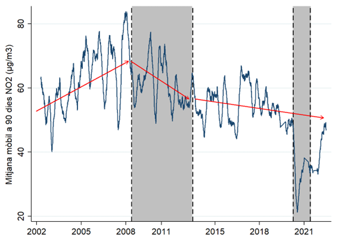
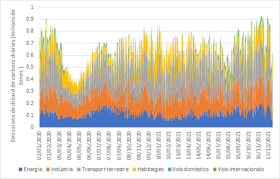
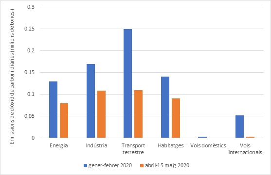
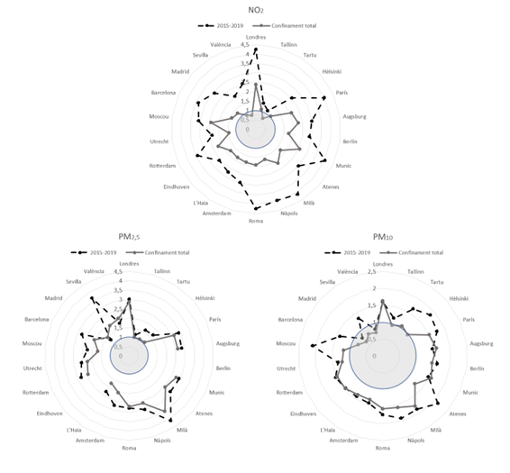
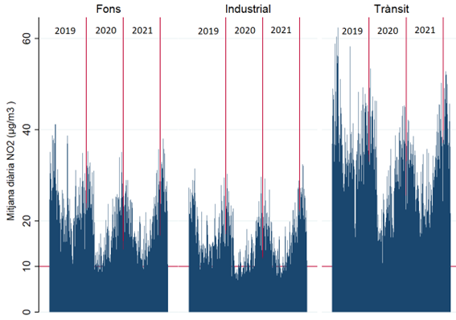
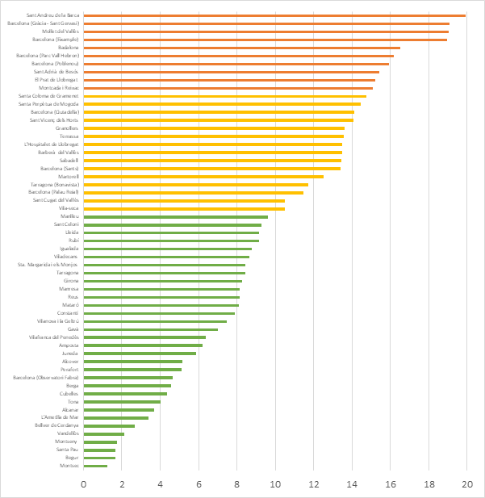
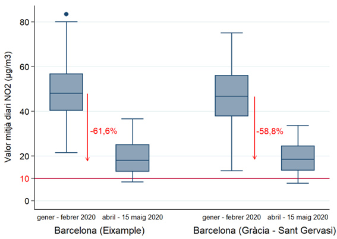

# Medi ambient en temps de la pandèmia

## Introducció 

En els darrers anys, ens hem acostumat a uns nivells elevats de contaminació a les nostres ciutats. Darrerament s’ha avançat molt en la comprensió dels efectes perjudicials de la contaminació atmosfèrica sobre la salut tant a curt com a llarg termini. El principal impacte de la contaminació de l’aire en la salut es produeix per l’exposició crònica i es tradueix en un augment de moltes malalties, així com de la mortalitat. Aquesta situació és realment preocupant donades les dificultats que tenen els poders públics per disminuir la concentració de bona part d’aquests contaminants a les nostres ciutats. Per exemple, si prenem com a referència els últims vint anys a l’estació que mesura la contaminació atmosfèrica a l’Eixample de Barcelona (il·lustració \@ref(fig:fig6c1)), ens adonem que la tendència per disminuir aquesta contaminació és molt lenta. Les crisis econòmiques tenen efectes positius sobre els nivells de contaminació, però, un cop s’acaben, són necessàries altres polítiques per disminuir aquests nivells de contaminació.

```{r fig6c1, echo=FALSE, fig.cap="Evolució del diòxid de nitrogen a l’estació de trànsit de l’Eixample entre el gener 2002 i el març del 2022", out.width = '100%'}

```

La pandèmia ha implicat caigudes dels nivells de contaminació. Amb la pandèmia de la COVID-19 els governs van haver de prendre mesures de restricció de la mobilitat destinades a la contenció de la malaltia, amb els pertinents efectes sobre l’activitat econòmica. Les mesures de confinament van incloure el tancament parcial o complet de les fronteres internacionals, les escoles i les empreses no essencials i, en alguns casos, es va restringir la mobilitat ciutadana. La reducció associada del trànsit i la indústria té impactes tant socioeconòmics com ambientals que s’han començat a quantificar. Mai s’havia donat un esdeveniment que permetés avaluar l’impacte de restriccions severes sobre la mobilitat en els nivells de contaminació a les ciutats a escala global. Tot i això, aquestes restriccions poden tenir uns efectes més aviat transitoris que no pas estructurals sobre els nivells de contaminació. Aquest capítol vol resumir els principals efectes sobre la contaminació durant el 2020 i el 2021, i què en podem aprendre de cara al futur.

El capítol està organitzat de la manera següent: primer, ens fixem en les emissions de gasos d’efecte hivernacle (GEH) durant la pandèmia i els efectes sobre el compliment dels objectius climàtics. A continuació, ho fem per a d’altres contaminants no directament relacionats amb el canvi climàtic. Així, primer ens centrem en els resultats obtinguts degut a les restriccions sobre la mobilitat durant la pandèmia en la contaminació a les ciutats. Després, extrapolem aquestes restriccions sobre el compliment dels límits d’aquests contaminants cap al futur. I per acabar, fem una descripció de les possibles polítiques que caldria aplicar, així com de la seva magnitud. De manera transversal, en cadascun dels apartats, aportarem referències tant a escala internacional com a escala de la ciutat de Barcelona.

## Gasos d’efecte hivernacle durant la pandèmia

Els confinaments lligats a la pandèmia impliquen reduccions de les emissions de gasos d’efecte hivernacle. Le Quéré et al. (2020) i Liu et al. [-@Liu2020] van identificar els cinc sectors principals que més van afectar les emissions de diòxid de carboni durant els confinaments: la generació d’energia i la indústria, la producció de ciment, el transport terrestre, l’aviació i les emissions marítimes, i els edificis comercials i residencials. Molts d’aquests sectors van patir variacions considerables en el seu dia a dia. Per exemple, per al cas d’Espanya, els dies de màxim confinament el consum elèctric va caure un $14,5\%$ els dies laborables i un $10,6\%$ els caps de setmana (Santiago et al., [-@Santiago2021]). Les emissions globals totals de CO~2~ van ser un $8,8\%$ més baixes durant el primer semestre del 2020 que el 2019 (Liu et al., [-@Liu2020]). Per al cas de Catalunya, les emissions de CO~2~ van disminuir un $12,4\%$ durant tot el 2020 comparat amb el 2019 (Generalitat de Catalunya, [-@Generalitat2021]).

A escala planetària, Ray et al. [-@Ray2022] mostren una reducció notable de les emissions anuals de carboni a l’Àsia, l’Amèrica del Nord i Europa durant l’any 2020 en comparació amb el 2019 i un augment a la resta de continents. A l’Àsia, l’Amèrica del Nord i Europa, el 2020 es va observar una reducció notable de les emissions de carboni respecte al 2019. Això s’ha de comparar amb la tendència d’anys anteriors: entre el 2016 i el 2019 hi havia una tendència creixent d’emissions de carboni als continents de l’Amèrica del Nord, Europa i Oceania, on trobem la majoria dels països desenvolupats. En canvi, mentre que a Oceania es va observar també un augment molt notable de les emissions de carboni l’any 2020, a l’Àfrica, l’Amèrica del Sud i l’Antàrtida es va observar una emissió de carboni només lleugerament superior el 2020 respecte al període anterior. Per tant, una reducció de les emissions dels gasos d’efecte hivernacle, però en cap cas uniformement a tot arreu.

Molts països van mostrar una reducció significativa d’aquests gasos per les mesures de confinament imposades el 2020, en comparació amb les emissions del 2019. És el cas d’Itàlia, Espanya, França, Alemanya, el Brasil, Rússia, l’Índia i els Estats Units (EUA). D’altra banda, el Vietnam, Bangladesh, l’Equador, l’Azerbaidjan, l’Argentina, el Japó i l’Iraq van mostrar més emissions anuals de carboni el 2020 que el 2019, a causa de les poques restriccions durant el 2020. Però, dins de cada país, Ray et al. [-@Ray2022] troben patrons molt diferents segons la ciutat. Hi ha països on les emissions del 2019 al 2020 creixen, com és la Xina, i només en algunes ciutats, com ara Pequín i Wuhan, baixen aquestes emissions. Per al cas d’Espanya, troben menys emissions de CO~2~ en conjunt, però a les principals ciutats analitzades (Madrid, Barcelona, Sevilla i València) hi ha una disminució de les emissions de CO~2~ molt més pronunciada que a la resta del país; Barcelona és la que més redueix les emissions de CO~2~ durant el 2020 en comparació amb el 2019. Així, queda clar que la contundència del confinament afecta les emissions de gasos d’efecte hivernacle. 

Per al cas d’Espanya, a la il·lustració \@ref(fig:fig6c2) mostrem de manera desagregada, per als principals sectors, les emissions diàries de l’any 2020 i del 2021 a partir de la metodologia de Liu et al. [-@Liu2020]. Veiem com les emissions totals en el primer confinament cauen a la meitat respecte a principis de l’any 2020, i com es recuperen ràpidament, amb la recuperació de la mobilitat i la indústria. Tot i això, aquests nivells només es recuperen temporalment a finals de l’any 2020 i del 2021. I és a finals de l’any 2021 quan les emissions ja són iguals que les de l’inici de la pandèmia.

```{r fig6c2, echo=FALSE, fig.cap="Evolució de les emissions de diòxid de carboni diàries a Espanya durant el 2020 i el 2021 *Font: elaboració pròpia a partir de eucarbonmonitor.org (Liu et al., [-@Liu2020]).*", out.width = '100%'}

```

A la il·lustració \@ref(fig:fig6c3) ens fixem en les diferències d’emissions diàries just abans que comencés el primer confinament (entre el 2 de gener i el 15 de febrer del 2020) i les emissions diàries d’un dels moments de confinament més estricte a Espanya (entre l’1 d’abril i el 15 de maig del 2020). En termes absoluts, la gran disminució d’emissions de CO~2~ es dona en el transport terrestre seguit per la indústria, l’energia i els habitatges. En canvi, la disminució més baixa en termes absoluts són els vols domèstics i els internacionals. Per contra, en termes percentuals, els vols domèstics disminueixen les emissions de CO~2~ un $79\%$, mentre que els internacionals un $93\%$. 

```{r fig6c3, echo=FALSE, fig.cap="Comparació de les emissions diàries de diòxid de carboni abans i durant el primer confinament *Font: elaboració pròpia a partir de eucarbonmonitor.org (Liu et al., [-@Liu2020]).*", out.width = '100%'}

```

L’avanç de l’estimació de les emissions de GEH totals de Catalunya per a l’any 2020 és de 38,5 milions de tones de CO~2~ equivalents (Generalitat de Catalunya, [-@Generalitat2021]). Les emissions de GEH totals a Catalunya suposen una reducció global del $12,4\%$ respecte de les emissions de l’any 2019. L’any 2020, l’objectiu per a les emissions totals de Catalunya era d’un creixement màxim del $4\%$ respecte dels nivells del 1990. Les emissions estimades per a l’any 1990 van ser de 38,9 milions de tones. Per tant, les emissions de l’any 2020 van estar un $1\%$ per sota dels valors de l’any 1990. Ara bé, a partir de l’aplicació de factors correctors de la metodologia de Liu et al. [-@Liu2020] sobre les dades que tenim, Catalunya haurà tingut unes emissions d’uns 42,26 milions de tones de CO~2~ l’any 2021, un $8,64\%$ més que el llindar del 1990. Aquest fet posa de manifest que, un cop passada la pandèmia, les emissions de gasos d’efecte hivernacle es tornen a recuperar i que la pandèmia ha tingut efectes més transitoris que estructurals.

Per a l’any 2030, les emissions han de ser un $55\%$ inferiors a les del 1990 per al conjunt de la Unió Europea, segons es va ratificar en el Consell Europeu celebrat el desembre del 2020. Però, si traslladéssim les emissions que va haver-hi a Espanya durant el mes d’abril i la primera quinzena de maig del 2020 a tot l’any 2020, encara ens trobaríem per sobre dels objectius marcats. Així, per tal d’aconseguir una reducció del $55\%$, encara faltarien uns quaranta milions de tones de diòxid de carboni. Aquesta quantitat equivaldria a la totalitat de les emissions del transport terrestre a Espanya durant un any amb un patró de mobilitat com el del període de confinament estricte a Espanya. Per tant, complir els acords de reducció de diòxid de carboni per a Espanya implicaria un 2030 amb les emissions equivalents als dies de confinament més estricte, així com suprimir la totalitat de la mobilitat terrestre. Aquesta comparativa ens permet il·lustrar l’abast del repte que comporta la reducció d’emissions de gasos d’efecte hivernacle per als propers anys.

Un últim aspecte gens negligible és la desigualtat en les emissions de gasos d’efecte hivernacle en la mobilitat. Per a l’àrea metropolitana de Barcelona, el $10\%$ dels seus habitants que més gasos d’efecte hivernacle emet per la seva mobilitat quotidiana representa el $49\%$ del total de les emissions. I el $20\%$ que més emet representa el $74\%$ del total de les emissions (Bel i Rosell, [-@Bel2017]). Per posar amb perspectiva aquestes xifres, la desigualtat que hi ha en emissions de diòxid de carboni és molt més elevada que la desigualtat econòmica a la mateixa àrea. Tot i aquestes xifres, Barcelona no sembla ser un cas especial en aquesta desigualtat; Leroutier i Quirion [-@Leroutier2022] troben que aquest $20\%$ emet el $75\%$ de les emissions de la mobilitat quotidiana a París i la seva conurbació. Així, les polítiques han d’anar dirigides a un segment molt concret d’individus que generen bona part de les emissions.

## Mobilitat i contaminació atmosfèrica durant la pandèmia

El primer resultat incontestable és una relació entre les restriccions a la mobilitat i la caiguda dels nivells de contaminació. El segon és: com més relacionat està el contaminant amb el trànsit rodat, més gran és la caiguda dels nivells de contaminació. Per exemple, els òxids de nitrogen (NO~x~) estan molt lligats a la mobilitat en ser un contaminant primari, seguits a més distància per les partícules de menys de 10 micròmetres (PM~10~), o encara amb menys relació el monòxid de carboni (CO). Menys lligats hi trobem els òxids de sofre (SO~x~). Tots poden ser classificats com a contaminants primaris, mentre que altres contaminants es formen a partir de processos secundaris, com és el cas de l’ozó (O~3~). I d’altres, poden tenir un origen primari o secundari, com poden ser les PM~2,5~.

A Europa, les reduccions d’emissions van ser d’un $-33\%$ per als NO~x~, un $-7\%$ per als SO~x~ i un $-7\%$ per a les PM~2,5~ durant el període de confinament més estricte, i el transport per carretera és el que més va contribuir-hi, excepte per al cas dels SO~x~. Als països amb confinaments més estrictes, com Espanya, Itàlia o França, aquestes reduccions van ser més elevades, al voltant del $-50\%$ per als NO~x~ o $-15\%$ per a les PM~2,5~ (Guevara et al., [-@Guevara2021]). La quantitat d’estudis és nombrosa i la majoria mostren aquestes proporcions, així com també un efecte rebot en una concentració més alta d’ozó (Baldasano, [-@Baldasano2020]; Bhat et al., [-@Bhat2021]; Dang i Trinh, [-@Dang2021]; Tobías et al., [-@Tobias2020]; Hashim et al., [-@Hashim2021]; Ju et al., [-@Ju2021]; Mahato i Ghosh, [-@Mahato2020]; Querol et al., [-@Querol2021]; Ropkins i Tate, [-@Ropkins2021]).

Tots aquests estudis ens han de permetre poder fer generalitzacions que ens donin una millor perspectiva. Un dels valors resum d’aquests confinaments el trobem a Sokhi et al. [-@Sokhi2021] i el resumim a la taula \@ref(tab:tab6c1). Per cada $1\%$ de reducció de la mobilitat, la disminució dels nivells de NO~2~ és del $0,6\%$ ± $0,2\%$ (al $95\%$ de confiança). A més, per a les ciutats europees, aquest valor d’elasticitat es troba entre el $0,6\%$-$0,8\%$, la qual cosa implica que reduccions de la mobilitat anirien acompanyades de disminucions més grans en els nivells de NO~2~ que no pas en d’altres zones, com ciutats de l’Amèrica del Nord. Això es deu al fet que els nivells d’aquest contaminant també es veuen afectats per altres fonts, com la indústria o el model de ciutat. Així, les polítiques lligades a les reduccions de NO~2~ per al trànsit rodat tindran un impacte més gran a ciutats europees que a les ciutats nord-americanes. I pel que fa a les ciutats espanyoles, els resultats que troben van en la línia de la majoria de ciutats europees. Tot i això, Querol et al. [-@Querol2021] ens donen una elasticitat per a estacions de trànsit elevat de 0,4. Malgrat això, els resultats de Barcelona es troben dins dels valors esperats per Sokhi et al. [-@Sokhi2021].

Tot i les bones notícies per a les nostres ciutats en relació amb el NO~2~, Sokhi et al. [-@Sokhi2021] no ens donen bones notícies per als altres contaminants. No apareixen unes relacions clares en disminucions dels contaminants per reduccions de la mobilitat en el cas del CO ni de PM~2,5~. Així, una reducció de l’$1\%$ de la mobilitat implica disminucions només del $0,2\%$ per al CO i per a PM~2,5~. A més, per al cas de les ciutats europees i espanyoles, la magnitud d’aquest impacte es troba més proper a zero. Així, una reducció de la mobilitat no tindrà el mateix efecte per a tots els contaminants, ja que hi ha molts altres factors que mitiguen o accentuen aquests nivells.

```{r tab6c1, echo=FALSE, warning=FALSE, results = 'asis', message=FALSE}
library(knitr)
library(dplyr)
library(kableExtra)
a<-c("NO~2~","CO","PM~2,5~")
b<-c("0,6 ± 0,2","0,2 ± 0,3","0,2 ± 0,3")
c<-c("0,6 ± 0,2","0,1 ± 0,1","0,1 ± 0,1")
d<-c("0,6 ± 0,2","0","0,1 ± 0,1")
matrix<-matrix(c(a,b,c,d),ncol=4,byrow=F)
kable(matrix,col.names=c("Contaminant","Totes les ciutats","Ciutats europees","Ciutats espanyoles"),caption="Elasticitat entre mobilitat i contaminació per a diferents contaminants",align=c("l","c","c","c"),booktabs=T) %>%
footnote(general = " extret i adaptat a partir de Sokhi et al. [-@Sokhi2021]", general_title = "Font:", footnote_as_chunk = T)
```

<html lang="en">
  <head>
    <meta charset="UTF-8" />
    <meta name="viewport" content="width=device-width, initial-scale=1.0" />
    <title> Page Title </title>
    <style>
      .boxed {
        background: lightgrey;
        color: black;
        border: 3px solid black;
        margin: 0px auto;
        width: 750px;
        padding: 10px;
        border-radius: 10px;
      }
    </style>
  </head>
  <body>
    <div class="boxed">
**Confinament i nivells de contaminació, una relació no tan simple**

Els investigadors sempre han buscat com aturar totalment o parcialment l’activitat d’una ciutat per trobar l’impacte sobre la qualitat de l’aire. Tot i això, un dels problemes que trobem en molts estudis és la comparació en moments diferents. Per exemple, per saber com el confinament de la primavera del 2020 va afectar la contaminació d’una ciutat, agafem els valors del 2019 o tan sols els de la primavera del 2019, per saber quin ha sigut el percentatge de reducció de contaminació causat per la pandèmia. Això ens porta a suposar que totes les altres variables s’han mantingut constants entre el 2019 i el 2020 (desenvolupament tecnològic, dinàmica atmosfèrica...). Van Heerwaarden et al. [-@Van2021] van demostrar que durant la primavera del 2020 una gran part de l’Europa occidental va experimentar un clima excepcionalment assolellat i sec des del 23 de març fins a finals de maig del 2020. Les hores de sol van ser anòmalament més llargues al Regne Unit, a Bèlgica, a Alemanya i als Països Baixos, combinat amb molts dies de cels clars. Per exemple, els Països Baixos van registrar 805 hores de sol, en comparació amb una mitjana històrica de 507 hores. Això va ser un rècord per a aquest país que no es donava des del 1928. Aquesta situació es tradueix en una afectació a la dispersió i generació de contaminants a l’atmosfera que molts estudis no tenen en compte. Ben segur que per a molts contaminants podem dir que el confinament va comportar-ne una reducció, però la magnitud pot estar en entredit per a la majoria dels estudis.

Un dels exemples que hem pres és reproduir un estudi que reporti dades en obert de diferents contaminants i de diferents llocs a la vegada. Per al cas dels Estats Units, Chen et al. [-@Chen2020] miren fins a vint-i-vuit ciutats fins al 30 d’abril del 2020, i fan una comparativa amb la mitjana del 2017 al 2019. En el nostre cas, apliquem un model de regressió lineal tot tenint en compte, no només efectes temporals i espacials de cada ciutat, sinó variables meteorològiques com la velocitat del vent, la temperatura màxima i mínima, així com també la quantitat de pluja recollida. A la taula \@ref(tab:tab6c2) mostrem les variacions de les concentracions dels contaminants per l’efecte del confinament en els resultats de l’estudi original i els valors que incorporen aquests efectes espacials, temporals i meteorològics. Per a la majoria dels contaminants, trobem que aquests impactes es veuen modificats entre un $20\%$ i un $65\%$. Amb aquestes dades volem posar sobre la taula que molts estudis que aporten valors de reducció de la contaminació durant el confinament poden ser fortament esbiaixats i inconsistents. Així, incorporar variables de control ens porta a resultats molt diferents, que tenen una importància especial en el disseny de polítiques de mitigació de la contaminació atmosfèrica. 

```{r tab6c2, echo=FALSE, results = 'asis', message=FALSE}
library(knitr)
library(dplyr)
library(kableExtra)
a<-c("NO~2~","CO","PM~2,5~","PM~10~","O~3~")
b<-c("-22%", "-10%", "0%", "-13%", "-8%")
c<-c("-17%***","-4,4%***","-5,6%**","-4,5%**","4,3%**")
matrix<-matrix(c(a,b,c),ncol=3,byrow=F)
kable(matrix,col.names=c("Contaminant","Impactes originals (Chen et al. [-@Chen2020])","Impactes modificats"),caption="Efectes del confinament en els contaminants segons l’estudi original i amb modificacions",align=c("l","c","c"),booktabs=T) %>%
footnote(general =c("*** significatiu al 99%, ** significatiu al 95%"), general_title = "", footnote_as_chunk = T)
```
  </body>
</html>

## Límits de contaminació a les nostres ciutats

Una de les preguntes que ens podem fer és, si la severitat del confinament s’hagués donat durant tot l’any 2020, quins efectes hauria tingut sobre la qualitat de l’aire durant el 2020. Més concretament, si amb un confinament estricte ens hauríem posat per sota dels llindars fixats per l’Organització Mundial de la Salut (OMS). Sokhi et al. [-@Sokhi2021] es fan aquesta pregunta i intenten posar valors a aquestes restriccions aplicant els llindars d’aquesta organització (World Health Organization [WHO], [-@World2006]). A la il·lustració \@ref(fig:fig6c4) fem el mateix exercici, però amb els llindars més restrictius de l’OMS establerts el 2021 per al NO~2~, PM~2,5~ i PM~10~, que són de 10, 5 i 15 µg/m^3^ de mitjana anual per a les ciutats europees (World Health Organization, [-@Weltgesundheits2021]), respectivament. Apliquem el valor mitjà de contaminació per a aquella ciutat si el confinament total hagués estat durant tot l’any 2020 i també per al període 2015-2019, i el dividim entre el llindar de l’OMS anterior segons el contaminant. Si el quocient es troba per sobre de la unitat, indica que aquella ciutat no compleix el llindar (World Health Organization, [-@Weltgesundheits2021]), mentre que, si està per sota la unitat, el compleix. 

Trobem que per a totes les ciutats europees, per al període 2015-2019, s’ha superat el llindar de l’OMS per al NO~2~, mentre que si estenem el confinament total per a tot el 2020, només Tartu, Sevilla i València passarien aquest llindar. Així, estar sota un confinament total portaria a complir aquest límit per al diòxid de nitrogen. Pel que fa a les PM~2,5~, la situació és molt més complicada: ni cap ciutat ha aconseguit arribar al límit en el període 2015-2019, ni amb polítiques de confinament total aquestes ciutats arribaran a complir els límits de l’OMS. Pel que fa a les PM~10~, la situació és ben diferent. Hi ha ciutats que han complert els nous límits per al període 2015-2019, com Madrid i València, mentre que, si la situació del confinament total s’estengués, sis de les vint-i-dues ciutats tindrien valors de contaminació inferiors als límits de l’OMS. Així, les quatre ciutats espanyoles analitzades es trobarien per sota d’aquest llindar. Els resultats que es desprenen d’aquesta anàlisi són molt clars: la majoria de grans ciutats europees estan molt lluny de complir els nous límits de l’OMS. La severitat de les mesures aplicades durant el confinament continuarien sent insuficients per aconseguir una qualitat de l’aire amb els nous estàndards de l’OMS. 

```{r fig6c4, echo=FALSE, fig.cap="Excés de contaminants en diferents ciutats europees *Font: extret i adaptat a partir de Sokhi et al. [-@Sokhi2021] per als límits de contaminació de l'OMS (2021).*", out.width = '100%'}

```

Seguint el fil argumental anterior, ara analitzarem aquests límits a Catalunya. Ens fixarem en l’evolució temporal dels contaminants durant els mesos de pandèmia a partir de les estacions de mesura de contaminants atmosfèrics de la Generalitat de Catalunya (XVPCA, [-@Xvpca2022]). A la il·lustració \@ref(fig:fig6c5) mostrem la mitjana diària de diòxid de nitrogen segons si l’estació és de fons, en zona industrial o de trànsit. El període temporal és de l’1 de gener del 2019 al 15 de març del 2022. Com a comú denominador, tots tres gràfics presenten un patró estacional, amb pics de diòxid de nitrogen a l’hivern, i són les estacions de trànsit les que presenten uns valors més elevats. Un cop començat el primer confinament i el més sever de tots a mitjans de març del 2020, les disminucions més importants de diòxid de nitrogen es donen en les estacions de trànsit. Tot i aquestes baixades, no s’arriba ni al valor mitjà diari dels 10 µg/m^3^, que facilitaria el camí per poder complir el límit anual. En canvi, les estacions de fons i industrials aconsegueixen rebaixar aquest límit. Coincidint amb el final de la pandèmia, l’hivern del 2021-2022 es detecta un augment dels nivells de contaminació, tot i que encara, en termes bruts i sense controlar per a altres factors, són lleugerament inferiors als d’abans de l’inici de la pandèmia. Així, la pandèmia hauria portat canvis temporals en les emissions de diòxid de nitrogen, i no es detectaria cap canvi de patró estructural en les emissions un cop acabada.

```{r fig6c5, echo=FALSE, fig.cap="Evolució temporal del NO~2~ segons el tipus d’estació *Font: elaboració pròpia a partir de XVPCA [-@Xvpca2022].*", out.width = '100%'}

```

Tot seguit, volem portar el focus a tots els municipis de Catalunya on hi ha dades disponibles per mirar si es compleix el llindar marcat per la WHO [-@Weltgesundheits2021]. Així, per mesurar aquesta distància dels llindars marcats per l’OMS, agafem aquestes mateixes estacions de mesura de contaminants atmosfèrics de la Generalitat de Catalunya (XVPCA, [-@Xvpca2022]). Pel que fa al període temporal, agafem els dies en què el confinament va ser més estricte, i donant uns dies de marge amb l’inici per disminuir l’efecte de la contaminació en dies anteriors d’abans del confinament. Així, escollim les dates entre l’1 d’abril del 2020 i el 15 de maig del 2020 per obtenir la mitjana a cadascuna de les estacions. Els 10 µg/m^3^ és el llindar marcat per World Health Organization [-@Weltgesundheits2021] i ens permet classificar els municipis entre els que no superen el límit, els que el superen fins a un $50\%$ i els que superen aquest límit més d’un $50\%$ (il·lustració \@ref(fig:fig6c6)).

Les estacions que superen un $50\%$ aquest límit (més de 15 µg/m^3^) es troben a Barcelona, són limítrofes a aquesta ciutat o es troben a prop de Barcelona i amb una presència destacada d’indústria (Sant Andreu de la Barca o Mollet del Vallès). Un segon conjunt de ciutats són les que tenen un valor entre els 10 i 15 µg/m^3^. Es tracta d’estacions en ciutats al voltant de Barcelona, la majoria més allunyades que les anteriors de Barcelona, ciutats amb molts habitants, com Terrassa o Sabadell, així com municipis a prop de zones industrials, com Santa Perpètua o Granollers. També trobem estacions de Barcelona més allunyades de les zones de trànsit rodat, com Palau Reial o el parc de la Ciutadella. I finalment, a la categoria per sota del llindar de l’OMS, hi ha petits municipis, ciutats mitjanes com Igualada, Manresa, Reus i Mataró, així com dues capitals de província (Girona i Lleida). Pel que fa a Tarragona, hi ha estacions que superen aquest límit i d’altres que hi estan per sota. 

```{r fig6c6, echo=FALSE, fig.cap="Mitjana del diòxid de nitrogen (µg/m^3^) entre l’1 d’abril i el 15 de maig del 2020 *Font: elaboració pròpia a partir de XVPCA [-@Xvpca2022].*", out.width = '100%'}

```

Aquesta classificació ens porta a poder plantejar mesures amb una intensitat diferenciada segons el grup en què es trobin. Els municipis per sota del llindar dels 10 µg/m^3^ s’han de focalitzar en les principals fonts d’emissió d’aquests òxids de nitrogen, ja sigui perquè hi ha una indústria o activitat propera o per vehicles altament contaminants en els seus municipis. Els municipis que es troben per sobre d’aquest llindar han de prendre mesures de més intensitat i en diverses direccions. Aquests municipis han vist com augmentaven les seves emissions durant l’any 2021, fet que encara els allunya molt més d’aquest llindar.

Pel que fa a les PM~10~, repetim la mateixa anàlisi que en el cas dels NO~2~ i seleccionem les estacions de la XVPCA [-@Xvpca2022] manuals que recullen les dades d’aquest contaminant. El límit segons l’OMS (WHO, [-@Weltgesundheits2021]) és de 15 µg/m^3^. Trobem que un total de vint estacions de quaranta-set van superar aquest límit durant els dies de màxim confinament. Tot i això, cap de les estacions va superar el llindar del $50\%$ d’aquest límit, mentre que en el cas del NO~2~ gairebé una de cada cinc estacions el va superar. La proporció de PM~10~ provinents del trànsit rodat és menor que en el cas del NO~2~, fet que pot explicar els millors resultats.

## Polítiques per reduir la contaminació atmosfèrica 

Davant d’aquests elevats nivells de contaminació, els governs han de prendre mesures per reduir-la. Cada vegada més es dona per assegurada la idoneïtat d’introduir un conjunt de mesures per mitigar els efectes de la contaminació atmosfèrica, ja que una sola mesura pot no ser suficient. Aquest argument és parcialment vàlid, ja que hi podria haver una mesura molt dràstica que permetés aconseguir l’objectiu. Tot i això, aquesta política podria aconseguir la reducció d’emissions, però podria no ser socialment desitjada, i sembla que els governs opten per un conjunt de mesures que pretenen aconseguir el mateix objectiu però amb un menor cost social. Segons el nostre punt de vista, ens podem trobar en un escenari en què una gran quantitat de mesures pot donar a entendre que s’estan prenent mesures, però, a la pràctica, ser molt lluny d’aconseguir l’objectiu. 

Per exemple, Rodriguez-Rey et al. [-@Rodriguez2022] simulen l’impacte de diferents mesures a Barcelona i voltants combinant un model macroscòpic de trànsit i d’emissions en zones de trànsit elevat. A la taula \@ref(tab:tab6c3) mostrem els resultats sobre les emissions de NO~2~ de les diferents mesures que analitzen.

```{r tab6c3, echo=FALSE, results = 'asis', message=FALSE}
library(knitr)
library(dplyr)
library(kableExtra)
a<-c(1:7)
b<-c("", "X", "", "X", "","X","X")
c<-c("","","X","X","","X","X")
d<-c("","","","","X","X","X")
e<-c("","","","","","","X")
f<-c("--","0,1%","0,1%","0,2%","-13,1%","-12,9%","-30,6%")
matrix<-matrix(c(a,b,c,d,e,f),ncol=6,byrow=F)
kable(matrix,col.names=c("Mesura","Urbanisme tàctic","Superilles","ZBE","Reducció de demanda 25%","Variació d'emissions de NO~2~"),caption="Efectes de diferents polítiques sobre els nivells de diòxid de nitrogen",align="c",booktabs=T) %>%
  footnote(general = " Rodríguez-Rey et al. [-@Rodriguez2022])", general_title = "Font:", footnote_as_chunk = T)
```

Es desprèn que l’urbanisme tàctic o les superilles tenen un impacte en la direcció contrària de l’objectiu perseguit. Això és degut al fet que generen una redistribució del trànsit; tot i que en els llocs on s’ubiquen hi ha reduccions d’emissions, se’n registra un augment en els carrers propers. Una altra política és la implantació de la zona de baixes emissions (ZBE). Els primers estudis dels efectes de la ZBE a Barcelona no indiquen un canvi apreciable en el nivell de NO~2~ a l’aire (ASPB, [-@Zbe2020]). Aquest resultat no és descoratjador, ja que tot fa pensar que en futurs estudis es trobarà un impacte que reduirà la contaminació per NO~2~ un cop es puguin separar els efectes de la caiguda del trànsit per la pandèmia dels efectes de la ZBE. Però, tot i això, la ZBE continuarà sent una mesura insuficient, tot i que s’estengui a vehicles menys contaminants tal com es mostra a la taula \@ref(tab:tab6c3). 

Aquestes mesures amb un impacte molt baix no serien les primeres que s’han pres a l’àrea de Barcelona per lluitar contra la contaminació atmosfèrica. El 2008 la Generalitat va limitar la velocitat màxima a 80 km/h a les principals vies d’accés al voltant de Barcelona per reduir la contaminació i els accidents, principalment. Els efectes sobre els nivells d’òxid de nitrogen i PM~10~ van ser negligibles, i fins i tot contraproduents, en el cas del diòxid de nitrogen (Bel i Rosell, [-@Bel2013]; Bel et al., [-@Guillen2014]). Aquestes polítiques, com les superilles o l’urbanisme tàctic, poden distreure la ciutadania de la urgència d’aplicar polítiques més ambicioses en la reducció de la contaminació. 

A l’escenari 7 de la taula \@ref(tab:tab6c3) s’apliquen totes les mesures. S’hi afegeix la reducció de la demanda de la mobilitat privada del $25\%$ i, juntament amb totes les mesures anteriors, s’aconsegueix una reducció de les emissions d’un $30,6\%$. L’impacte mitjà a les estacions de l’Eixample i Gràcia, les estacions analitzades per Rodriguez-Rey et al. [-@Rodriguez2022], és una reducció del $27\%$ i del $38\%$, respectivament, dels valors mitjans diaris de NO~2~. Si analitzem les reduccions dels valors mitjans diaris en aquestes dues estacions entre el gener i el febrer del 2020 i les comparem amb les de l’abril i mitjans de maig del 2020, trobem disminucions dels nivells d’immissió en aquestes estacions entre el $58,8\%$ i el $61,6\%$ (il·lustració \@ref(fig:fig6c7)). Aquests mateixos valors en els ofereixen Querol et al. [-@Querol2021] per a les dues estacions de referència de Barcelona lligades al trànsit (Eixample i Gràcia). I arriben a conclusions semblants: si disminuïm el trànsit un $25\%$ entre setmana, reduirem els nivells de contaminació de NO~2~ fins als 40 µg/m^3^. Si volem arribar al límit dels 20 µg/m^3^ anuals, hem de disminuir el trànsit un $70\%$ els dies entre setmana. I si volem arribar al límit dels 10 µg/m^3^, estaríem al voltant d’una reducció del $80\%$.

```{r fig6c7, echo=FALSE, fig.cap="Variació dels nivells mitjans diaris de NO~2~ abans i durant el confinament sever en estacions de trànsit *Font: elaboració pròpia a partir de XVPCA [-@Xvpca2022].*", out.width = '100%'}

```

Tal com hem comentat al començament d’aquest capítol, entre principis d’abril i mitjans de maig del 2020, la mobilitat a la ciutat de Barcelona va caure entre un $45\%$ i un $90\%$, segons el dia o si es tractava de les rondes, les vies d’entrada a la ciutat o dins de la mateixa ciutat. Tot i que aplicar aquestes reduccions del trànsit poden ser considerades mesures dràstiques, permet fer una comparativa amb les proposades per Rodriguez-Rey et al. [-@Rodriguez2022]. Amb el conjunt de mesures anteriors, estarem molt lluny del límit que ens marca l’OMS. Tota mesura que no tingui uns efectes molt grans en el nostre dia a dia no ens solucionarà el problema de la contaminació a les nostres ciutats. Res fa pensar que polítiques de reducció del vehicle privat no siguin possibles. Segons l’Ajuntament de Barcelona [-@Ajuntament2021], el $74\%$ està a favor de reduir el trànsit de vehicle privat motoritzat a la ciutat. Als barris amb nivells de contaminació més elevats i més trànsit privat, com l’Eixample, el grau de suport és del $69\%$. Així, l’escenari de proposar mesures de més intensitat no sembla del tot impossible.

Però aquestes mesures potser no han de ser uniformes per a tothom. Pel que fa als contaminants atmosfèrics, hi ha desigualtats en les emissions. En la mobilitat quotidiana, Leroutier i Quirion [-@Leroutier2022] troben que el $20\%$ de la població que més òxids de nitrogen emet representa el $85\%$ del total de les emissions d’aquest contaminant. Una proporció semblant per a les PM~2,5~: el $20\%$ que més emet representa el $74\%$ de les emissions d’aquest contaminant. Aquest grup d’emissors que contamina tant té dues característiques importants: viu fora de la ciutat principal (París), disposa de vehicle propi i el seu nivell de renda no importa per ser un alt emissor.

Poder diferenciar aquests emissors és clau per fer polítiques específiques per mitigar la contaminació. I per aquestes mesures, i la seva intensitat, s’ha de tenir en compte la vessant de l’equitat. Leroutier i Quirion [-@Leroutier2022] troben una associació positiva entre els ingressos baixos i la intensitat de la contaminació i una associació negativa entre els ingressos baixos i la distància recorreguda i els ingressos baixos i l’ús del cotxe. Així, una política que prohibeix els cotxes més contaminants sense tenir en compte el nombre de quilòmetres recorreguts podria ser socialment injusta: afectaria les persones d’ingressos baixos amb un cotxe contaminant però que condueixen només uns pocs quilòmetres, però no les persones amb ingressos alts que tinguin un cotxe menys contaminant però que condueixin més quilòmetres amb aquest vehicle i que en general tinguin més emissions.

A més, les polítiques motivades per objectius de qualitat de l’aire poden tenir efectes distributius diferents dels motivats pels objectius climàtics, perquè les persones amb ingressos baixos tenen cotxes més contaminants en tots els tipus de contaminants, mentre que les persones amb ingressos alts tenen cotxes amb una intensitat contaminant local més baixa, però significativament amb una intensitat més gran d’emissió de CO~2~. Així, la reducció dels contaminants atmosfèrics s’ha de contraposar a la reducció de gasos d’efecte hivernacle, ja que poden no anar en la mateixa direcció. Per exemple, les polítiques basades en la intensitat de contaminació local dels vehicles, com les zones de baixes emissions, podrien ser més regressives que les polítiques que regulen la intensitat d’emissions de CO~2~ dels vehicles, com ara les normes d’emissions de CO~2~. Cal més investigació per comparar els impactes distributius reals dels dos tipus de polítiques, però la política que permet més guanys d’eficiència controlada per efectes equitatius ha de tenir en compte la renda dels individus, la distància recorreguda i la intensitat d’emissions de contaminants i gasos d’efecte hivernacle. La política que més s’ajusta a aquestes tres variables és un impost per distància recorreguda, corregint pel nivell de renda (exempcions o tipus menors) i emissions del vehicle. Si aquesta política té uns costos d’implementació excessius, la següent seria un peatge de congestió al voltant de Barcelona, i caldria diferenciar entre nivells de renda i emissions del vehicle. Aquesta seria una de les mesures que aniria al fons de la qüestió, ja que és una mesura que reduiria el percentatge de viatges a motor en vehicle privat.
