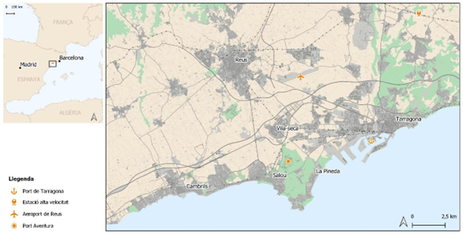
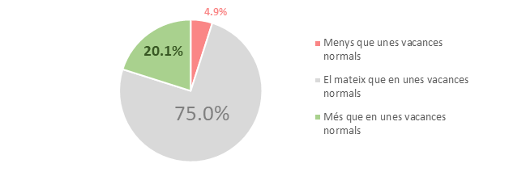
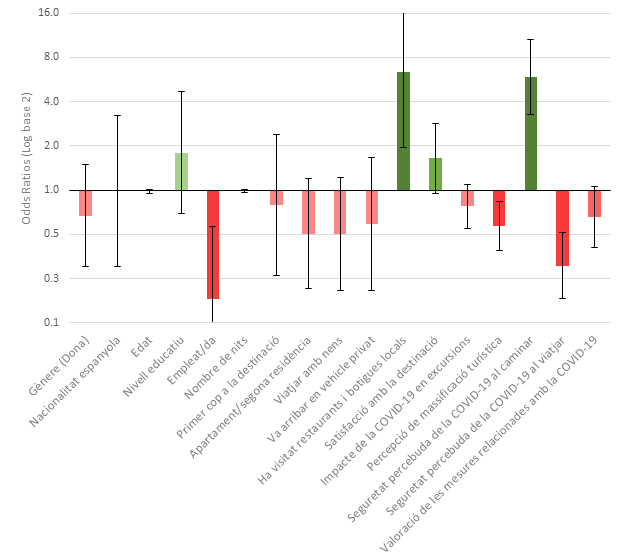
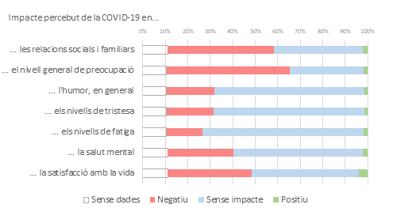
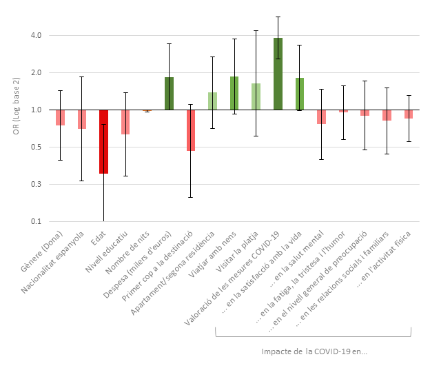

# La salut física i mental dels visitants durant la pandèmia de la COVID-19

###### Xavier Delclòs-Alió *(Universitat Rovira i Virgili)* {-}
###### Aaron Gutiérrez *(Universitat Rovira i Virgili)* {-}
###### Josep Tomàs-Porres *(Universitat Rovira i Virgili)* {-}
###### Oriol Gallardo *(Universitat Rovira i Virgili)* {-}
###### Daniel Miravet *(Universitat Rovira i Virgili)* {-}
###### Salvador Anton Clavé *(Universitat Rovira i Virgili)* {-}


## Introducció

La pandèmia causada per la COVID-19 ha tingut un impacte indiscutible per al sector turístic (Gosling et al., [-@gossling2020pandemics]). Tant el turisme nacional com l'internacional han patit caigudes sense precedents durant l'any 2020 a causa de les restriccions per viatjar, implementades arreu del món. A més, la pandèmia ha afectat la presa de decisions d'aquells que viatgen (per exemple, si viatjar o no, escollir destinacions domèstiques o properes per davant de destinacions més llunyanes, evitar els espais més massificats de les destinacions o reduir la duració del viatge) (Peluso i Picherri, 2020). D'altra banda, les destinacions turístiques que han seguit operatives durant els primers compassos de la pandèmia han hagut d'implementar mesures per tal de prevenir el contagi de la COVID-19. Alguns exemples d'aquestes mesures són el tancament d'equipaments, la limitació d'ocupacions, el distanciament social o les mesures higièniques (Robina-Ramírez et al., [-@robina2021safety]). És probable que la implementació d'aquestes mesures tingui un impacte en l'experiència del turista durant les vacances. Malgrat l'efectivitat provada d'aquestes mesures en la limitació del contagi del nou coronavirus, és evident que la reducció de les activitats lúdiques ha contribuït a la reducció de l'activitat física (Douglas et al., [-@douglas2020mitigating]) i, en conseqüència, a un increment del risc de patir malalties cròniques (Chen et al., [-@chen2020coronavirus]). Així mateix, la pandèmia ha tingut un impacte negatiu en la salut mental en global (Xiong et al., [-@xiong2020impact]), especialment per l'anomenada fatiga pandèmica, com a conseqüència de les mesures impulsades pels governs, que van limitar la mobilitat de les persones i la interacció social amb l'objectiu d'evitar el contagi del virus (Patherick et al., [-@petherick2021worldwide]). Per aquest motiu, és rellevant explorar quins van ser els condicionants de la satisfacció envers les vacances durant els primers estadis de la pandèmia de la COVID-19.

Hi ha una gran evidència sobre com la pandèmia de la COVID-19 ha impactat en els hàbits de consum d'oci en general. Per una banda, diversos autors assenyalen un augment significatiu a l'hora de prioritzar les activitats a l'aire lliure, la qual cosa ha donat com a resultat un increment de les visites a espais naturals i àrees rurals (Landry et al., [-@landry2021has]; McGinlay et al., [-@mcginlay2020impact]; Saladié et al., [-@saladie2021growth]; Seong i Hong, [-@seong2021does]; Spenceley et al., [-@spenceley2021tourism]). Per una altra banda, l'oci i les visites a les àrees urbanes s'han vist reduïdes per dos motius: en primer lloc, les ciutats es van veure especialment afectades per la COVID-19 a causa de les grans concentracions de persones pròpies de les àrees urbanes amb una elevada densitat, fet que va generar una percepció del risc de contagi molt més elevada entre els visitants (Anguera-Torrell et al., [-@anguera2021urban]; Liang et al., [-@liang2021impact]). En segon lloc, moltes de les atraccions turístiques localitzades a les ciutats són d'interior i l'accés a espais oberts en entorns urbans és generalment limitat (Corbisiero i Monaco, [-@corbisiero2021post]; Jiricka-Pürrer et al., [-@jiricka2020city]). No obstant això, alguns estudis han demostrat com algunes activitats d'oci en àrees urbanes han augmentat durant la pandèmia. Per exemple, i reflectint les preferències generals per les formes d'oci a l'aire lliure, Geng et al. [-@geng2021impacts] assenyalen com les visites als parcs urbans han augmentat de manera significativa durant la pandèmia. Igualment, altres estudis han evidenciat que certes activitats esportives com ara córrer o anar en bicicleta a l'aire lliure s'han tornat més populars com a formes d'oci, especialment durant les fases més restrictives de la pandèmia (Rice et al., [-@rice2020covid]; Schweizer et al., [-@schweizer2021outdoor]; Venter et al., [-@venter2020urban]). Pel que fa específicament a l'àmbit de l'oci durant les vacances, un estudi ha provat un canvi d'usos de l'espai públic per part dels turistes durant l'estiu de l'any 2020, especialment reduint les visites a aquells espais centrals tradicionalment associats amb la presència de moltes persones (Lopes et al., [-@da2021effects]).

Pel que fa a la salut mental, hi ha una evidència creixent sobre com la pandèmia ha tingut un impacte negatiu. Per exemple, a Espanya s'ha evidenciat com el llarg període d'activitats restringides i l'aïllament social propi de la fase de confinament a l'inici de la pandèmia, juntament amb la por de les conseqüències econòmiques, han causat nivells alts d'ansietat, estrès i depressió entre la població (Rodríguez-Rey et al., [-@rodriguez2020psychological]). Així i tot, continua sent incert si la possibilitat d'anar de vacances pot haver contribuït a moderar o disminuir l'impacte negatiu de la pandèmia en el benestar mental individual. En aquest context, sembla rellevant explorar també l'impacte de la satisfacció envers les vacances durant els primers estadis de la pandèmia, quan només una part de la població va poder o va voler anar de vacances. La satisfacció envers les vacances és un concepte àmpliament estudiat, en què es tenen en compte no només les implicacions per a la gestió de les destinacions, sinó també l'impacte positiu de les vacances en el benestar personal (Chen et al., [-@chen2016holiday]; Kay Smith i Diekmann, [-@smith2017tourism]; Yu et al., [-@yu2021effects]). Per exemple, hi ha un estudi que evidencia com les persones que han anat de vacances mostren un grau de felicitat més elevat que les que no hi han anat (Gilbert i Abdullah, [-@gilbert2004holidaytaking]). Un altre estudi prova que viatjar amb la intenció de fer vacances està associat, amb el pas del temps, amb nivells de creativitat més elevats (De Bloom et al., [-@debloom2014]). Finalment, un altre estudi assenyala com les millores en la salut emocional poden durar fins i tot un mes després d'un període de vacances, la qual cosa provoca nivells més baixos de cansament i de queixes sobre la salut, així com un augment de la satisfacció general (De Bloom et al., [-@debloom2009]).

En aquest capítol es presenta un estudi preliminar de dos aspectes clau amb referència a l'experiència dels visitants que van fer vacances durant el primer estiu amb COVID-19. En primer lloc, s'estudia l'impacte de la pandèmia sobre una de les formes principals d'activitat física durant les vacances, com són les caminades recreatives. En segon lloc, s'estudien els factors que determinen la satisfacció envers les vacances, tenint en compte l'impacte percebut de la pandèmia de la COVID-19 sobre la salut mental individual. Els resultats presentats s'extreuen d'una enquesta exploratòria distribuïda durant l'agost de l'any 2020 entre els visitants de la Costa Daurada, una important destinació litoral a Catalunya. Durant l'agost de 2020, Espanya es trobava en un estadi inicial de l'anomenada segona onada, amb una incidència relativament baixa però creixent, amb menys de 200 casos confirmats per 100.000 habitants (Instituto Nacional de Estadística, 2021). A més, l'agost de l'any 2020 representa un moment clau en l'evolució de la pandèmia a Espanya, marcat per la confluència de les vacances d'estiu i la relaxació de les restriccions impulsades pel Govern respecte a les activitats i la mobilitat de la població després del confinament de la primavera. Els resultats presentats en aquest capítol pretenen ser d'utilitat de cara a noves polítiques per a aquesta pandèmia o d'altres de futures, tant en matèria de gestió de destinacions turístiques, com en matèria de salut pública, ja que s'examinen factors associats amb la satisfacció envers les vacances després d'un llarg període d'inactivitat, la reducció de la interacció social i la fatiga pandèmica.

## Metodologia

Les dades utilitzades en aquest capítol s'han extret d'una enquesta a peu de carrer elaborada durant el mes d'agost de 2020 a 241 visitants dels principals municipis de la Costa Daurada (figura \@ref(fig:fig8c1)). Caracteritzada per un clima mediterrani suau, la Costa Daurada se situa com una de les principals destinacions turístiques estivals d'Europa amb més de cinc milions de visitants anuals (Patronat de Turisme de la Diputació de Tarragona, [-@Patronat2018]). Malgrat que, principalment, es tracta d'una destinació de platja, la Costa Daurada és a prop d'una sèrie d'enclavaments declarats Patrimoni de la Humanitat per la Unesco, així com altres indrets d'interès cultural, a més de PortAventura World, un dels principals parcs temàtics d'Europa (Clavé, [-@clave2010leisure]). Aquest estudi se centra en els municipis de Cambrils, Salou i Vila-Seca - la Pineda. La població combinada permanent d'aquesta zona l'any 2019 era de 83.561 habitants, amb un increment aproximat del 40 % si es pren en consideració també la població estacional (Institut d'Estadística de Catalunya, [-@de2012institut]). Aquests tres municipis es troben localitzats entre dues de les principals ciutats mitjanes de Catalunya ---Tarragona (134.515 habitants) i Reus (104.373 habitants)--- i tenen una bona connexió tant a escala regional com internacional ja sigui per carretera, per tren ---tant convencional com d'alta velocitat--- o per aire, concretament a través de l'aeroport de Reus. Per la seva banda, el Port de Tarragona és el principal port de la regió i recentment ha començat a rebre creuers internacionals (Domènech et al., [-@domenech2020]).

```{r fig8c1, echo=FALSE, fig.cap="Mapa de l’àrea d’estudi: els municipis centrals de la Costa Daurada", out.width = '100%'}

```

L'enquesta inclou aspectes com ara les característiques dels visitants, les característiques del viatge i la seva visita, i preguntes relacionades amb les activitats que han dut a terme durant l'estada a la destinació, així com la manera com han percebut l'impacte de la COVID-19 en les seves vides, en la seva salut mental i en la seva visita. Els participants que ho van voler van signar un formulari de consentiment informat abans de respondre l'enquesta. La taula 1 reflecteix les característiques de la mostra. Les persones incloses eren majoritàriament dones (53 %), amb una edat mitjana de 49,7 anys. El nivell d'estudis més comú entre els enquestats és estudis secundaris (38 %), seguit d'estudis primaris (32 %) i estudis superiors (23 %). Entre altres característiques individuals i relacionades amb la visita, destaca que els visitants eren majoritàriament espanyols (80 %), passaven una mitjana de quinze nits a la Costa Daurada i s'allotjaven principalment en segones residències, apartaments o residències d'amics o familiars (aproximadament el 60 % del total). A més, la majoria dels visitants no visitaven la destinació per primera vegada (77 %). Aquests resultats extrets de l'anàlisi de la mostra suggereixen que els visitants espanyols i de proximitat van ser més habituals que en circumstàncies normals, tal com indiquen els resultats obtinguts en estudis anteriors basats en enquestes de visitants similars fetes a l'àrea d'estudi (Gutiérrez i Miravet, [-@gutierrez2016determinants]).

<style type="text/css">
.tg  {border-collapse:collapse;border-spacing:0;}
.tg td{border-color:black;border-style:solid;border-width:1px;font-family:Arial, sans-serif;font-size:14px;
  overflow:hidden;padding:10px 5px;word-break:normal;}
.tg th{border-color:black;border-style:solid;border-width:1px;font-family:Arial, sans-serif;font-size:14px;
  font-weight:normal;overflow:hidden;padding:10px 5px;word-break:normal;}
.tg .tg-c3ow{border-color:inherit;text-align:center;vertical-align:top}
.tg .tg-7btt{border-color:inherit;font-weight:bold;text-align:center;vertical-align:top}
.tg .tg-fymr{border-color:inherit;font-weight:bold;text-align:left;vertical-align:top}
.tg .tg-0pky{border-color:inherit;text-align:left;vertical-align:top}
.tg .tg-f8tv{border-color:inherit;font-style:italic;text-align:left;vertical-align:top}
</style>
<table class="tg">
<thead>
  <tr>
    <th class="tg-7btt" colspan="2">Taula 1. Descripció de la&nbsp;&nbsp;&nbsp;mostra</th>
  </tr>
</thead>
<tbody>
  <tr>
    <td class="tg-fymr">Total de la mostra (n, %)</td>
    <td class="tg-c3ow">241 (100)</td>
  </tr>
  <tr>
    <td class="tg-fymr">Característiques individuals</td>
    <td class="tg-fymr"></td>
  </tr>
  <tr>
    <td class="tg-0pky">Gènere&nbsp;&nbsp;&nbsp;(n, %)</td>
    <td class="tg-0pky"></td>
  </tr>
  <tr>
    <td class="tg-f8tv">Femení</td>
    <td class="tg-c3ow">128 (53,11)</td>
  </tr>
  <tr>
    <td class="tg-f8tv">Masculí</td>
    <td class="tg-c3ow">97 (40,25)</td>
  </tr>
  <tr>
    <td class="tg-f8tv">s.&nbsp;&nbsp;&nbsp;d.</td>
    <td class="tg-c3ow">16 (6,64)</td>
  </tr>
  <tr>
    <td class="tg-0pky">Edat&nbsp;&nbsp;&nbsp;(mitjana, SD)</td>
    <td class="tg-c3ow">49,74 (17,53)</td>
  </tr>
  <tr>
    <td class="tg-0pky">Nivell&nbsp;&nbsp;&nbsp;d’estudis (n, %)</td>
    <td class="tg-0pky"></td>
  </tr>
  <tr>
    <td class="tg-f8tv">Educació primària</td>
    <td class="tg-c3ow">76 (31,54)</td>
  </tr>
  <tr>
    <td class="tg-f8tv">Educació&nbsp;&nbsp;&nbsp;secundària</td>
    <td class="tg-c3ow">91 (37,76)</td>
  </tr>
  <tr>
    <td class="tg-f8tv">Educació&nbsp;&nbsp;&nbsp;superior</td>
    <td class="tg-c3ow">56 (23,24)</td>
  </tr>
  <tr>
    <td class="tg-f8tv">s.&nbsp;&nbsp;&nbsp;d.</td>
    <td class="tg-c3ow">18 (7,47)</td>
  </tr>
  <tr>
    <td class="tg-0pky">Nacionalitat&nbsp;&nbsp;&nbsp;(n, %)</td>
    <td class="tg-0pky"></td>
  </tr>
  <tr>
    <td class="tg-f8tv">Espanyola</td>
    <td class="tg-c3ow">194 (80,5)</td>
  </tr>
  <tr>
    <td class="tg-f8tv">Altres</td>
    <td class="tg-c3ow">31 (12,86)</td>
  </tr>
  <tr>
    <td class="tg-f8tv">s. d.</td>
    <td class="tg-c3ow">16 (6,64)</td>
  </tr>
  <tr>
    <td class="tg-fymr">Característiques de la visita</td>
    <td class="tg-fymr"></td>
  </tr>
  <tr>
    <td class="tg-0pky">Nombre&nbsp;&nbsp;&nbsp;de nits (mitjana, SD)</td>
    <td class="tg-c3ow">14,63 (23,18)</td>
  </tr>
  <tr>
    <td class="tg-0pky">Despesa&nbsp;&nbsp;&nbsp;(milers d’euros) (mitjana, SD)</td>
    <td class="tg-c3ow">0,46 (0,59)</td>
  </tr>
  <tr>
    <td class="tg-0pky">Primera&nbsp;&nbsp;&nbsp;vegada que visita la destinació (n, %)</td>
    <td class="tg-0pky"></td>
  </tr>
  <tr>
    <td class="tg-f8tv">Sí</td>
    <td class="tg-c3ow">39 (16,18)</td>
  </tr>
  <tr>
    <td class="tg-f8tv">No</td>
    <td class="tg-c3ow">186 (77,18)</td>
  </tr>
  <tr>
    <td class="tg-f8tv">s.&nbsp;&nbsp;&nbsp;d.</td>
    <td class="tg-c3ow">16 (6,64)</td>
  </tr>
  <tr>
    <td class="tg-0pky">Tipus&nbsp;&nbsp;&nbsp;d’allotjament (n, %)</td>
    <td class="tg-0pky"></td>
  </tr>
  <tr>
    <td class="tg-f8tv">Segona residència</td>
    <td class="tg-c3ow">75 (31,12)</td>
  </tr>
  <tr>
    <td class="tg-f8tv">Apartament</td>
    <td class="tg-c3ow">39 (16,18)</td>
  </tr>
  <tr>
    <td class="tg-f8tv">Residència d’un&nbsp;&nbsp;&nbsp;familiar o un amic</td>
    <td class="tg-c3ow">22 (9,13)</td>
  </tr>
  <tr>
    <td class="tg-f8tv">Hotel&nbsp;&nbsp;&nbsp;de 3 o menys estrelles</td>
    <td class="tg-c3ow">23 (9,54)</td>
  </tr>
  <tr>
    <td class="tg-f8tv">Hotel&nbsp;&nbsp;&nbsp;de 4 o menys estrelles</td>
    <td class="tg-c3ow">48 (19,92)</td>
  </tr>
  <tr>
    <td class="tg-f8tv">Altres</td>
    <td class="tg-c3ow">18 (7,47)</td>
  </tr>
  <tr>
    <td class="tg-f8tv">s.&nbsp;&nbsp;&nbsp;d.</td>
    <td class="tg-c3ow">16 (6,64)</td>
  </tr>
  <tr>
    <td class="tg-0pky">Acompanyants&nbsp;&nbsp;&nbsp;durant el viatge (n, %)</td>
    <td class="tg-c3ow"></td>
  </tr>
  <tr>
    <td class="tg-f8tv">Pel&nbsp;&nbsp;&nbsp;seu compte</td>
    <td class="tg-c3ow">16 (6,64)</td>
  </tr>
  <tr>
    <td class="tg-f8tv">En&nbsp;&nbsp;&nbsp;parella</td>
    <td class="tg-c3ow">90 (37,34)</td>
  </tr>
  <tr>
    <td class="tg-f8tv">Família amb infants</td>
    <td class="tg-c3ow">76 (31,53)</td>
  </tr>
  <tr>
    <td class="tg-f8tv">Amb&nbsp;&nbsp;&nbsp;altres familiars</td>
    <td class="tg-c3ow">28 (11,62)</td>
  </tr>
  <tr>
    <td class="tg-f8tv">Amb&nbsp;&nbsp;&nbsp;amics</td>
    <td class="tg-c3ow">15 (6,22)</td>
  </tr>
  <tr>
    <td class="tg-f8tv">s. d.</td>
    <td class="tg-c3ow">16 (6,64)</td>
  </tr>
</tbody>
</table>

L'anàlisi s'ha estructurat en una sèrie de passos. En primer lloc, s'ha quantificat l'impacte percebut de la COVID-19 en les caminades recreatives comparat amb unes vacances sense pandèmia. En segon lloc, s'han analitzat les respostes obtingudes a l'enquesta per tal de conèixer els nivells de satisfacció envers les vacances, l'impacte percebut de la pandèmia en el benestar i la salut mental, així com l'impacte de la pandèmia en la visita. Per tal d'entendre quins factors de la visita estaven relacionats amb els nivells de les caminades recreatives, per una banda, i amb el seu grau de satisfacció amb les vacances, per l'altra, s'ha optat per fer servir lògits ordenats. L'ús d'aquests models estadístics es basa en la naturalesa de les variables dependents, que consisteixen en diferents nivells d'activitat respecte a les caminades recreatives (nivells d'activitat més baixos, similars o més elevats), i una escala de Likert, que comprèn de l'1 (molt baixa) al 5 (excel·lent), per mesurar la satisfacció envers les vacances. Pel que fa al model sobre les caminades recreatives, s'han inclòs un conjunt de característiques personals (gènere, nacionalitat, edat, educació i ocupació) i un conjunt de característiques sobre la visita (nombre de nits, despesa, mitjà de transport utilitzat per arribar a la destinació, si era o no la primera vegada que visitaven la destinació, el tipus d'allotjament, els acompanyants durant el viatge, si visitaven els serveis locals o passejaven per la destinació, la seva satisfacció global envers la destinació i la seva percepció respecte a la massificació del turisme). També s'hi han inclòs un conjunt d'indicadors clau sobre com havien percebut l'impacte de la COVID-19 durant la visita. S'ha examinat el risc percebut de l'impacte de la COVID-19 en viatges realitzats fora de la destinació, la seva percepció de seguretat respecte de contraure la COVID-19 mentre caminaven i mentre viatjaven tant dins com fora de la destinació, i la seva valoració respecte a les mesures de prevenció de la COVID-19 trobades a la destinació. Pel que fa al model relatiu a la satisfacció del turista durant les vacances, també s'han inclòs característiques individuals, característiques de la visita que podrien estar relacionades amb la satisfacció respecte a la visita i un conjunt de factors relacionats amb la salut mental com ara l'impacte percebut de la COVID-19 en la seva satisfacció vital, en la salut mental i aspectes com el cansament, la tristesa, l'estat d'ànim, el nivell de preocupació general i l'impacte en les seves relacions socials i familiars. Aquestes preguntes tenien tres opcions: impacte negatiu, sense impacte i impacte positiu. També s'hi ha inclòs una pregunta respecte de l'impacte de la COVID-19 en les activitats físiques dutes a terme durant la visita (per exemple, caminar i nedar; i s'ha fet ús d'una escala de Likert, de l'1 [molt menys] al 7 [molt més]). Finalment, s'hi ha inclòs una pregunta sobre com els visitants valoraven les mesures de prevenció de la COVID-19 que es trobaven a la destinació. Aquesta valoració s'ha fet, de nou, amb una escala de Likert, de l'1 (molt dolenta) al 5 (excel·lent).

## Resultats

### L'impacte de la pandèmia en les caminades recreatives durant les vacances

Aquesta primera part de l'anàlisi se centra en 224 respostes obtingudes a la pregunta relativa a la percepció de l'impacte de la COVID-19 en les caminades recreatives. El primer i principal resultat obtingut de l'explotació d'aquesta pregunta mostra com el 75 % dels enquestats van declarar mantenir nivells similars a l'hora de caminar de manera recreativa en comparació amb un any sense COVID-19. D'altra banda, un 20 % de les respostes declara haver caminat més de manera recreativa que en un any sense COVID-19. Únicament el 4,9 % indica un decreixement del volum de caminades recreatives respecte a un any sense COVID-19 (figura \@ref(fig:fig8c2)).

```{r fig8c2, echo=FALSE, fig.cap="Impacte percebut de la COVID-19 en les caminades recreatives durant la visita a la Costa Daurada", out.width = '100%'}

```

En segon lloc, les associacions entre els factors individuals, relacionats amb la visita i la COVID-19, així com l'impacte de la COVID-19 en les caminades recreatives es presenten a la figura \@ref(fig:fig8c3). Els coeficients s'han exponenciat i s'interpreten com odds ratios (OR). D'una banda, es pot observar una relació positiva i significant entre els nivells més alts de pràctica de les caminades recreatives en comparació amb un any sense COVID-19 i el fet d'haver visitat restaurants i comerços locals o haver passejat per la destinació. Els resultats també mostren una relació significativa entre el nivell de pràctica de les caminades recreatives en comparació amb anys sense COVID-19 i una percepció de seguretat envers el risc de contagi més elevada mentre caminen. De l'altra, podem veure una relació negativa significativa entre nivells més elevats de les caminades recreatives en comparació amb circumstàncies normals i el fet de tenir feina, la qual cosa fa palesa una percepció més gran respecte a la massificació turística i una percepció més gran de seguretat respecte a la COVID-19 a l'hora de viatjar. A més, s'han identificat altres relacions estadísticament menys significatives (p-valor \< 0,1). Per una banda, els resultats suggereixen una relació positiva entre el nivell de pràctica de les caminades recreatives en comparació amb anys sense COVID-19 i la satisfacció global envers la destinació. Per l'altra, s'ha identificat una possible relació negativa amb la valoració de les mesures de prevenció de la COVID-19 trobades a la destinació.

```{r fig8c3, echo=FALSE, fig.cap="Odds ratios de l’impacte de la COVID-19 en les caminades recreatives durant la visita, associades amb característiques individuals, de la visita, i aspectes relacionats amb l’impacte percebut de la pandèmia, derivats d’un model logístic ordenat. ^[Nota. Els resultats del model de regressió logística ordenada fan referència a l’impacte de la COVID-19 en les caminades recreatives, que pot prendre tres valors en comparació amb les circumstàncies normals (un any sense COVID-19): 1) menys activitat, 2) la mateixa activitat, 3) més activitat. La prova de significació del model té un resultat positiu, i presenta un valor de khi quadrat de 109,19, la qual cosa proporciona una probabilitat α ≤ 0,01 de refusar erròniament la hipòtesi nul·la. Els detalls de les variables categòriques es troben en el material suplementari. La variable «Satisfacció global amb la destinació» resulta de la sectorització de les variables que identifiquen la satisfacció amb la seguretat, l’amabilitat local, les comoditats per als vianants, la neteja de les platges i el mar, la relació qualitat/preu i la senyalització. La variable «Seguretat percebuda envers la COVID-19 en viatjar» resulta de la factorització de les variables que identifiquen la seguretat percebuda a l’hora de viatjar dins i fora de la destinació. Les variables que presentaven una proporció de casos perduts inferior al 15 % han estat eliminades amb una metodologia KNN. Significació de les associacions en el model *p ≤ 0,1, **p ≤ 0,05, ***p ≤ 0,01.] ", out.width = '100%'}

```

### L'impacte de la pandèmia en la satisfacció vacacional

Per aquest cas, s'han analitzat les dades d'un total de 222 respostes vàlides a la pregunta sobre la satisfacció envers les vacances de l'enquesta. Una proporció considerable de les persones enquestades va manifestar que la pandèmia de la COVID-19 havia tingut un impacte negatiu en diferents aspectes relacionats amb la pròpia salut mental i el benestar personal (figura \@ref(fig:fig8c4)): el 37 % dels enquestats van declarar que la pandèmia havia tingut un impacte negatiu en la seva satisfacció amb la vida; un 29 % van declarar que havia tingut un impacte negatiu en la seva salut mental; un 16 % en van assenyalar l'impacte negatiu en els seus nivells de cansament; un 21 % van declarar un impacte negatiu en la seva tristesa; un 21 % van declarar un impacte negatiu en el seu estat d'ànim general; un 55 % van declarar un impacte negatiu en els seus nivells de preocupació i, finalment, un 47 % dels enquestats van explicar com la pandèmia havia tingut un impacte negatiu en les seves relacions socials i familiars. D'altra banda, el 93 % de les persones enquestades van manifestar com la satisfacció envers les seves vacances era positiva, incloent-hi aquelles persones que consideraven la satisfacció envers les vacances com a bona (63 %) o fins i tot excel·lent (33 %).

```{r fig8c4, echo=FALSE, fig.cap="Impacte percebut de la pandèmia de la COVID-19 en diversos indicadors relacionats amb la salut mental, així com amb la satisfacció amb la visita a la Costa Daurada", out.width = '100%'}

```

La relació entre la satisfacció envers les vacances i les variables independents del model de regressió lògit ordenat es presenten a la figura \@ref(fig:fig8c5). Els coeficients del model han estat exponenciats i són interpretables com odds ratios (OR), ja que indiquen l'efecte de l'increment d'una unitat en les variables predictores respecte de les probabilitats d'informar del nivell més alt de la variable de resposta. En general, no s'observen relacions estadísticament significatives entre els indicadors que mesuren l'impacte percebut de la COVID-19 sobre la salut mental o el benestar i la satisfacció envers les vacances. L'única excepció trobada ha estat una relació positiva però menys significativa entre l'impacte percebut de la COVID-19 en la satisfacció vital i el resultat, evidenciat per una OR d'1,824 (95 % CI 0,99 a 3,358, p-valor \< 0,1). Tres variables més del model han mostrat relacions estadísticament significatives amb la satisfacció envers les vacances. En primer lloc, es pot observar una relació negativa significativa entre la satisfacció vacacional i l'edat de les persones enquestades (OR de 0,307, 95 % CI 0,124 a 0,764). En segon lloc, s'observa una relació positiva significativa entre la satisfacció envers les vacances i la despesa individual durant la visita (OR d'1,854, 95 % CI 1,004 a 3,423). En tercer lloc, es veu de nou una relació positiva i significativa entre la satisfacció envers les vacances i la valoració de les accions dutes a terme a la destinació per tal de prevenir el contagi de la COVID-19 (OR de 3,828, 95 % CI 2,581 a 5,679).

```{r fig8c5, echo=FALSE, fig.cap="IOdds ratios de l’associació entre la satisfacció amb la visita a la Costa Daurada, característiques individuals i de la visita, i aspectes relacionats amb l’impacte percebut de la COVID-19 en la salut mental, derivats d’un model logístic ordenat. ^[Nota. Els resultats en el model de regressió logística ordenada és la satisfacció envers les vacances, que pren valors de l’1 al 5 (de menys a més satisfacció). El model estimat és altament significatiu, ja que presenta un valor de khi quadrat de 80,55, i és significatiu en un α ≤ 0,01. Les variables relatives a l’impacte percebut de la COVID-19 poden prendre tres valors: 1) impacte negatiu, 2) no impacte, 3) impacte positiu. La variable «Impacte de la COVID-19 sobre el cansament i la tristesa i l’estat d’ànim» resulta de la factorització de les variables relacionades amb l’efecte de la COVID-19 sobre el cansament, la tristesa i l’estat d’ànim durant la visita. La variable «Impacte de la COVID-19 en les activitats físiques (caminar o nedar)» és el resultat de la factorització de les variables relacionades amb l’efecte de la COVID-19 en els hàbits de caminar i nedar durant la visita. Les variables que presentaven una proporció de casos perduts inferior al 15 % han estat eliminades amb una metodologia KNN. *p ≤ 0,1, **p ≤ 0,05, ***p ≤ 0,01.]", out.width = '100%'}

```

## Conclusions

En aquesta secció final es presenten els resultats preliminars sobre com la pandèmia de la COVID-19 ha afectat l'experiència dels visitants en relació amb les caminades recreatives, així com la relació entre la satisfacció envers les vacances i l'impacte negatiu de la pandèmia en la salut mental.

### Les implicacions d'un lleuger increment de les caminades recreatives durant les vacances

En primer lloc, cal destacar que, si bé la gran majoria de les persones enquestades no van declarar cap canvi en el nivell de les caminades recreatives respecte a un any sense COVID-19, una proporció considerable (20 %) va manifestar haver caminat de manera recreativa fins i tot més que en altres períodes de vacances. Aquest resultat es pot explicar pel fet que les caminades recreatives en les destinacions mediterrànies urbanes i litorals, com la Costa Daurada, es produeixen principalment a l'espai públic urbà, per exemple, als passejos marítims. Parlem, per tant, d'una activitat a l'aire lliure que requereix una interacció social mínima. Aquesta evidència suggereix que és probable que caminar de manera recreativa hagi estat considerada una pràctica segura i saludable durant les vacances, fins i tot durant la pandèmia de la COVID-19 (Halabchi et al., 2020).

A més, sortir a caminar de manera recreativa també pot haver substituït altres activitats que implicaven un desplaçament més gran i, per tant, suposaven l'ús del transport públic, ja que aquesta és la principal forma de transport entre els visitants de la regió en circumstàncies normals (Gutiérrez i Miravet, [-@gutierrez2016determinants]). En aquesta línia, el resultat denota un increment de la preferència per part del turista d'activitats recreatives a l'aire lliure. Aquesta realitat coincideix amb altres estudis anteriors en altres tipus d'activitats recreatives com ara la visita a parcs, el fet d'anar a córrer o el ciclisme (Geng et al., [-@geng2021impacts]; Schweizer et al., [-@schweizer2021outdoor]; Venter et al., [-@venter2020urban]). Aquests resultats tenen també implicacions importants pel que fa a la salut pública, ja que el manteniment, i fins i tot l'augment de les caminades recreatives durant les vacances, pot contrastar directament amb el fet observat en els estudis que han analitzat les caminades quotidianes i l'activitat física durant el primer any de la pandèmia, pel fet que aquests estudis han mostrat un decreixement de les activitats dutes a terme fora de casa (Barbieri et al., 2021; Chen et al., [-@chen2020coronavirus]; Douglas et al., [-@douglas2020mitigating]).

En segon lloc, s'ha vist també una relació positiva entre uns nivells més elevats de pràctica de les caminades recreatives en comparació amb un any sense COVID-19 i el fet d'haver visitat serveis locals o haver passejat per la destinació. Hi ha també una relació menys significativa entre la satisfacció general envers la destinació, la qual inclou aspectes relacionats específicament amb la qualitat de l'espai públic, com la seguretat percebuda, les facilitats per als vianants o la senyalització, entre d'altres. Aquests resultats suggereixen, que, malgrat que la caminada objectiva i percebuda pot ser rellevant per a les destinacions turístiques en condicions normals (Anton Clavé, 2019), podria ser que hi hagués més possibilitats de fer una activitat segura a l'aire lliure en context de pandèmia. Pot ser, per tant, que les caminades recreatives hagin substituït altres activitats que els turistes duien a terme a la destinació sense que això hagi suposat un decreixement de la satisfacció dels visitants envers la destinació i, fins i tot, mostri una possible relació positiva entre ambdós factors. Aquest resultat es podria emmarcar en la literatura sobre la capacitat de substitució de les activitats recreatives, que, en termes generals, considera que certes activitats lúdiques poden ser intercanviables per tal de satisfer les persones com a part d'una estratègia per adaptar-se a canvis temporals en l'oferta original de les activitats (Brunson i Shelby, 1993; Hendee i Burdge, 1974). Aquest resultat és especialment rellevant com a possible primer pas cap a adoptar nous hàbits d'oci a mitjà i llarg termini.

Entre altres variables, també s'ha pogut observar com els nivells més alts de les caminades recreatives en comparació amb anys amb condicions normals han mostrat una relació positiva amb una major percepció de seguretat respecte a la COVID-19 a l'hora de caminar. Aquestes dades concorden amb la bibliografia sobre la percepció del risc, en què s'explora com les decisions del turista estan condicionades per les amenaces que percep (en aquest cas, relacionades amb la salut) i com pren decisions buscant protegir-se. Aquest fet ha estat relacionat amb la manera com els visitants fan ús de l'espai públic (Lopes et al., [-@da2021effects]). A més, també s'ha identificat una relació negativa amb la percepció respecte a la massificació turística, seguint allò que s'assenyala en altres estudis en què s'analitzen diverses formes d'oci durant la pandèmia (Craig, 2021; Kainthola et al., 2021; Park et al., 2021). En conjunt, aquests resultats destaquen la necessitat d'implementar mesures efectives que garanteixin el distanciament social, no només en equipaments interiors, sinó també en l'espai públic de les ciutats, d'ús comú.

Els resultats obtinguts durant aquesta anàlisi preliminar suggereixen que les caminades recreatives dutes a terme en període de vacances durant el primer estiu amb pandèmia poden no haver-se vist alterades i, fins i tot, poden haver augmentat en comparació amb un any sense COVID-19. Aquest fet indica com la pandèmia podria haver implicat canvis significatius en la manera de consumir oci durant les vacances. Això podria tenir un especial interès per als sectors del turisme i de l'oci, ja que possiblement els visitants tinguin una predilecció més gran per passar temps a l'aire lliure, a l'espai públic de les ciutats i ser partícips de formes d'oci actives, tal com s'ha assenyalat en l'apartat introductori.

Aquest resultat també és rellevant per als gestors públics, pel fet que el volum dels fluxos de visitants que caminen podria augmentar en el període postpandèmic, especialment en els espais per on sigui agradable i segur de caminar. Aquest fet queda demostrat per la relació significativa trobada entre els factors objectius i percebuts i uns nivells més alts de les caminades recreatives, on caminar i passejar ja eren components clau en el comportament del visitant (Farkic et al., 2015). En aquest sentit, d'una banda, les administracions locals haurien d'incentivar accions orientades a la promoció de caminar, per exemple, amb la millora de les voreres, intervencions per pacificar el trànsit i, en general, prioritzant els vianants a l'espai públic. De l'altra, les administracions hauran de ser conscients de la necessitat d'evitar el risc de massificació, per exemple, descentralitzant els punts d'interès i reordenant els corrents de visitants cap a zones menys concorregudes. Finalment, aquest possible augment de les caminades recreatives observat entre els visitants participants en l'enquesta pot suggerir que les persones podrien haver tingut uns nivells d'activitat física durant les vacances de l'any 2020 en comparació amb altres períodes de vacances. D'acord amb aquest resultat, serà vital que futurs estudis explorin si aquestes alteracions observades en el comportament dels visitants durant les primeres fases de la pandèmia són persistents en el temps (Salon et al., 2021). Especialment, serà interessant conèixer si els canvis detectats en aquest estudi en relació amb la pràctica de les caminades recreatives durant les vacances es mantindran a mitjà i llarg termini.

### Les implicacions de la satisfacció envers les vacances malgrat l'impacte negatiu de la pandèmia en la salut mental

Pel que fa a la satisfacció envers les vacances, els resultats obtinguts proposen, en primer lloc, que els visitants es van mostrar, en general, satisfets amb les vacances. A més, també podem veure l'absència de relació entre la satisfacció envers les vacances i els indicadors relacionats amb l'impacte percebut de la COVID-19 sobre la salut mental i el benestar. Aquest fet suggereix que les vacances van ser satisfactòries malgrat les conseqüències negatives de la pandèmia amb relació a la salut mental i al benestar durant els primers estadis de la pandèmia. Aquests resultats implicarien que, malgrat que les restriccions de mobilitat entre la població són clau per controlar la propagació d'una pandèmia com la COVID-19, permetre un cert grau de flexibilitat pel que fa a viatges i vacances pot ajudar a reduir les conseqüències negatives de la pandèmia sobre la salut mental i, a la vegada, contribuir a mitigar l'impacte econòmic de la pandèmia en el sector turístic.

Per contra, s'ha pogut observar una relació positiva i significativa entre la satisfacció envers les vacances i la valoració de les mesures dutes a terme a la destinació per tal de prevenir la propagació de la pandèmia. Aquesta realitat coincideix amb resultats d'estudis anteriors (Hassan i Soliman, [-@hassan2021covid]). També s'ha evidenciat una relació negativa significativa entre l'edat dels visitants i la satisfacció envers les vacances. Aquest fet podria explicar-se pel risc més alt de patir conseqüències greus a causa de la COVID-19 per part de la població de més edat i, en conseqüència, un temor més gran a infectar-se entre aquest grup demogràfic. Ambdues evidències suggereixen com les destinacions turístiques hauran de garantir el desenvolupament de mesures per tal de prevenir el contagi de la COVID-19, sigui en aquesta pandèmia o en futures. Aquestes accions hauran d'anar encaminades a incrementar la percepció de seguretat, especialment entre la població de més edat. Així i tot, cal assenyalar que els resultats obtinguts durant aquesta exploració inicial es troben limitats pel fet que la mostra d'estudi és petita. A més, cal recordar que la majoria dels participants a l'enquesta eren nacionals i, aparentment, tenien una relació forta amb la destinació d'acord amb les llargues durades de l'estada i el tipus d'allotjament. A més, també cal assenyalar que aquests visitants eren d'edats més altes respecte a anys anteriors (Gutiérrez i Miravet, [-@gutierrez2016determinants]). És possible, per tant, que una mostra més gran i més diversa mostrés relacions encara més fortes o, per contra, relacions diferents de les observades durant aquesta exploració preliminar.

Els resultats preliminars presentats en aquest capítol suggereixen que anar de vacances després del període de confinament a l'inici de la COVID-19 podria considerar-se altament satisfactori, malgrat els impactes evidents de la pandèmia en la salut mental de les persones. El fet d'anar de vacances ha estat tradicionalment associat en diverses investigacions a nivells més alts de benestar emocional i a una millor salut mental. A més, aquest estudi partia de la base que aquesta relació podia ser especialment rellevant després d'un període prolongat d'activitat restringida i interacció social limitada, juntament amb nivells elevats d'ansietat i estrès derivats del temor a les conseqüències d'una pandèmia mundial. Aquest estudi s'ha dut a terme durant la fase inicial de la pandèmia, per la qual cosa estudis futurs podrien explorar la relació entre l'impacte de la COVID-19 en la salut mental i la satisfacció envers les vacances a mesura que la pandèmia ha anat evolucionant, i centrar-se especialment en el paper que tindran les estratègies de reobertura i la campanya de vacunació en la percepció i experiències dels visitants.

