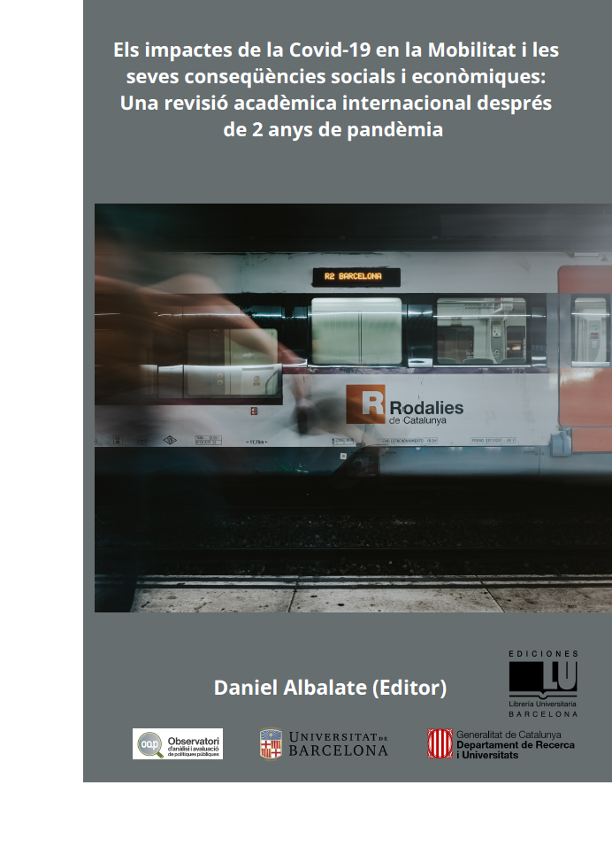

--- 
title: "Els impactes de la Covid-19 en la Mobilitat i les seves conseqüències socials i econòmiques: Una revisió acadèmica internacional després de 2 anys de pandèmia^[Aquest llibre ha estat finançat amb els recursos de la Secretaria d'Universitats i Recerca del Departament d'Empresa i Coneixement de la Generalitat de Catalunya (2020 PANDE 00058), gestionats mitjançant l'Agència de Gestió d'Ajuts Universitaris i de Recerca - AGAUR.]"
author: "Daniel Albalate (Editor)"
date: "Oct-2022"
site: bookdown::bookdown_site
output: bookdown::gitbook
documentclass: book
bibliography: [book.bib, packages.bib]
biblio-style: apalike
link-citations: yes
github-repo: rstudio/bookdown-demo
description: "Aquest projecte pretén entendre les causes i determinants dels canvis en les preferències i comportaments dels ciutadans de les grans àrees urbanes de Catalunya per tal d’identificar mesures i accions que puguin incidir-hi i mitigar o fins i tot revertir els efectes de la Covid19 sobre la sostenibilitat financera del transport públic i la sostenibilitat ambiental i la lluita contra el canvi climàtic, així com discutir-ne la seva viabilitat, la seva efectivitat en relació a l’evidència internacional, i la seva contribució a la solució o mitigació d’aquests dos grans reptes de sostenibilitat"
---

# Benvinguts {-}

<a href=""></a>

Aquesta monografia pretén aportar dues contribucions a la literatura. En primer lloc, procura aglutinar i revisar la literatura científica que ha tractat els efectes de la pandèmia sobre diferents aspectes de la mobilitat. L’objectiu no és altre que sintetitzar el coneixement que ha assolit la comunitat científica sobre les qüestions relatives a la mobilitat durant la pandèmia i el període posterior. Es tracta, doncs, no només de conèixer els impactes a curt termini, sinó també d’abordar els canvis estructurals amb caràcter permanent que puguin afectar la manera com ens movem i com gestionem la mobilitat a les grans ciutats. 

En segon lloc, en aquesta obra també s’inclouen els primers resultats d’una enquesta elaborada a més de 8.000 residents de les àrees urbanes de Barcelona, Girona i el Camp de Tarragona sobre la seva mobilitat en el context de la pandèmia i de la postpandèmia. Aquesta primera anàlisi de les dades de l’enquesta ens ajuda a entendre millor els impactes de la pandèmia, sobre la mobilitat a les grans àrees urbanes de Catalunya, a curt i llarg termini.


```{r include=FALSE}
# automatically create a bib database for R packages
knitr::write_bib(c(
  .packages(), 'bookdown', 'knitr', 'rmarkdown'
), 'packages.bib')
```
